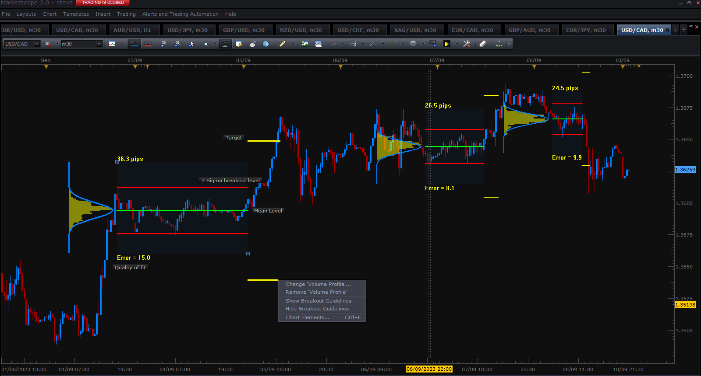
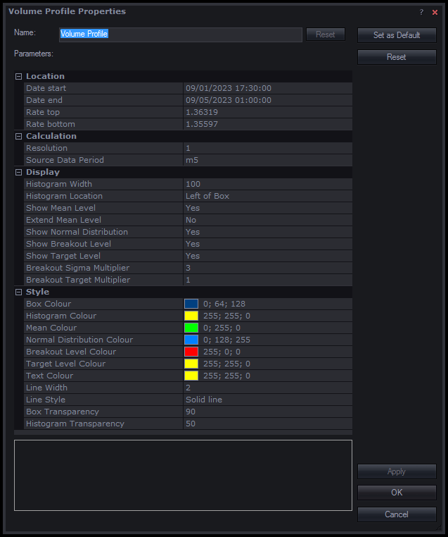
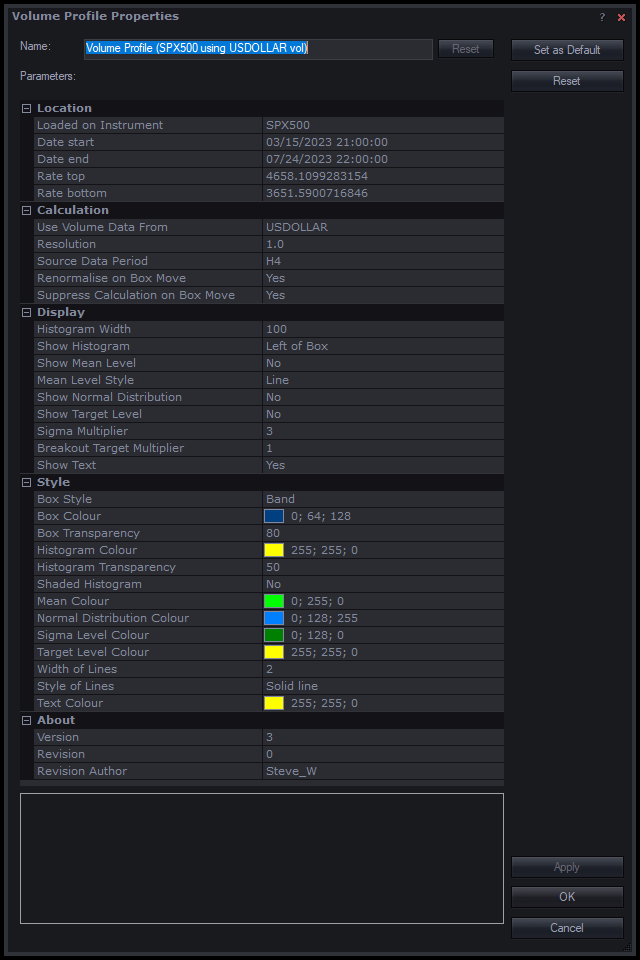
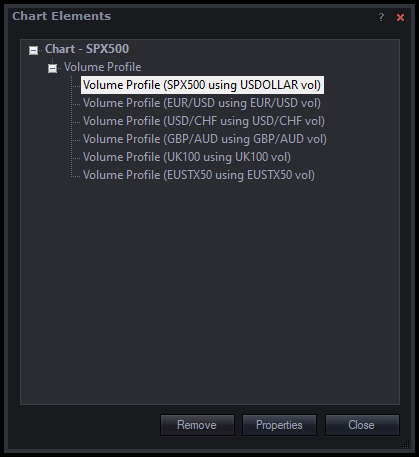

# Volume Profile

> Source: https://fxcodebase.com/code/viewtopic.php?f=17&t=74137  
> Forum: 17 · Topic 74137 · 8 post(s)

---

## Volume Profile

**Steve_W** · Sat Sep 09, 2023 2:29 am

Hi all,

I've coded up a drag and drop volume profile indicator tool.
Use via custom tool button, or right click->add tool->volume profile then drag+drop a box over area of interest. The box may be resized or moved dynamically around the chart.
Parameters are histogram resolution in pips, and source data time period

Install as normal, and copy 16x16 icon vol_profile.png to C:\Program Files (x86)\Candleworks\FXTS2\Tools\Custom\

The idea is to look at custom areas of consolidation of trends that may contain areas of high volume. These may provide future areas of support and resistance.

All the best, Steve

[img]

screen_shot.png

[/img]

 [vol_profile.lua](files/152440/vol_profile.lua)

 [38900](files/152440/vol_profile.png)

---

## Re: Volume Profile

**Steve_W** · Sun Sep 10, 2023 4:20 pm

Added some statistics to help applying over areas of consolidation and potential breakout trades.
The adjustable levels are set to 3 sigma and 1:1 RR by default.
Right click mouse menu to enable/disable, or set in parameters.
The statistics features is only intended for use in areas of consolidation - turn off if looking at a wider trend

Steve

Retrospective example to give an idea

 

*USDCAD example*

 

*parameters*

 [vol_profile.lua](files/152485/vol_profile.lua)

---

## Re: Volume Profile

**susan61** · Mon Oct 09, 2023 9:32 am

Hey
Great tool but I noticed when you change charts to a different pair you lose all the info is there a way this can be kept and able to flick through different pairs ? and a separate request is there a MT5 version or could that be done
hope you can help with this a
Susan

---

## Re: Volume Profile

**Apprentice** · Thu Oct 12, 2023 3:50 am

We have added your request to the development list.
Development reference 915

---

## Re: Volume Profile

**Steve_W** · Sun Oct 15, 2023 5:57 am

> **susan61 wrote:**
> Hey
> Great tool but I noticed when you change charts to a different pair you lose all the info is there a way this can be kept and able to flick through different pairs ? and a separate request is there a MT5 version or could that be done
> hope you can help with this a
> Susan

Susan, I've hopfully addressed that code issue with this version. It now saves a dummy variable, "Loaded on Instrument", to work out which chart instrument it was drawn on, and suppresses reload if looking at a different chart. Previously it would hang on code errors and you lost your drawings.
With new code, check chart elements->chart elements... if any confusion (if you reset the dummy variable to another instrument it will move it - just leave as default). I couldn't presently work out a better solution here.

other changes
- four corners grabbing
- option to renormalise histogram if box is moved
- some code cosmetics and version tracking

Install as before or instructions in code - also remove previous installation to delete unwated icon

Steve

 [vol_profile_v2_1.lua](files/152923/vol_profile_v2_1.lua)

---

## Re: Volume Profile

**Steve_W** · Sat Nov 18, 2023 3:24 am

Some fairly big updates to this tool:
- profile can source volume data from a different instrument. See screenshot example showing two overlaid tool instances - SPX500 using SPX500 volume, and SPX500 using USDOLLAR volume. Often the profiles are very similar, but here USD volume was previously high at recent SPX turning points.
- code refactor, improved calculation, data loading, speed and general operation [it should work a lot faster and minimises data download]
- multiple instances on same chart for different instruments - changing chart instrument is possible without losing previous drawings on return
- band [default] or box modes
- bug fixes and alternate tool options to make it more useable + flexible. Auto sensible params to prevent loading m1 data on W1 chart [delay issue]

Install as normal - see top of thread, include icon. use right-click or tool icon to add to chart

I may add the ability to point and click to graphically add levels in future... work in progress

 [vol_profile_v3_0.lua](files/153319/vol_profile_v3_0.lua)

 

*Alternate volume source - here two instances overlaid, SPX volume compared to USDOLLAR volume on SPX*

 

*Box with normal distribution plotted as a zone*

 

*Tool options*

 

*Multiple tool instances on same chart (to allow chart switching and return)*

---

## Re: Volume Profile

**jdal1980** · Wed Aug 14, 2024 9:58 am

Hello Steve,

in first, many thanks for this great tools, but I have a question , did you used fxcm volume to calculate your volume profile?
if yes, is it possible that you made the same volume profile based on RealVolume indicator and not with fxcm tick volume?

thanks in advance for your answer.
best regards

julien

---

## Re: Volume Profile

**Steve_W** · Tue Nov 19, 2024 3:46 am

Sorry a late reply...
Tool uses candle tick volume from Bar data array: source = core.host:execute("getHistory",...)
and access via source.volume[period]

I could look at FXCM RealVolume indicator data - would need to research to check that out, so no promises

No updates to code since last post, it seems stable so far.

Steve
