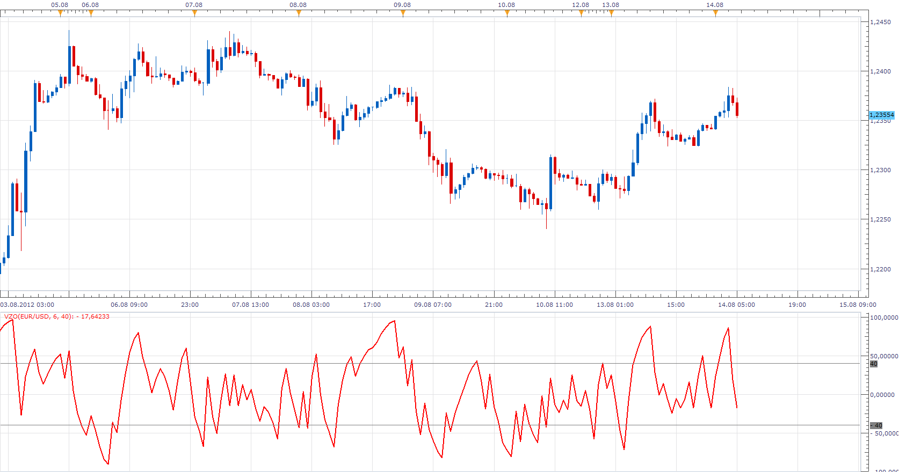
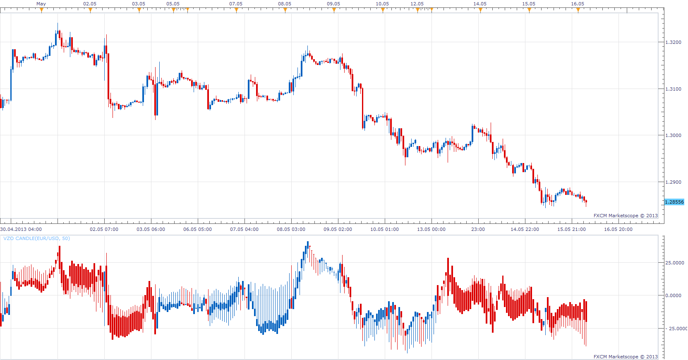

# VOLUME ZONE OSCILLATOR

> Source: https://fxcodebase.com/code/viewtopic.php?f=17&t=22397  
> Forum: 17 · Topic 22397 · 9 post(s)

---

## VOLUME ZONE OSCILLATOR

**Apprentice** · Tue Aug 14, 2012 4:52 am

In his book Technical Analysis Of The Financial Markets, John J. Murphy explains that using oscillators provides three benefits:
Overbought and oversold conditions warn that price trend is overextended and vulnerable.
Divergence between oscillator and price action shows hidden strength or weakness in the market, which is not apparent in the price action.
The crossing of the zero line can give an important trading signal.
The formula depends on only one condition: If today’s closing price is higher than yesterday’s, then the volume will have a positive value (bullish). Otherwise, it will have a negative value (bearish).

 [VZO.lua](files/38670/VZO.lua)

The indicator was revised and updated

MQ4/MT4 version.
[viewtopic.php?f=38&t=25075](https://fxcodebase.com/code/viewtopic.php?f=38&t=25075)

---

## Re: VOLUME ZONE OSCILLATOR

**juju1024** · Sat Oct 27, 2012 11:44 am

Hi,

Can you convert this indicator to MQ4 format ?

thanks

---

## Re: VOLUME ZONE OSCILLATOR

**Apprentice** · Sun Oct 28, 2012 4:33 am

Your request is added to the development list.

---

## Re: VOLUME ZONE OSCILLATOR

**Apprentice** · Sun Oct 28, 2012 8:36 am

Requested can be found here.
[viewtopic.php?f=38&t=25075](https://fxcodebase.com/code/viewtopic.php?f=38&t=25075)

---

## VZO Candle

**Apprentice** · Thu May 16, 2013 3:15 am

 [VZO Candle.lua](files/62926/VZO%20Candle.lua)

---

## Re: VOLUME ZONE OSCILLATOR

**Apprentice** · Tue May 23, 2017 10:23 am

Indicator was revised and updated.

---

## Re: VOLUME ZONE OSCILLATOR

**logicgate** · Tue Jan 01, 2019 8:43 am

Hello brothers! Happy new year, that this new yer be of very profitable trading for us!

Would you please compile a MT4 version of the VZO indicator? With some mods:

-When above 0 the main data line is green
-When below 0 the main data line is red
-Option in indi settings to apply smoothing to main data (SMA or EMA).
-Option in indi settings to apply an SMA or EMA to main data, to serve as a trigger line.

Cheers!

---

## Re: VOLUME ZONE OSCILLATOR

**Apprentice** · Wed Jan 02, 2019 5:07 am

MQ4/MT4 version.
[viewtopic.php?f=38&t=25075](https://fxcodebase.com/code/viewtopic.php?f=38&t=25075)

---

## Re: VOLUME ZONE OSCILLATOR

**logicgate** · Wed Jan 02, 2019 6:37 am

> **Apprentice wrote:**
> MQ4/MT4 version.
> [viewtopic.php?f=38&t=25075](https://fxcodebase.com/code/viewtopic.php?f=38&t=25075)

Thanks brother!!
