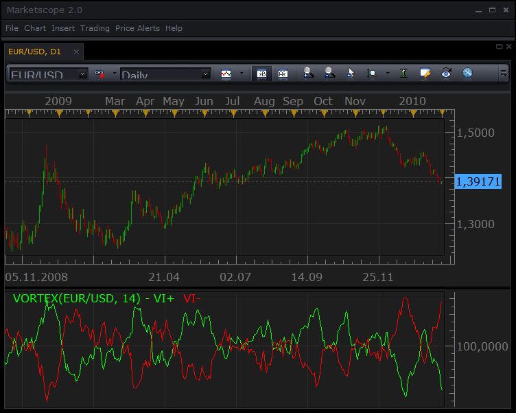
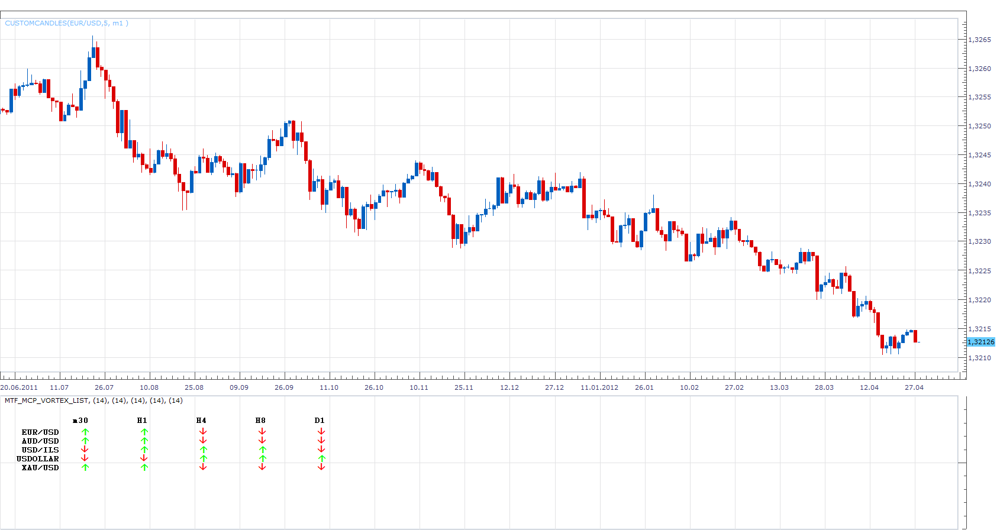

# Vortex Indicator

> Source: https://fxcodebase.com/code/viewtopic.php?f=17&t=277  
> Forum: 17 · Topic 277 · 18 post(s)

---

## Vortex Indicator

**TonyMod** · Tue Feb 02, 2010 6:05 pm

VORTEX INDICATOR

Posting a new Vortex Indicator. 'kingscorpion' has requested this indicator to be developed for marketscope, and short description was inserted here from his original request.

Information on this indicator can be found here:[http://www.traders.com/Reprints/PDF_reprints/VFX_VORTEX.PDF](http://www.traders.com/Reprints/PDF_reprints/VFX_VORTEX.PDF)

 



*Screenshot Of 'Vortex Indicator' from MarketScope*

**Vortex Indicator**
by **kingscorpion**

Vortex, developed by Etienne Botes & Douglas Siepman of [http://www.VortexFund.com](http://www.VortexFund.com), uses the relationship between today's high and yesterday's low for VM+ (similar to DMI+) and today's low and yesterday's high for VM- (similar to DMI-). The indicator plots only two line.

The first calculation is for the positive trending vortex movement VM+:
= ABS(Today's High - Yesterday's Low)

Next, calculate the negative trending vortex movement –VM. The formula is:
=ABS(Today's Low - Yesterday's High)

A 14-period sum of both VM+ and VM- is calculated.

Next, we calculate the true range (TR) and need to get the sum of the last 14 periods’ true range.

Finally, we need to calculate the ratio of each 14 period VM+ and 14 period VM- to the sum of the last 14 days’ daily true ranges.

And now the two ratios are drawn for the Vortex Indicator.

-**kingscorpion**

```lua
-- Indicator profile initialization routine
function Init()
    indicator:name("The Vortext Indicator");
    indicator:description("The indicator was described in Jan, 10 issue of the 'Stock and Commodites' Magazin");
    indicator:requiredSource(core.Bar);
    indicator:type(core.Oscillator);

    indicator.parameters:addInteger("N", "Length of the vortex", "No description", 14);
    indicator.parameters:addColor("VIP_color", "Color of VI+", "Color of VI+", core.rgb(0, 255, 0));
    indicator.parameters:addColor("VIM_color", "Color of VI-", "Color of VI-", core.rgb(255, 0, 0));
end

-- Indicator instance initialization routine
-- Processes indicator parameters and creates output streams
local N;

local first;
local source = nil;

-- Streams block
local VIP = nil;
local VIM = nil;
local iVIP = nil;
local iVIN = nil;
local iATR = nil;

-- Routine
function Prepare()
    N = instance.parameters.N;
    source = instance.source;
    iATR = core.indicators:create("ATR", instance.source, 1);
 
    first = iATR.DATA:first() + N;

    local name = profile:id() .. "(" .. source:name() .. ", " .. N .. ")";
    instance:name(name);
    VIP = instance:addStream("VIP", core.Line, name .. ".VI+", "VI+", instance.parameters.VIP_color, first);
    VIM = instance:addStream("VIM", core.Line, name .. ".VI-", "VI-", instance.parameters.VIM_color, first);

    iVIP = instance:addInternalStream(1, 0);
    iVIM = instance:addInternalStream(1, 0);
end

-- Indicator calculation routine
function Update(period, mode)
    iATR:update(mode);
    if period >= 1 then
        iVIP[period] = math.abs(source.high[period] - source.low[period - 1]);
        iVIM[period] = math.abs(source.low[period] - source.high[period - 1]);
    end
    if period >= first then
        local svip, svim, satr;
        local range;
        range = core.rangeTo(period, N);
        svip = core.sum(iVIP, range);
        svim = core.sum(iVIM, range);
        satr = core.sum(iATR.DATA, range);

        VIP[period] = svip / satr * 100;
        VIM[period] = svim / satr * 100;
    end
end
```

 [VORTEX.lua](files/441/VORTEX.lua)

MT4/MQ4 Version.
[viewtopic.php?f=38&t=64350](https://fxcodebase.com/code/viewtopic.php?f=38&t=64350)

---

## Re: Vortex Indicator

**jtatalov** · Tue Sep 13, 2011 12:59 pm

Can someone please develop a signal with sound for this indicator, thank you in advance

Jason

---

## Re: Vortex Indicator

**Apprentice** · Thu Sep 15, 2011 12:17 pm

Requested can be found here.
[viewtopic.php?f=31&t=6571](https://fxcodebase.com/code/viewtopic.php?f=31&t=6571)

---

## Re: Vortex Indicator

**zmender** · Wed Jan 04, 2012 4:09 pm


Vortex Difference indicator. Plots the VI+ - VI-

 [VORTEX_Difference.lua](files/22444/VORTEX_Difference.lua)

---

## Re: Vortex Indicator

**Apprentice** · Mon Apr 30, 2012 4:56 am


 [MTF VORTEX.lua](files/31772/MTF%20VORTEX.lua)

 



 [MTF_MCP_Vortex_List.lua](files/31772/MTF_MCP_Vortex_List.lua)

MQ4/MT4 version.
[viewtopic.php?f=38&t=64349](https://fxcodebase.com/code/viewtopic.php?f=38&t=64349)

 


 [Vortex Heat Map.lua](files/31772/Vortex%20Heat%20Map.lua)

MQ4/MT4 version.
[viewtopic.php?f=38&t=64362](https://fxcodebase.com/code/viewtopic.php?f=38&t=64362)

---

## Re: Vortex Indicator

**jackfx09** · Mon Apr 30, 2012 6:13 am

nicely done gentlemen, thank you!

In reference to heat maps, is it possible to create a Multi Currency Pair, MTF heatmap?

Thanks again for your efforts, nice work!

sjc

---

## Re: Vortex Indicator

**Apprentice** · Tue May 01, 2012 8:24 am

Yes it is possible

---

## Re: Vortex Indicator

**Apprentice** · Fri Oct 12, 2012 3:12 am


 [MTF MCP Vortex Heat Map.lua](files/41919/MTF%20MCP%20Vortex%20Heat%20Map.lua)

---

## Re: Vortex Indicator

**Yodian** · Fri Apr 12, 2013 3:48 am

Can you please make the MTF_MCP_Vortex_List to display the actual values (in green for + or Red for -)? This will make it much more usefull to understand the strength of the Vortex.

Thank you in advance!

---

## Re: Vortex Indicator

**Apprentice** · Tue Apr 16, 2013 1:36 pm


Indicator will show +/- Vortex Values for all currency pairs available, for all time frame selected.

 [MTF MCP VORTEX LIST.lua](files/59103/MTF%20MCP%20VORTEX%20LIST.lua)

---

## Re: Vortex Indicator

**Yodian** · Thu Apr 18, 2013 10:48 am

Thanks, but I have two issues:
(a)My request was the MTF_MCP_Vortex_List to display the actual values (in Green for + or Red for -). These values in the aforementioned list are the difference of the VI+ & VI- which shows the + difference with a green up arrow, and the - difference with a red down arrow. I just need instead of arrows, their value (difference of VI+ & VI-) in red when negative and in green when positive.

(b) I tried it anyway but I have an error "...145:Cannot recognize the host command"

Thank you in any case for the prompt response.

Looking for your assistance.

Regards,

Yodian

---

## Re: Vortex Indicator

**Apprentice** · Sun Apr 21, 2013 6:05 am

Please download new version of TS from FXCM web page.
This should fix the problems.

---

## Re: Vortex Indicator

**Yodian** · Sun Apr 21, 2013 1:03 pm

I updated and works fine. When possible I would appreciate the "vortex difference" version.
Thanks,

Yodian

---

## Re: Vortex Indicator

**Apprentice** · Tue Apr 23, 2013 6:09 am

Requested can be found here.
[viewtopic.php?f=17&t=35281&p=59768#p59768](https://fxcodebase.com/code/viewtopic.php?f=17&t=35281&p=59768#p59768)

---

## Re: Vortex Indicator

**Alexander.Gettinger** · Mon Sep 15, 2014 12:22 pm

MQL4 version of Vortex: [viewtopic.php?f=38&t=61152](https://fxcodebase.com/code/viewtopic.php?f=38&t=61152).

---

## Re: Vortex Indicator

**Apprentice** · Tue Jan 13, 2015 1:00 pm

VORTEX.lua Update.

---

## Re: Vortex Indicator

**Apprentice** · Mon Nov 13, 2017 8:13 am

The indicator was revised and updated.

---

## Re: Vortex Indicator

**Apprentice** · Sun Feb 04, 2018 6:59 am

The Indicator was revised and updated.
