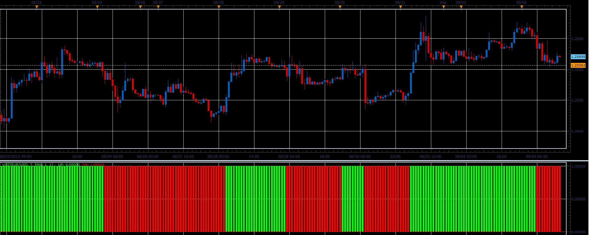
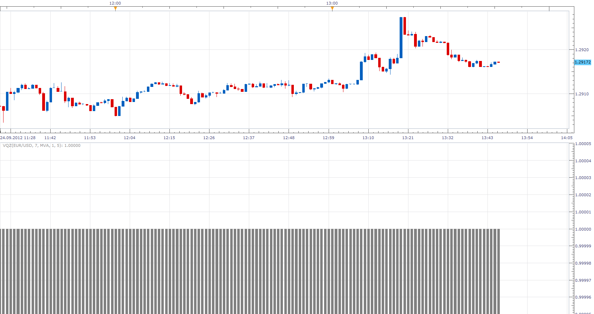

# VQz indicator

> Source: https://fxcodebase.com/code/viewtopic.php?f=17&t=23002  
> Forum: 17 · Topic 23002 · 20 post(s)

---

## VQz indicator

**Alexander.Gettinger** · Tue Sep 04, 2012 2:02 pm

Original indicator: [viewtopic.php?f=27&t=22596](https://fxcodebase.com/code/viewtopic.php?f=27&t=22596)

 

Download:

 [VQz.lua](files/39650/VQz.lua)

For this indicator must be installed Averages indicator ([viewtopic.php?f=17&t=2430](https://fxcodebase.com/code/viewtopic.php?f=17&t=2430)).

The indicator was revised and updated

---

## Re: VQz indicator

**biggiesmalls** · Wed Sep 05, 2012 7:20 am

First, thank you for the indicator. However, I'm having some problems with it. I installed it on a 30 minute chart and for some reason the entire graph just shows up green for the entire chart where as the the metatrader version I have pulled up with the exact same settings fluctuates with price action like it's designed.

Also, I don't know why but the smaller the chart, the worst the indicator gets. When I put it on a 15 minute chart I only get maybe 60 candles worth of price data. Put it on a 5 minute and the indicator doesn't show anything.

I attached an image to this post so you can see what I'm trying to describe. The image is of the EUR/USD 5 minute chart.

NOTE: I DO have the latest version of the AVERAGES indicator installed.

---

## Re: VQz indicator

**Apprentice** · Wed Sep 05, 2012 5:05 pm

You're right, this looks like TS bug.

---

## Re: VQz indicator

**biggiesmalls** · Mon Sep 10, 2012 6:42 am

Is this TS bug you mentioned resolvable?

---

## Re: VQz indicator

**Apprentice** · Tue Sep 11, 2012 4:00 am

I still do not have feedback from Dev. Team.

---

## Re: VQz indicator

**biggiesmalls** · Mon Sep 24, 2012 8:11 am

Dev. team respond to you yet

No rush..just curious. Thanks.

---

## Re: VQz indicator

**transformer** · Mon Sep 24, 2012 10:29 am

hi,

can you create strategy based on this indicator,

buy : when color changes from red to green
sell: when color changes from green to red

---

## Re: VQz indicator

**Apprentice** · Mon Sep 24, 2012 12:45 pm

biggiesmalls try this version, after double checking the code,
i have a solution, for lower time frame use a smaller filter. (1,2,3 ...)
Also this is a single stream version, which circumvents this problem.

 [VQZI.lua](files/40829/VQZI.lua)

For this indicator must be installed Averages indicator
[viewtopic.php?f=17&t=2430](https://fxcodebase.com/code/viewtopic.php?f=17&t=2430)

---

## Re: VQz indicator

**Apprentice** · Mon Sep 24, 2012 1:07 pm

transformer Your strategy can be found here.
[viewtopic.php?f=31&t=23740](https://fxcodebase.com/code/viewtopic.php?f=31&t=23740)

---

## Re: VQz indicator

**transformer** · Mon Sep 24, 2012 3:47 pm

thank you apprendice . you are great.

---

## Re: VQz indicator

**biggiesmalls** · Mon Sep 24, 2012 10:02 pm

I have posted images of the VQZI indicator and the original MT4 version and the whole .lua version seems to be incorrect. As you can see in the images I have posted 2 charts of the EUR/USD daily. One from FXCM market scope and one from a demo FXCM metatrader 4 account. I applied the volatility quality index indicator on both platforms using the exact same settings which I showed in both images. As you can see, their results are not the same or slightly similar. They're just off completely.

So there are two issues:

 1) The indicators do not match; ergo the translated (.lua) version is incorrect.

 2) The original MT4 version of the indicator has a true mtf function. The original author designed it so that if, for example; you are looking at price action on a 1 hour chart, you can have the vqzz2 indicator set to daily time frame data. BUT....the multiple time frame version he/she designed does not repaint/readjust like a normal higher time frame indicator. He/she designed it to show when, in real time; the indicator would be readjusting to the higher time frames current open candle. (Does that make sense? Kind of hard to explain in words sometimes and I apologize for any confusion.)

I appreciate the hard work as usual guys. Thank you for your time.

---

## Re: VQz indicator

**Apprentice** · Tue Sep 25, 2012 1:44 am

I will double check Alex work, and offer my version.

---

## Re: VQz indicator

**Apprentice** · Tue Sep 25, 2012 3:11 am

It seems that Alex has written only one of three Indicator methods.
Without deviation from the original.
Also you are using different smoothing methods.
You are using LWMA in Marketscope, MQ4 is using MVA (SMA)

---

## Re: VQz indicator

**biggiesmalls** · Tue Sep 25, 2012 6:30 pm

Hey Apprentice. Thanks for getting back to me. You're correct. I thought the mq4 image was using the LWMA for smoothing but I was using another moving average. However, I did go through each of the available moving averages and they still do not match up entirely. Also, will the other 2 portions of the indicator that you said were not programmed in the .lua version be added?

Another issue. Earlier your posted that to get the VQZ indicator to work on smaller time frames that users should just lower the smoothing. However; the original mq4 version doesn't require users to lower the smoothing to get the indicator to work. I've seen strategies built around this indicator for m1 charts that required users to have a smoothing factor of 25 or greater.

I just want to make sure traders don't download this indicator and naively start trading real money when it's not functioning properly or functioning as intended.

Thanks for the hard work and updates Apprentice. It's surely appreciated.

---

## Re: VQz indicator

**Apprentice** · Wed Sep 26, 2012 3:58 am

Try VQ Bar my Version of this indicator.
[viewtopic.php?f=17&t=10504&p=40944#p40944](https://fxcodebase.com/code/viewtopic.php?f=17&t=10504&p=40944#p40944)

---

## Re: VQz indicator

**biggiesmalls** · Wed Sep 26, 2012 10:06 am

Hey, I tried the other version and it's not working the way the original VQZZ2.mq4 indicator I uploaded functions. I prefer the original .lua that was posted requiring the averages indicator. I thought that was a nice feature bringing in different moving averages.

It would be nice if we could focus on the first translation (the one with the averages indicator) and see if we can get this indicator working as designed. Because every version/modification flat out does not work. I have posted 2 more images. Metatrader and Marketscope. The marketscope platform I have placed both Vq Bar and VQZ indicators. Both show same errors. The metatrader version I have posted has all 4 moving average variants the it supports on the chart. None of them obviously match the marketscope version of this indicator. All settings are the same. (7, some variant of MVA, 1, 5)

We'll get this working and one day we'll look back on this and laugh...hahaha

I'll send you all some Cas No. 16 crown royal I've got sitting here beside me.

---

## Re: VQz indicator

**Alexander.Gettinger** · Thu Sep 27, 2012 11:03 am

Parameter "Filter" is specified in pips.
There are different pip sizes in Marketscope and MT4.
For example:
if you use Filter=1 in Marketscope, you must use Filter=10 in MT4 for same results.

---

## Re: VQz indicator

**biggiesmalls** · Thu Sep 27, 2012 1:30 pm

That makes sense. Didn't realize that the 4-digit/5-digit broker would have any effect on these settings. I appreciate everything. Thanks guys.

Any chance on implementing the true/false mode higher time frame portion of the indicator?

Thanks again guys.

---

## Re: VQz indicator

**Alexander.Gettinger** · Thu Sep 27, 2012 1:57 pm

> **biggiesmalls wrote:**
> Any chance on implementing the true/false mode higher time frame portion of the indicator?

Yes.

---

## Re: VQz indicator

**Apprentice** · Mon Apr 17, 2017 6:39 am

Indicator was revised and updated.
