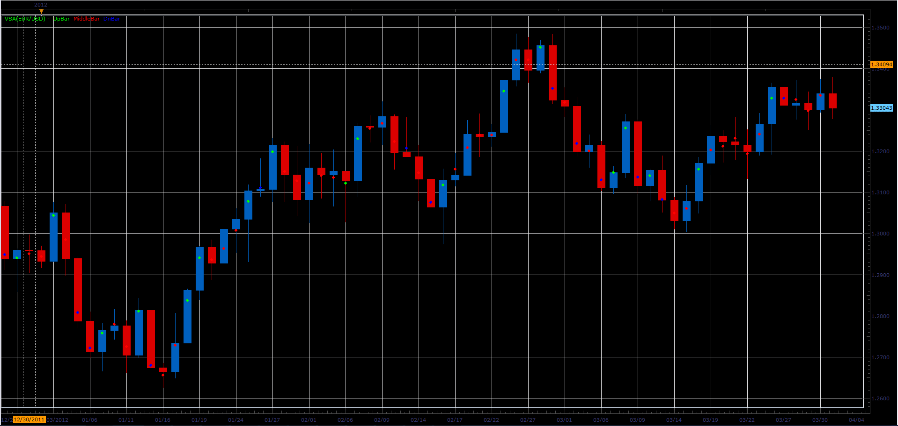

# VSA indicator

> Source: https://fxcodebase.com/code/viewtopic.php?f=17&t=15508  
> Forum: 17 · Topic 15508 · 6 post(s)

---

## VSA indicator

**Alexander.Gettinger** · Mon Apr 02, 2012 10:09 am

Indicator is a port of indicator from request [viewtopic.php?f=27&t=5424](https://fxcodebase.com/code/viewtopic.php?f=27&t=5424)

Formulas:
The bar is:
UP, if Close>UpPrice;
DN, if Close<DnPrice;
Middle, if DnPrice<Close<UpPrice.

UpPrice=MiddlePrice+D,
DnPrice=MiddlePrice-D, where
MiddlePrice=(High+Low)/2,
D=(High-Low)/K.

 



Download:

 [VSA.lua](files/29213/VSA.lua)

---

## Re: VSA indicator

**chimpy** · Mon Mar 25, 2013 8:10 am

Alexander,

Thanks so much for this. I must have missed the notification and have only just discovered it again. It seems to be popular by the look of the downloads.

I will have a good look later.

By the way, whats happened to Allpin, does he work with you guys anymore?
Are you able to look at any of the coded programs (exe) I have a small problem with the CSV project
[viewtopic.php?f=27&t=4685](https://fxcodebase.com/code/viewtopic.php?f=27&t=4685)
Is this your area of skill?

chimpy

---

## Re: VSA indicator

**Jeffreyvnlk** · Fri Jul 05, 2013 1:40 pm

> **Alexander.Gettinger wrote:**
> Indicator is a port of indicator from request [viewtopic.php?f=27&t=5424](https://fxcodebase.com/code/viewtopic.php?f=27&t=5424)
>
> Formulas:
> The bar is:
> UP, if Close>UpPrice;
> DN, if Close<DnPrice;
> Middle, if DnPrice<Close<UpPrice.
>
> UpPrice=MiddlePrice+D,
> DnPrice=MiddlePrice-D, where
> MiddlePrice=(High+Low)/2,
> D=(High-Low)/K.
>
>
>
> VSA.PNG
>
>
>
> Download:
>
>
> VSA.lua

May I ask what is K for ? May I understand that Up bar is a bar which got the close higher than that of a previous bar. It was appreciated if you could explain why using Middle Price in this formula
Thank you

---

## Re: VSA indicator

**Apprentice** · Sat Jul 06, 2013 11:07 am

K is a constant set by the user.

```lua
local D=(source.high[period-1]-source.low[period-1])/K;
Middle=(source.high[period-1]+source.low[period-1])/2;
    local Up=Middle+D;
    local Dn=Middle-D;

or simplified

Up = source.median[period-1] + (source.high[period-1]-source.low[period-1])/K;
Dn = sourcemedian[period-1] - (source.high[period-1]-source.low[period-1])/K;
```

If price is greater then Up then we will have Up Bar
If price is less then Dn then we will have Bar
otherwise we will have Middle Bar

---

## Re: VSA indicator

**angelalzate** · Thu Mar 12, 2015 3:38 pm

Good afternoon. Could anyone explain me what is the indicator , what is its function ?. Thank you very much and happy evening .

---

## Re: VSA indicator

**Apprentice** · Mon Oct 29, 2018 7:11 am

The indicator was revised and updated.
