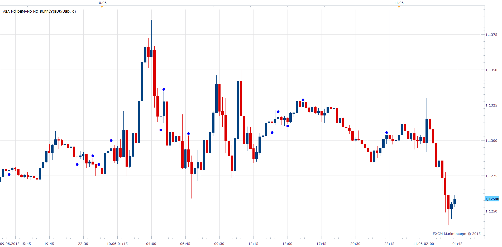

# VSA

> Source: https://fxcodebase.com/code/viewtopic.php?f=17&t=62307  
> Forum: 17 · Topic 62307 · 41 post(s)

---

## VSA

**Apprentice** · Thu Jun 11, 2015 3:42 am

Based on request.
[viewtopic.php?p=99867#p99867](https://fxcodebase.com/code/viewtopic.php?p=99867#p99867)

 [VSA No Demand No Supply.lua](files/100894/VSA%20No%20Demand%20No%20Supply.lua)

 [VSA Squats.lua](files/100894/VSA%20Squats.lua)

 [VSA No Demand No Supply with Alert.lua](files/100894/VSA%20No%20Demand%20No%20Supply%20with%20Alert.lua)

Compatibility issue fixed.
_Alert Helper is not longer needed.

---

## Re: VSA

**Apprentice** · Wed Jun 17, 2015 12:17 pm

Fixed.
Please report any additional bugs.
This code is enormous, difficult to debug.

---

## Re: VSA

**MaximeCau** · Fri Jun 19, 2015 7:45 am

other error here :

An error occurred during the calculation of the indicator 'VSA NO DEMAND NO SUPPLY'. The error details: VSA No Demand No Supply.lua:150: attempt to compare number with table.

Thanks

---

## Re: VSA

**Apprentice** · Sat Jun 20, 2015 8:21 am

Please Re-Download.

---

## Re: VSA

**Century1** · Sat Jul 04, 2015 9:29 am

I've been backtesting with this indicator along with manually using volume and candlestick analysis. What is the logic (in dumbed-down speak) for how this indicator calculates a signal. There are times it signals ndns where I would not have seen one. While I am still learning VSA, it seems to calculate its signals slightly different then from what I have learned.

I would like to know because I have been getting great results using this based upon specific pairs, timeframes and time of day and want to know the complete logic (to include what is different from my basic understanding of ndns) and not just rely solely on the signal.

Thanks for the help and for creating this.

---

## Re: VSA

**midas9090** · Sat Sep 12, 2015 5:59 am

Can alert be added to this indicator (vsa no demand no supply) ?

---

## Re: VSA

**Apprentice** · Mon Sep 14, 2015 2:38 am

Your request is added to the development list.

---

## Re: VSA

**Apprentice** · Mon Sep 14, 2015 5:17 am

VSA No Demand No Supply with Alert.lua Added.

---

## Re: VSA

**midas9090** · Sun Sep 20, 2015 10:36 am

thanks for adding the alert, but can the indicator be adjusted a bit away from the candle bar, because it overlap with the candle bar, thanks.

---

## Re: VSA

**spotdespot** · Tue Sep 22, 2015 9:17 am

Hi Apprentice - useful indicators thanks.

Is there any possibility of having the option to use True Volume for these please? Or produce real volume versions if not?

Many thanks,
Dave.

---

## Re: VSA

**Apprentice** · Wed Sep 23, 2015 5:11 am

Your request is additional to development list.

---

## Re: VSA

**Stance** · Thu Sep 24, 2015 6:05 pm

> **spotdespot wrote:**
> Hi Apprentice - useful indicators thanks.
>
> Is there any possibility of having the option to use True Volume for these please? Or produce real volume versions if not?
>
> Many thanks,
> Dave.

Hi Dave,

Here's my attempt to modify the indicator to use real volume.

Code: [Select all](https://fxcodebase.com/code/)
`--+------------------------------------------------------------------+
--|                                   VSA No Demand No Supply.lua    |
--|                               Copyright © 2015, Gehtsoft USA LLC |
--|                                            http://fxcodebase.com |
--+------------------------------------------------------------------+
--|                                      Developed by : Mario Jemic  |                   
--|                                          [[email protected]](https://fxcodebase.com/cdn-cgi/l/email-protection)   |
--+------------------------------------------------------------------+
--|                                 Support our efforts by donating  |
--|                                    Paypal: http://goo.gl/cEP5h5  |
--|                    BitCoin : 1MfUHS3h86MBTeonJzWdszdzF2iuKESCKU  | 
--+------------------------------------------------------------------+

-- Indicator profile initialization routine
-- Defines indicator profile properties and indicator parameters
-- TODO: Add minimal and maximal value of numeric parameters and default color of the streams
function Init()
    indicator:name("VSA No Demand No Supply with Real Volume");
    indicator:description("");
    indicator:requiredSource(core.Bar);
    indicator:type(core.Indicator);

    indicator.parameters:addInteger("NumberofTicks", "Number of Ticks", "Number of Ticks", 0);
   
   indicator.parameters:addInteger("Size", "Label Size", "", 10, 1 , 100);
    indicator.parameters:addColor("NSLabelColor", "Color of NoSupply", "Color of Label", core.rgb(0, 255, 0));
   indicator.parameters:addColor("NDLabelColor", "Color of NoDemand", "Color of Label", core.rgb(255,0 , 0));
end

-- Indicator instance initialization routine
-- Processes indicator parameters and creates output streams
-- TODO: Refine the first period calculation for each of the output streams.
-- TODO: Calculate all constants, create instances all subsequent indicators and load all required libraries
-- Parameters block
local NumberofTicks;

local first;
local source = nil;
local Size, NSLabelColor, NDLabelColor, font;
-- Streams block

 local O,L,H,C,Vol;
local FirstStart;
local LastTime;
 
 function ReleaseInstance()
       core.host:execute("deleteFont", font);
end      

-- Routine
function Prepare(nameOnly)
    NumberofTicks = instance.parameters.NumberofTicks;
    source = instance.source;
    first = source:first()+5;
   Size = instance.parameters.Size;
   NSLabelColor = instance.parameters.NSLabelColor;
   NDLabelColor = instance.parameters.NDLabelColor;
   
   font = core.host:execute("createFont", "Wingdings", Size, false, false);
 
   HT = instance:addInternalStream(first, 0);
   LT = instance:addInternalStream(first, 0);
   H=source.high;
    L=source.low;
   O=source.open;
   C=source.close;
   Vol=core.indicators:create("REAL VOLUME", source);
   
   FirstStart=true;
     LastTime=0;
   

    local name = profile:id() .. "(" .. source:name() .. ", " .. tostring(NumberofTicks) .. ")";
    instance:name(name);
 
end

 function Plot(Data, period, Label)
    if Data[period]== LT[period] then
    core.host:execute("drawLabel1", source:serial(period), source:date(period),  core.CR_CHART, Data[period], core.CR_CHART, core.H_Center, core.V_Top, font, NDLabelColor,  "\108");
    else
    core.host:execute("drawLabel1", source:serial(period), source:date(period),  core.CR_CHART, Data[period], core.CR_CHART, core.H_Center, core.V_Bottom, font, NSLabelColor,  "\108");
    end
 end;

   

-- Indicator calculation routine
-- TODO: Add your code for calculation output values
function Update(period, mode)
    if period < first or not source:hasData(period) then
   return;
   end
   Vol:update(mode);
    if not(Vol.DATA:hasData(period)) then
            if period==first then
                FirstStart=true;
            end   
            return;
        elseif FirstStart then
            FirstStart=false;
            instance:updateFrom(first);   
        elseif LastTime~=source:date(period) and period==source:size()-1 then
            LastTime=source:date(period);
            instance:updateFrom(period-10);
        end
   
   HT[period]=L[period] - NumberofTicks*source:pipSize();
    LT[period]=H[period] + NumberofTicks*source:pipSize();
   
   
   
if H[period]>H[period-1] and L[period]>=L[period-1] and (H[period]-L[period])<(H[period-1]-L[period-1]) and C[period]==O[period] and C[period]==H[period] and C[period]>C[period-1] and Vol.DATA[period]<Vol.DATA[period-1]and Vol.DATA[period]<Vol.DATA[period-2] then 
   Plot(LT,period,"NoDemand");   
end;

if L[period]<L[period-1] and H[period]<=H[period-1] and (H[period]-L[period])<(H[period-1]-L[period-1]) and C[period]==O[period] and C[period]==L[period] and C[period]<C[period-1] and Vol.DATA[period]<Vol.DATA[period-1]and Vol.DATA[period]<Vol.DATA[period-2] then 
   Plot(HT,period,"NoSupply");   
end;

if H[period]>H[period-1] and L[period]>=L[period-1] and (H[period]-L[period])<(H[period-1]-L[period-1]) and C[period]==O[period] and C[period]==(((H[period]-L[period])*0.5)+L[period]) and C[period]>C[period-1] and Vol.DATA[period]<Vol.DATA[period-1] and Vol.DATA[period]<Vol.DATA[period-2]   then 
   Plot(LT,period,"NoDemand");
end;

if L[period]<L[period-1] and H[period]<=H[period-1] and (H[period]-L[period])<(H[period-1]-L[period-1]) and C[period]==O[period] and C[period]==(((H[period]-L[period])*0.5)+L[period]) and C[period]<C[period-1] and Vol.DATA[period]<Vol.DATA[period-1] and Vol.DATA[period]<Vol.DATA[period-2]  then 
   Plot(HT,period,"NoSupply");
end;

if H[period]>H[period-1] and L[period]>=L[period-1] and (H[period]-L[period])<(H[period-1]-L[period-1]) and C[period]==O[period] and C[period]==L[period] and C[period]>C[period-1] and Vol.DATA[period]<Vol.DATA[period-1] and Vol.DATA[period]<Vol.DATA[period-2]   then 
   Plot(LT,period,"NoDemand");
end;

if L[period]<L[period-1] and H[period]<=H[period-1] and (H[period]-L[period])<(H[period-1]-L[period-1]) and C[period]==O[period] and C[period]==H[period] and C[period]<C[period-1] and Vol.DATA[period]<Vol.DATA[period-1] and Vol.DATA[period]<Vol.DATA[period-2]  then 
   Plot(HT,period,"NoSupply");
end;

if H[period-1]>H[period-2] and L[period-1]>=L[period-2] and C[period-1]>C[period] and H[period-1]>=H[period] and Vol.DATA[period-1]<Vol.DATA[period-2] and Vol.DATA[period-1]<Vol.DATA[period-3] then 
   Plot(LT,period-1,"NoDemand");
end;

if L[period-1]<L[period-2] and H[period-1]<=H[period-2] and C[period-1]<C[period] and L[period-1]<=L[period] and Vol.DATA[period-1]<Vol.DATA[period-2] and Vol.DATA[period-1]<Vol.DATA[period-3] then 
   Plot(HT,period-1,"NoSupply");
end;

 

if H[period-2]>H[period-3] and L[period-2]>=L[period-3] and (H[period-2]-L[period-2])<(H[period-3]-L[period-3]) and C[period-2]==O[period-2] and C[period-2]>C[period-3] and C[period-2]==C[period-1] and C[period-2]>C[period] and H[period-2]>=H[period-1] and H[period-2]>=H[period] and Vol.DATA[period-2]<Vol.DATA[period-3] and Vol.DATA[period-2]<Vol.DATA[period-4] then 
   Plot(LT,period-2,"NoDemand");
end;

if L[period-2]<L[period-3] and H[period-2]<=H[period-3] and (H[period-2]-L[period-2])<(H[period-3]-L[period-3]) and C[period-2]==O[period-2] and C[period-2]<C[period-3] and C[period-2]==C[period-1] and C[period-2]<C[period] and L[period-2]<=L[period-1] and L[period-2]<=L[period] and Vol.DATA[period-2]<Vol.DATA[period-3] and Vol.DATA[period-2]<Vol.DATA[period-4]   then 
   Plot(HT,period-2,"NoSupply");
end;

if H[period-2]>H[period-3] and L[period-2]>=L[period-3] and (H[period-2]-L[period-2])<(H[period-3]-L[period-3]) and C[period-2]~=O[period-2] and C[period-2]==H[period-2] and C[period-2]>C[period-3] and C[period-2]==C[period-1] and C[period-2]>C[period] and H[period-2]>=H[period-1] and H[period-2]>=H[period] and Vol.DATA[period-2]<Vol.DATA[period-3] and Vol.DATA[period-2]<Vol.DATA[period-4] then   
   Plot(LT,period-2,"NoDemand");
end;

if L[period-2]<L[period-3] and H[period-2]<=H[period-3] and (H[period-2]-L[period-2])<(H[period-3]-L[period-3]) and C[period-2]~=O[period-2] and C[period-2]==L[period-2] and C[period-2]<C[period-3] and C[period-2]==C[period-1] and C[period-2]<C[period] and L[period-2]<=L[period-1] and L[period-2]<=L[period] and Vol.DATA[period-2]<Vol.DATA[period-3] and Vol.DATA[period-2]<Vol.DATA[period-4] then 
   Plot(HT,period-2,"NoSupply");
end;

if H[period-2]>H[period-3] and L[period-2]>=L[period-3] and (H[period-2]-L[period-2])<(H[period-3]-L[period-3]) and C[period-2]~=O[period-2] and C[period-2]==((H[period-2]-L[period-2])*0.5)+L[period-2] and C[period-2]>C[period-3] and C[period-2]==C[period-1] and C[period-2]>C[period] and H[period-2]>=H[period-1] and H[period-2]>=H[period] and Vol.DATA[period-2]<Vol.DATA[period-3] and Vol.DATA[period-2]<Vol.DATA[period-4] then 
   Plot(LT,period-2,"NoDemand");
end;

if L[period-2]<L[period-3] and H[period-2]<=H[period-3] and (H[period-2]-L[period-2])<(H[period-3]-L[period-3]) and C[period-2]~=O[period-2] and C[period-2]==((H[period-2]-L[period-2])*0.5)+L[period-2] and C[period-2]<C[period-3] and C[period-2]==C[period-1] and C[period-2]<C[period] and L[period-2]<=L[period-1] and L[period-2]<=L[period] and Vol.DATA[period-2]<Vol.DATA[period-3] and Vol.DATA[period-2]<Vol.DATA[period-4] then 
   Plot(HT,period-2,"NoSupply");
end;

if H[period-2]>H[period-3] and L[period-2]>=L[period-3] and (H[period-2]-L[period-2])<(H[period-3]-L[period-3]) and C[period-2]~=O[period-2] and C[period-2]==L[period-2] and C[period-2]>C[period-3] and C[period-2]==C[period-1] and C[period-2]>C[period] and H[period-2]>=H[period-1] and H[period-2]>=H[period] and Vol.DATA[period-2]<Vol.DATA[period-3] and Vol.DATA[period-2]<Vol.DATA[period-4] then 
   Plot(LT,period-2,"NoDemand");
end;

if L[period-2]<L[period-3] and H[period-2]<=H[period-3] and (H[period-2]-L[period-2])<(H[period-3]-L[period-3]) and C[period-2]~=O[period-2] and C[period-2]==H[period-2] and C[period-2]<C[period-3] and C[period-2]==C[period-1] and C[period-2]<C[period] and L[period-2]<=L[period-1] and L[period-2]<=L[period] and Vol.DATA[period-2]<Vol.DATA[period-3] and Vol.DATA[period-2]<Vol.DATA[period-4] then 
   Plot(HT,period-2,"NoSupply");
end;

if H[period-3]>H[period-4] and L[period-3]>=L[period-4] and (H[period-3]-L[period-3])<(H[period-4]-L[period-4]) and C[period-3]==O[period-3] and C[period-3]==H[period-3] and C[period-3]>C[period-4] and C[period-3]==C[period-2] and C[period-3]==C[period-1] and C[period-3]>C[period] and H[period-3]>=H[period-2] and H[period-3]>=H[period-1] and H[period-3]>=H[period] and Vol.DATA[period-3]<Vol.DATA[period-4] and Vol.DATA[period-3]<Vol.DATA[period-5] then 
   Plot(LT,period-3,"NoDemand");
end;

if L[period-3]<L[period-4] and H[period-3]<=H[period-4] and (H[period-3]-L[period-3])<(H[period-4]-L[period-4]) and C[period-3]==O[period-3] and C[period-3]==L[period-3] and C[period-3]<C[period-4] and C[period-3]==C[period-2] and C[period-3]==C[period-1] and C[period-3]<C[period] and L[period-3]<=L[period-2] and L[period-3]<=L[period-1] and L[period-3]<=L[period] and Vol.DATA[period-3]<Vol.DATA[period-4] and Vol.DATA[period-3]<Vol.DATA[period-5]  then 
   Plot(HT,period-3,"NoSupply");
end;

if H[period-3]>H[period-4] and L[period-3]>=L[period-4] and (H[period-3]-L[period-3])<(H[period-4]-L[period-4]) and C[period-3]==O[period-3] and C[period-3]==((H[period-3]-L[period-3])*0.5)+L[period-3] and C[period-3]>C[period-4] and C[period-3]==C[period-2] and C[period-3]==C[period-1] and C[period-3]>C[period] and H[period-3]>=H[period-2] and H[period-3]>=H[period-1] and H[period-3]>=H[period] and Vol.DATA[period-3]<Vol.DATA[period-4] and Vol.DATA[period-3]<Vol.DATA[period-5]  then 
   Plot(LT,period-3,"NoDemand");
end;

if L[period-3]<L[period-4] and H[period-3]<=H[period-4] and (H[period-3]-L[period-3])<(H[period-4]-L[period-4]) and C[period-3]==O[period-3] and C[period-3]==((H[period-3]-L[period-3])*0.5)+L[period-3] and C[period-3]<C[period-4] and C[period-3]==C[period-2] and C[period-3]==C[period-1] and C[period-3]<C[period] and L[period-3]<=L[period-2] and L[period-3]<=L[period-1] and L[period-3]<=L[period] and Vol.DATA[period-3]<Vol.DATA[period-4] and Vol.DATA[period-3]<Vol.DATA[period-5]  then 
   Plot(HT,period-3,"NoSupply");
end;

if H[period-3]>H[period-4] and L[period-3]>=L[period-4] and (H[period-3]-L[period-3])<(H[period-3]-L[period-3]) and C[period-3]==O[period-3] and C[period-3]==L[period-3] and C[period-3]>C[period-4] and C[period-3]==C[period-2] and C[period-3]==C[period-1] and C[period-3]>C[period] and H[period-3]>=H[period-2] and H[period-3]>=H[period-1] and H[period-3]>=H[period] and Vol.DATA[period-3]<Vol.DATA[period-4] and Vol.DATA[period-3]<Vol.DATA[period-5] then 
   Plot(LT,period-3,"NoDemand");
end;

if L[period-3]<L[period-4] and H[period-3]<=H[period-4] and (H[period-3]-L[period-3])<(H[period-3]-L[period-3]) and C[period-3]==O[period-3] and C[period-3]==H[period-3] and C[period-3]<C[period-4] and C[period-3]==C[period-2] and C[period-3]==C[period-1] and C[period-3]<C[period] and L[period-3]<=L[period-2] and L[period-3]<=L[period-1] and L[period-3]<=L[period] and Vol.DATA[period-3]<Vol.DATA[period-4] and Vol.DATA[period-3]<Vol.DATA[period-5]   then 
   Plot(HT,period-3,"NoSupply");
end;

if H[period]<=H[period-1] and L[period]>=L[period-1] and (H[period]-L[period])<(H[period-1]-L[period-1]) and C[period]==O[period] and C[period]==H[period] and C[period]>C[period-1] and Vol.DATA[period]<Vol.DATA[period-1] and Vol.DATA[period]<Vol.DATA[period-2] then 
   Plot(LT,period,"NoDemand");
end;

if H[period]<=H[period-1] and L[period]>=L[period-1] and (H[period]-L[period])<(H[period-1]-L[period-1]) and C[period]==O[period] and C[period]==L[period] and C[period]<C[period-1] and Vol.DATA[period]<Vol.DATA[period-1] and Vol.DATA[period]<Vol.DATA[period-2] then 
   Plot(HT,period,"NoSupply");
end;

if H[period]<=H[period-1] and L[period]>=L[period-1] and (H[period]-L[period])<(H[period-1]-L[period-1]) and C[period]==O[period] and C[period]==((H[period]-L[period])*0.5)+L[period] and C[period]>C[period-1] and Vol.DATA[period]<Vol.DATA[period-1] and Vol.DATA[period]<Vol.DATA[period-2]  then 
   Plot(LT,period,"NoDemand");
end;

if H[period]<=H[period-1] and L[period]>=L[period-1] and (H[period]-L[period])<(H[period-1]-L[period-1]) and C[period]==O[period] and C[period]==((H[period]-L[period])*0.5)+L[period] and C[period]<C[period-1] and Vol.DATA[period]<Vol.DATA[period-1] and Vol.DATA[period]<Vol.DATA[period-2] then 
   Plot(HT,period,"NoSupply");
end;

if H[period]<=H[period-1] and L[period]>=L[period-1] and (H[period]-L[period])<(H[period-1]-L[period-1]) and C[period]==O[period] and C[period]==L[period] and C[period]>C[period-1] and Vol.DATA[period]<Vol.DATA[period-1] and Vol.DATA[period]<Vol.DATA[period-2]   then 
   Plot(LT,period,"NoDemand");
end;

if H[period]<=H[period-1] and L[period]>=L[period-1] and (H[period]-L[period])<(H[period-1]-L[period-1]) and C[period]==O[period] and C[period]==H[period] and C[period]<C[period-1] and Vol.DATA[period]<Vol.DATA[period-1] and Vol.DATA[period]<Vol.DATA[period-2]  then 
   Plot(HT,period,"NoSupply");
end;

if H[period-1]<=H[period-2] and L[period-1]>=L[period-2] and (H[period-1]-L[period-1])<(H[period-2]-L[period-2]) and C[period-1]>C[period-2] and C[period-1]>C[period] and H[period-1]>=H[period] and Vol.DATA[period-1]<Vol.DATA[period-2] and Vol.DATA[period-1]<Vol.DATA[period-3] then 
   Plot(LT,period-1,"NoDemand");
end;

if H[period-1]<=H[period-2] and L[period-1]>=L[period-2] and (H[period-1]-L[period-1])<(H[period-2]-L[period-2]) and C[period-1]<C[period-2] and C[period-1]<C[period] and L[period-1]<=L[period] and Vol.DATA[period-1]<Vol.DATA[period-2] and Vol.DATA[period-1]<Vol.DATA[period-3] then 
   Plot(HT,period-1,"NoSupply");
end;

if H[period-2]<=H[period-3] and L[period-2]>=L[period-3] and (H[period-2]-L[period-2])<(H[period-3]-L[period-3]) and C[period-2]==O[period-2] and C[period-2]>C[period-3] and C[period-2]==C[period-1] and C[period-2]>C[period] and H[period-2]>=H[period-1] and H[period-2]>=H[period] and Vol.DATA[period-2]<Vol.DATA[period-3] and Vol.DATA[period-2]<Vol.DATA[period-4]  then 
   Plot(LT,period-2,"NoDemand");
end;

if H[period-2]<=H[period-3] and L[period-2]>=L[period-3] and (H[period-2]-L[period-2])<(H[period-3]-L[period-3]) and C[period-2]==O[period-2] and C[period-2]<C[period-3] and C[period-2]==C[period-1] and C[period-2]<C[period] and L[period-2]<=L[period-1] and L[period-2]<=L[period] and Vol.DATA[period-2]<Vol.DATA[period-3] and Vol.DATA[period-2]<Vol.DATA[period-4]  then 
   Plot(HT,period-2,"NoSupply");
end;

if H[period-2]<=H[period-3] and L[period-2]>=L[period-3] and (H[period-2]-L[period-2])<(H[period-3]-L[period-3]) and C[period-2]~=O[period-2] and C[period-2]==H[period-2] and C[period-2]>C[period-3] and C[period-2]==C[period-1] and C[period-2]>C[period] and H[period-2]>=H[period-1] and H[period-2]>=H[period] and Vol.DATA[period-2]<Vol.DATA[period-3] and Vol.DATA[period-2]<Vol.DATA[period-4] then 
   Plot(LT,period-2,"NoDemand");
end;

if H[period-2]<=H[period-3] and L[period-2]>=L[period-3] and (H[period-2]-L[period-2])<(H[period-3]-L[period-3]) and C[period-2]~=O[period-2] and C[period-2]==L[period-2] and C[period-2]<C[period-3] and C[period-2]==C[period-1] and C[period-2]<C[period] and L[period-2]<=L[period-1] and L[period-2]<=L[period] and Vol.DATA[period-2]<Vol.DATA[period-3] and Vol.DATA[period-2]<Vol.DATA[period-4] then 
   Plot(HT,period-2,"NoSupply");
end;

if H[period-2]<=H[period-3] and L[period-2]>=L[period-3] and (H[period-2]-L[period-2])<(H[period-3]-L[period-3]) and C[period-2]~=O[period-2] and C[period-2]==((H[period-2]-L[period-2])*0.5)+L[period-2] and C[period-2]>C[period-3] and C[period-2]==C[period-1] and C[period-2]>C[period] and H[period-2]>=H[period-1] and H[period-2]>=H[period] and Vol.DATA[period-2]<Vol.DATA[period-3] and Vol.DATA[period-2]<Vol.DATA[period-4] then 
   Plot(LT,period-2,"NoDemand");
end;

if H[period-2]<=H[period-3] and L[period-2]>=L[period-3] and (H[period-2]-L[period-2])<(H[period-3]-L[period-3]) and C[period-2]~=O[period-2] and C[period-2]==((H[period-2]-L[period-2])*0.5)+L[period-2] and C[period-2]<C[period-3] and C[period-2]==C[period-1] and C[period-2]<C[period] and L[period-2]<=L[period-1] and L[period-2]<=L[period] and Vol.DATA[period-2]<Vol.DATA[period-3] and Vol.DATA[period-2]<Vol.DATA[period-4] then 
   Plot(HT,period-2,"NoSupply");
end;

if H[period-2]<=H[period-3] and L[period-2]>=L[period-3] and (H[period-2]-L[period-2])<(H[period-3]-L[period-3]) and C[period-2]~=O[period-2] and C[period-2]==L[period-2] and C[period-2]>C[period-3] and C[period-2]==C[period-1] and C[period-2]>C[period] and H[period-2]>=H[period-1] and H[period-2]>=H[period] and Vol.DATA[period-2]<Vol.DATA[period-3] and Vol.DATA[period-2]<Vol.DATA[period-4] then 
   Plot(LT,period-2,"NoDemand");
end;

if H[period-2]<=H[period-3] and L[period-2]>=L[period-3] and (H[period-2]-L[period-2])<(H[period-3]-L[period-3]) and C[period-2]~=O[period-2] and C[period-2]==H[period-2] and C[period-2]<C[period-3] and C[period-2]==C[period-1] and C[period-2]<C[period] and L[period-2]<=L[period-1] and L[period-2]<=L[period] and Vol.DATA[period-2]<Vol.DATA[period-3] and Vol.DATA[period-2]<Vol.DATA[period-4] then 
   Plot(HT,period-2,"NoSupply");
end;

if H[period-3]<=H[period-4] and L[period-3]>=L[period-4] and (H[period-3]-L[period-3])<(H[period-4]-L[period-4]) and C[period-3]==O[period-3] and C[period-3]==H[period-3] and C[period-3]>C[period-4] and C[period-3]==C[period-2] and C[period-3]==C[period-1] and C[period-3]>C[period] and H[period-3]>=H[period-2] and H[period-3]>=H[period-1] and H[period-3]>=H[period] and Vol.DATA[period-3]<Vol.DATA[period-4] and Vol.DATA[period-3]<Vol.DATA[period-5]  then 
   Plot(LT,period-3,"NoDemand");
end;

if H[period-3]<=H[period-4] and L[period-3]>=L[period-4] and (H[period-3]-L[period-3])<(H[period-4]-L[period-4]) and C[period-3]==O[period-3] and C[period-3]==L[period-3] and C[period-3]<C[period-4] and C[period-3]==C[period-2] and C[period-3]==C[period-1] and C[period-3]<C[period] and L[period-3]<=L[period-2] and L[period-3]<=L[period-1] and L[period-3]<=L[period] and Vol.DATA[period-3]<Vol.DATA[period-4] and Vol.DATA[period-3]<Vol.DATA[period-5]   then 
   Plot(HT,period-3,"NoSupply");
end;

if H[period-3]<=H[period-4] and L[period-3]>=L[period-4] and (H[period-3]-L[period-3])<(H[period-4]-L[period-4]) and C[period-3]==O[period-3] and C[period-3]==((H[period-3]-L[period-3])*0.5)+L[period-3] and C[period-3]>C[period-4] and C[period-3]==C[period-2] and C[period-3]==C[period-1] and C[period-3]>C[period] and H[period-3]>=H[period-2] and H[period-3]>=H[period-1] and H[period-3]>=H[period] and Vol.DATA[period-3]<Vol.DATA[period-4] and Vol.DATA[period-3]<Vol.DATA[period-5]  then 
   Plot(LT,period-3,"NoDemand");
end;

if H[period-3]<=H[period-4] and L[period-3]>=L[period-4] and (H[period-3]-L[period-3])<(H[period-4]-L[period-4]) and C[period-3]==O[period-3] and C[period-3]==((H[period-3]-L[period-3])*0.5)+L[period-3] and C[period-3]<C[period-4] and C[period-3]==C[period-2] and C[period-3]==C[period-1] and C[period-3]<C[period] and L[period-3]<=L[period-2] and L[period-3]<=L[period-1] and L[period-3]<=L[period] and Vol.DATA[period-3]<Vol.DATA[period-4] and Vol.DATA[period-3]<Vol.DATA[period-5]  then 
   Plot(HT,period-3,"NoSupply");
end;

if H[period-3]<=H[period-4] and L[period-3]>=L[period-4] and (H[period-3]-L[period-3])<(H[period-4]-L[period-4]) and C[period-3]==O[period-3] and C[period-3]==L[period-3] and C[period-3]>C[period-4] and C[period-3]==C[period-2] and C[period-3]==C[period-1] and C[period-3]>C[period] and H[period-3]>=H[period-2] and H[period-3]>=H[period-1] and H[period-3]>=H[period] and Vol.DATA[period-3]<Vol.DATA[period-4] and Vol.DATA[period-3]<Vol.DATA[period-5]  then 
   Plot(LT,period-3,"NoDemand");
end;

if H[period-3]<=H[period-4] and L[period-3]>=L[period-4] and (H[period-3]-L[period-3])<(H[period-4]-L[period-4]) and C[period-3]==O[period-3] and C[period-3]==H[period-3] and C[period-3]<C[period-4] and C[period-3]==C[period-2] and C[period-3]==C[period-1] and C[period-3]<C[period] and L[period-3]<=L[period-2] and L[period-3]<=L[period-1] and L[period-3]<=L[period] and Vol.DATA[period-3]<Vol.DATA[period-4] and Vol.DATA[period-3]<Vol.DATA[period-5]   then 
   Plot(HT,period-3,"NoSupply");
end;

if H[period-1]<=H[period-2] and L[period-1]>=L[period-2] and (H[period-1]-L[period-1])==(H[period-2]-L[period-2]) and C[period-1]==O[period-1] and C[period-1]>C[period-2] and C[period-1]>C[period] and H[period-1]>=H[period] and Vol.DATA[period-1]<Vol.DATA[period-2] and Vol.DATA[period-1]<Vol.DATA[period-3] then 
   Plot(LT,period-1,"NoDemand");
end;

if H[period-1]<=H[period-2] and L[period-1]>=L[period-2] and (H[period-1]-L[period-1])==(H[period-2]-L[period-2]) and C[period-1]==O[period-1] and C[period-1]<C[period-2] and C[period-1]<C[period] and L[period-1]<=L[period] and Vol.DATA[period-1]<Vol.DATA[period-2] and Vol.DATA[period-1]<Vol.DATA[period-3] then 
   Plot(HT,period-1,"NoSupply");
end;

if H[period-1]<=H[period-2] and L[period-1]>=L[period-2] and (H[period-1]-L[period-1])==(H[period-2]-L[period-2]) and C[period-1]~=O[period-1] and C[period-1]==H[period-1] and C[period-1]>C[period-2] and C[period-1]>C[period] and H[period-1]>=H[period] and Vol.DATA[period-1]<Vol.DATA[period-2] and Vol.DATA[period-1]<Vol.DATA[period-3] then 
   Plot(LT,period-1,"NoDemand");
end;

if H[period-1]<=H[period-2] and L[period-1]>=L[period-2] and (H[period-1]-L[period-1])==(H[period-2]-L[period-2]) and C[period-1]~=O[period-1] and C[period-1]==L[period-1] and C[period-1]<C[period-2] and C[period-1]<C[period] and L[period-1]<=L[period] and Vol.DATA[period-1]<Vol.DATA[period-2] and Vol.DATA[period-1]<Vol.DATA[period-3] then 
   Plot(HT,period-1,"NoSupply");
end;

if H[period-1]<=H[period-2] and L[period-1]>=L[period-2] and (H[period-1]-L[period-1])==(H[period-2]-L[period-2]) and C[period-1]~=O[period-1] and C[period-1]==((H[period-1]-L[period-1])*0.5)+L[period-1] and C[period-1]>C[period-2] and C[period-1]>C[period] and H[period-1]>=H[period] and Vol.DATA[period-1]<Vol.DATA[period-2] and Vol.DATA[period-1]<Vol.DATA[period-3] then 
   Plot(LT,period-1,"NoDemand");
end;

if H[period-1]<=H[period-2] and L[period-1]>=L[period-2] and (H[period-1]-L[period-1])==(H[period-2]-L[period-2]) and C[period-1]~=O[period-1] and C[period-1]==((H[period-1]-L[period-1])*0.5)+L[period-1] and C[period-1]<C[period-2] and C[period-1]<C[period] and L[period-1]<=L[period] and Vol.DATA[period-1]<Vol.DATA[period-2] and Vol.DATA[period-1]<Vol.DATA[period-3] then 
   Plot(HT,period-1,"NoSupply");
end;

if H[period-2]<=H[period-3] and L[period-2]>=L[period-3] and (H[period-2]-L[period-2])==(H[period-3]-L[period-3]) and C[period-2]==O[period-2] and C[period-2]==H[period-2] and C[period-2]>C[period-3] and C[period-2]==C[period-1] and C[period-2]>C[period] and H[period-2]>=H[period-1] and H[period-2]>=H[period] and Vol.DATA[period-2]<Vol.DATA[period-3] and Vol.DATA[period-2]<Vol.DATA[period-4] then 
   Plot(LT,period-2,"NoDemand");
end;

if H[period-2]<=H[period-3] and L[period-2]>=L[period-3] and (H[period-2]-L[period-2])==(H[period-3]-L[period-3]) and C[period-2]==O[period-2] and C[period-2]==L[period-2] and C[period-2]<C[period-3] and C[period-2]==C[period-1] and C[period-2]<C[period] and L[period-2]<=L[period-1] and L[period-2]<=L[period] and Vol.DATA[period-2]<Vol.DATA[period-3] and Vol.DATA[period-2]<Vol.DATA[period-4] then 
   Plot(HT,period-2,"NoSupply");
end;

if H[period-2]<=H[period-3] and L[period-2]>=L[period-3] and (H[period-2]-L[period-2])==(H[period-3]-L[period-3]) and C[period-2]==O[period-2] and C[period-2]==((H[period-2]-L[period-2])*0.5)+L[period-2] and C[period-2]>C[period-3] and C[period-2]==C[period-1] and C[period-2]>C[period] and H[period-2]>=H[period-1] and H[period-2]>=H[period] and Vol.DATA[period-2]<Vol.DATA[period-3] and Vol.DATA[period-2]<Vol.DATA[period-4]   then 
   Plot(LT,period-2,"NoDemand");
end;

if H[period-2]<=H[period-3] and L[period-2]>=L[period-3] and (H[period-2]-L[period-2])==(H[period-3]-L[period-3]) and C[period-2]==O[period-2] and C[period-2]==((H[period-2]-L[period-2])*0.5)+L[period-2] and C[period-2]<C[period-3] and C[period-2]==C[period-1] and C[period-2]<C[period] and L[period-2]<=L[period-1] and L[period-2]<=L[period] and Vol.DATA[period-2]<Vol.DATA[period-3] and Vol.DATA[period-2]<Vol.DATA[period-4]  then 
   Plot(HT,period-2,"NoSupply");
end;

if H[period-1]<=H[period-2] and L[period-1]>=L[period-2] and (H[period-1]-L[period-1])<(H[period-2]-L[period-2]) and C[period-1]==O[period-1] and C[period-1]==C[period-2] and C[period-1]>C[period] and H[period-1]>=H[period] and Vol.DATA[period-1]<Vol.DATA[period-2] and Vol.DATA[period-1]<Vol.DATA[period-3] and C[period-2]>C[period-3] then 
   Plot(LT,period-1,"NoDemand");
end;

if H[period-1]<=H[period-2] and L[period-1]>=L[period-2] and (H[period-1]-L[period-1])<(H[period-2]-L[period-2]) and C[period-1]==O[period-1] and C[period-1]==C[period-2] and C[period-1]<C[period] and L[period-1]<=L[period] and Vol.DATA[period-1]<Vol.DATA[period-2] and Vol.DATA[period-1]<Vol.DATA[period-3] and C[period-2]<C[period-3] then 
   Plot(HT,period-1,"NoSupply");
end;

if H[period-1]<=H[period-2] and L[period-1]>=L[period-2] and (H[period-1]-L[period-1])<(H[period-2]-L[period-2]) and C[period-1]~=O[period-1] and C[period-1]==H[period-1] and C[period-1]==C[period-2] and C[period-1]>C[period] and H[period-1]>=H[period] and Vol.DATA[period-1]<Vol.DATA[period-2] and Vol.DATA[period-1]<Vol.DATA[period-3] and C[period-2]>C[period-3] then 
   Plot(LT,period-1,"NoDemand");
end;

if H[period-1]<=H[period-2] and L[period-1]>=L[period-2] and (H[period-1]-L[period-1])<(H[period-2]-L[period-2]) and C[period-1]~=O[period-1] and C[period-1]==L[period-1] and C[period-1]==C[period-2] and C[period-1]<C[period] and L[period-1]<=L[period] and Vol.DATA[period-1]<Vol.DATA[period-2] and Vol.DATA[period-1]<Vol.DATA[period-3] and C[period-2]<C[period-3] then 
   Plot(HT,period-1,"NoSupply");
end;

if H[period-1]<=H[period-2] and L[period-1]>=L[period-2] and (H[period-1]-L[period-1])<(H[period-2]-L[period-2]) and C[period-1]~=O[period-1] and C[period-1]==((H[period-1]-L[period-1])*0.5)+L[period-1] and C[period-1]==C[period-2] and C[period-1]>C[period] and H[period-1]>=H[period] and Vol.DATA[period-1]<Vol.DATA[period-2] and Vol.DATA[period-1]<Vol.DATA[period-3] and C[period-2]>C[period-3] then 
   Plot(LT,period-1,"NoDemand");
end;

if H[period-1]<=H[period-2] and L[period-1]>=L[period-2] and (H[period-1]-L[period-1])<(H[period-2]-L[period-2]) and C[period-1] ~=O[period-1] and C[period-1]==((H[period-1]-L[period-1])*0.5)+L[period-1] and C[period-1]==C[period-2] and C[period-1]<C[period] and L[period-1]<=L[period] and Vol.DATA[period-1]<Vol.DATA[period-2] and Vol.DATA[period-1]<Vol.DATA[period-3] and C[period-2]<C[period-3] then 
   Plot(HT,period-1,"NoSupply");
end;

if H[period-1]<=H[period-2] and L[period-1]>=L[period-2] and (H[period-1]-L[period-1])<(H[period-2]-L[period-2]) and C[period-1]~=O[period-1] and C[period-1]==L[period-1] and C[period-1]==C[period-2] and C[period-1]>C[period] and H[period-1]>=H[period] and Vol.DATA[period-1]<Vol.DATA[period-2] and Vol.DATA[period-1]<Vol.DATA[period-3] and C[period-2]>C[period-3] then 
   Plot(LT,period-1,"NoDemand");
end;

if H[period-1]<=H[period-2] and L[period-1]>=L[period-2] and (H[period-1]-L[period-1])<(H[period-2]-L[period-2]) and C[period-1]~=O[period-1] and C[period-1]==H[period-1] and C[period-1]==C[period-2] and C[period-1]<C[period] and L[period-1]<=L[period] and Vol.DATA[period-1]<Vol.DATA[period-2] and Vol.DATA[period-1]<Vol.DATA[period-3] and C[period-2]<C[period-3] then 
   Plot(HT,period-1,"NoSupply");
end;

if H[period-2]<=H[period-3] and L[period-2]>=L[period-3] and (H[period-2]-L[period-2])<(H[period-3]-L[period-3]) and C[period-2]==O[period-2] and C[period-2]==((H[period-2]-L[period-2])*0.5)+L[period-2] and C[period-2]==C[period-3] and C[period-2]==C[period-1] and C[period-2]>C[period] and H[period-2]>=H[period-1] and H[period-2]>=H[period] and Vol.DATA[period-2]<Vol.DATA[period-3] and Vol.DATA[period-2]<Vol.DATA[period-4] and C[period-3]>C[period-4] then 
   Plot(LT,period-2,"NoDemand");
end;

if H[period-2]<=H[period-3] and L[period-2]>=L[period-3] and (H[period-2]-L[period-2])<(H[period-3]-L[period-3]) and C[period-2]==O[period-2] and C[period-2]==((H[period-2]-L[period-2])*0.5)+L[period-2] and C[period-2]==C[period-3] and C[period-2]==C[period-1] and C[period-2]<C[period] and L[period-2]<=L[period-1] and L[period-2]<=L[period] and Vol.DATA[period-2]<Vol.DATA[period-3] and Vol.DATA[period-2]<Vol.DATA[period-4] and C[period-3]<C[period-4] then 
   Plot(HT,period-2,"NoSupply");
end;

if H[period-2]<=H[period-3] and L[period-2]>=L[period-3] and (H[period-2]-L[period-2])<(H[period-3]-L[period-3]) and C[period-2]==O[period-2] and C[period-2]==L[period-2] and C[period-2]==C[period-3] and C[period-2]==C[period-1] and C[period-2]>C[period] and H[period-2]>=H[period-1] and H[period-2]>=H[period] and Vol.DATA[period-2]<Vol.DATA[period-3] and Vol.DATA[period-2]<Vol.DATA[period-4] and C[period-3]>C[period-4]   then 
   Plot(LT,period-2,"NoDemand");
end;

if H[period-2]<=H[period-3] and L[period-2]>=L[period-3] and (H[period-2]-L[period-2])<(H[period-3]-L[period-3]) and C[period-2]==O[period-2] and C[period-2]==H[period-2] and C[period-2]==C[period-3] and C[period-2]==C[period-1] and C[period-2]<C[period] and L[period-2]<=L[period-1] and L[period-2]<=L[period] and Vol.DATA[period-2]<Vol.DATA[period-3] and Vol.DATA[period-2]<Vol.DATA[period-4] and C[period-3]<C[period-4]  then 
   Plot(HT,period-2,"NoSupply");
end;

if H[period-1]<=H[period-2] and L[period-1]>=L[period-2] and (H[period-1]-L[period-1])==(H[period-2]-L[period-2]) and C[period-1]==O[period-1] and C[period-1]==H[period-1] and C[period-1]==C[period-2] and C[period-1]>C[period] and H[period-1]>=H[period] and Vol.DATA[period-1]<Vol.DATA[period-2] and Vol.DATA[period-1]<Vol.DATA[period-3] and C[period-2]>C[period-3] then 
   Plot(LT,period-1,"NoDemand");
end;

if H[period-1]<=H[period-2] and L[period-1]>=L[period-2] and (H[period-1]-L[period-1])==(H[period-2]-L[period-2]) and C[period-1]==O[period-1] and C[period-1]==L[period-1] and C[period-1]==C[period-2] and C[period-1]<C[period] and L[period-1]<=L[period] and Vol.DATA[period-1]<Vol.DATA[period-2] and Vol.DATA[period-1]<Vol.DATA[period-3] and C[period-2]<C[period-3] then 
   Plot(HT,period-1,"NoSupply");
end;

if H[period-1]<=H[period-2] and L[period-1]>=L[period-2] and (H[period-1]-L[period-1])==(H[period-2]-L[period-2]) and C[period-1]==O[period-1] and C[period-1]==((H[period-1]-L[period-1])*0.5)+L[period-1] and C[period-1]==C[period-2] and C[period-1]>C[period] and H[period-1]>=H[period] and Vol.DATA[period-1]<Vol.DATA[period-2] and Vol.DATA[period-1]<Vol.DATA[period-3] and C[period-2]>C[period-3]  then 
   Plot(LT,period-1,"NoDemand");
end;

if H[period-1]<=H[period-2] and L[period-1]>=L[period-2] and (H[period-1]-L[period-1])==(H[period-2]-L[period-2]) and C[period-1]==O[period-1] and C[period-1]==((H[period-1]-L[period-1])*0.5)+L[period-1] and C[period-1]==C[period-2] and C[period-1]<C[period] and L[period-1]<=L[period] and Vol.DATA[period-1]<Vol.DATA[period-2] and Vol.DATA[period-1]<Vol.DATA[period-3] and C[period-2]<C[period-3]   then 
   Plot(HT,period-1,"NoSupply");
end;

if H[period-1]<=H[period-2] and L[period-1]>=L[period-2] and (H[period-1]-L[period-1])==(H[period-2]-L[period-2]) and C[period-1]==O[period-1] and C[period-1]==L[period-1] and C[period-1]==C[period-2] and C[period-1]>C[period] and H[period-1]>=H[period] and Vol.DATA[period-1]<Vol.DATA[period-2] and Vol.DATA[period-1]<Vol.DATA[period-3] and C[period-2]>C[period-3]   then 
   Plot(LT,period-1,"NoDemand");
end;

if H[period-1]<=H[period-2] and L[period-1]>=L[period-2] and (H[period-1]-L[period-1])==(H[period-2]-L[period-2]) and C[period-1]==O[period-1] and C[period-1]==H[period-1] and C[period-1]==C[period-2] and C[period-1]<C[period] and L[period-1]<=L[period] and Vol.DATA[period-1]<Vol.DATA[period-2] and Vol.DATA[period-1]<Vol.DATA[period-3] and C[period-2]<C[period-3]   then 
   Plot(HT,period-1,"NoSupply");
end;

if H[period-1]>H[period-2] and L[period-1]>=L[period-2] and (H[period-1]-L[period-1])<(H[period-2]-L[period-2]) and C[period-1]==O[period-1] and C[period-1]>C[period-2] and C[period-1]>C[period] and H[period-1]>=H[period] and Vol.DATA[period-1]==Vol.DATA[period-2] and Vol.DATA[period-1]<=Vol.DATA[period-3] then 
   Plot(LT,period-1,"NoDemand");
end;

if L[period-1]<L[period-2] and H[period-1]<=H[period-2] and (H[period-1]-L[period-1])<(H[period-2]-L[period-2]) and C[period-1]==O[period-1] and C[period-1]<C[period-2] and C[period-1]<C[period] and L[period-1]<=L[period] and Vol.DATA[period-1]==Vol.DATA[period-2] and Vol.DATA[period-1]<=Vol.DATA[period-3] then 
   Plot(HT,period-1,"NoSupply");
end;

if H[period-1]>H[period-2] and L[period-1]>=L[period-2] and (H[period-1]-L[period-1])<(H[period-2]-L[period-2]) and C[period-1]~=O[period-1] and C[period-1]==H[period-1] and C[period-1]>C[period-2] and C[period-1]>C[period] and H[period-1]>=H[period] and Vol.DATA[period-1]==Vol.DATA[period-2] and Vol.DATA[period-1]<=Vol.DATA[period-3] then 
   Plot(LT,period-1,"NoDemand");
end;

 

if L[period-1]<L[period-2] and H[period-1]<=H[period-2] and (H[period-1]-L[period-1])<(H[period-2]-L[period-2]) and C[period-1]~=O[period-1] and C[period-1]==L[period-1] and C[period-1]<C[period-2] and C[period-1]<C[period] and L[period-1]<=L[period] and Vol.DATA[period-1]==Vol.DATA[period-2] and Vol.DATA[period-1]<=Vol.DATA[period-3] then 
   Plot(HT,period-1,"NoSupply");
end;

if H[period-1]>H[period-2] and L[period-1]>=L[period-2] and (H[period-1]-L[period-1])<(H[period-2]-L[period-2]) and C[period-1]~=O[period-1] and C[period-1]==((H[period-1]-L[period-1])*0.5)+L[period-1] and C[period-1]>C[period-2] and C[period-1]>C[period] and H[period-1]>=H[period] and Vol.DATA[period-1]==Vol.DATA[period-2] and Vol.DATA[period-1]<=Vol.DATA[period-3] then   
   Plot(LT,period-1,"NoDemand");
end;

if L[period-1]<L[period-2] and H[period-1]<=H[period-2] and (H[period-1]-L[period-1])<(H[period-2]-L[period-2]) and C[period-1]~=O[period-1] and C[period-1]==((H[period-1]-L[period-1])*0.5)+L[period-1] and C[period-1]<C[period-2] and C[period-1]<C[period] and L[period-1]<=L[period] and Vol.DATA[period-1]==Vol.DATA[period-2] and Vol.DATA[period-1]<=Vol.DATA[period-3] then 
   Plot(HT,period-1,"NoSupply");
end;

if H[period-1]>H[period-2] and L[period-1]>=L[period-2] and (H[period-1]-L[period-1])<(H[period-2]-L[period-2]) and C[period-1]~=O[period-1] and C[period-1]==L[period-1] and C[period-1]>C[period-2] and C[period-1]>C[period] and H[period-1]>=H[period] and Vol.DATA[period-1]==Vol.DATA[period-2] and Vol.DATA[period-1]<=Vol.DATA[period-3] then 
   Plot(LT,period-1,"NoDemand");
end;

if L[period-1]<L[period-2] and H[period-1]<=H[period-2] and (H[period-1]-L[period-1])<(H[period-2]-L[period-2]) and C[period-1]~=O[period-1] and C[period-1]==H[period-1] and C[period-1]<C[period-2] and C[period-1]<C[period] and L[period-1]<=L[period] and Vol.DATA[period-1]==Vol.DATA[period-2] and Vol.DATA[period-1]<=Vol.DATA[period-3] then 
   Plot(HT,period-1,"NoSupply");
end;

if H[period-1]>H[period-2] and L[period-1]>=L[period-2] and (H[period-1]-L[period-1])<(H[period-2]-L[period-2]) and C[period-1]==O[period-1] and C[period-1]>C[period-2] and C[period-1]>C[period] and H[period-1]>=H[period] and Vol.DATA[period-1]<Vol.DATA[period-2] and Vol.DATA[period-1]==Vol.DATA[period-3] then 
   Plot(LT,period-1,"NoDemand");
end;

if L[period-1]<L[period-2] and H[period-1]<=H[period-2] and (H[period-1]-L[period-1])<(H[period-2]-L[period-2]) and C[period-1]==O[period-1] and C[period-1]<C[period-2] and C[period-1]<C[period] and L[period-1]<=L[period] and Vol.DATA[period-1]<Vol.DATA[period-2] and Vol.DATA[period-1]==Vol.DATA[period-3] then 
   Plot(HT,period-1,"NoSupply");
end;

if H[period-1]>H[period-2] and L[period-1]>=L[period-2] and (H[period-1]-L[period-1])<(H[period-2]-L[period-2]) and C[period-1]~=O[period-1] and C[period-1]==H[period-1] and C[period-1]>C[period-2] and C[period-1]>C[period] and H[period-1]>=H[period] and Vol.DATA[period-1]<Vol.DATA[period-2] and Vol.DATA[period-1]==Vol.DATA[period-3] then 
   Plot(LT,period-1,"NoDemand");
end;

if L[period-1]<L[period-2] and H[period-1]<=H[period-2] and (H[period-1]-L[period-1])<(H[period-2]-L[period-2]) and C[period-1]~=O[period-1] and C[period-1]==L[period-1] and C[period-1]<C[period-2] and C[period-1]<C[period] and L[period-1]<=L[period] and Vol.DATA[period-1]<Vol.DATA[period-2] and Vol.DATA[period-1]==Vol.DATA[period-3] then 
   Plot(HT,period-1,"NoSupply");
end;

if H[period-1]>H[period-2] and L[period-1]>=L[period-2] and (H[period-1]-L[period-1])<(H[period-2]-L[period-2]) and C[period-1]~=O[period-1] and C[period-1]==((H[period-1]-L[period-1])*0.5)+L[period-1] and C[period-1]>C[period-2] and C[period-1]>C[period] and H[period-1]>=H[period] and Vol.DATA[period-1]<Vol.DATA[period-2] and Vol.DATA[period-1]==Vol.DATA[period-3] then 
   Plot(LT,period-1,"NoDemand");
end;

if L[period-1]<L[period-2] and H[period-1]<=H[period-2] and (H[period-1]-L[period-1])<(H[period-2]-L[period-2]) and C[period-1]~=O[period-1] and C[period-1]==((H[period-1]-L[period-1])*0.5)+L[period-1] and C[period-1]<C[period-2] and C[period-1]<C[period] and L[period-1]<=L[period] and Vol.DATA[period-1]<Vol.DATA[period-2] and Vol.DATA[period-1]==Vol.DATA[period-3] then 
   Plot(HT,period-1,"NoSupply");
end;

if H[period-1]>H[period-2] and L[period-1]>=L[period-2] and (H[period-1]-L[period-1])<(H[period-2]-L[period-2]) and C[period-1]~=O[period-1] and C[period-1]==L[period-1] and C[period-1]>C[period-2] and C[period-1]>C[period] and H[period-1]>=H[period] and Vol.DATA[period-1]<Vol.DATA[period-2] and Vol.DATA[period-1]==Vol.DATA[period-3] then
   Plot(LT,period-1,"NoDemand");
end;

if L[period-1]<L[period-2] and H[period-1]<=H[period-2] and (H[period-1]-L[period-1])<(H[period-2]-L[period-2]) and C[period-1]~=O[period-1] and C[period-1]==H[period-1] and C[period-1]<C[period-2] and C[period-1]<C[period] and L[period-1]<=L[period] and Vol.DATA[period-1]<Vol.DATA[period-2] and Vol.DATA[period-1]==Vol.DATA[period-3] then 
   Plot(HT,period-1,"NoSupply");
end;
 
   
end`

---

## Re: VSA

**spotdespot** · Fri Sep 25, 2015 6:25 am

Thank you very much it look perfect!

There is one issue I am seeing with the original - I will check your real volume version and see if it exists there too - to do with refreshing I think.

Thanks again.

Cheers,
Dave.

---

## Re: VSA

**spotdespot** · Thu Oct 01, 2015 5:09 am

There is a bit of an issue with the No Supply/Demand indies and I "think" I have worked out when it is happening. Essentially when the chart with the indi on has focus it is fine. When it loses focus (focus either on another chart or another app) it prints dots all over and you have to manually go in to the indicator's properties to "reset" it.

fwiw - this happens in the original tick volume version and the real volume version.

See below for a before and after reset example after the chart has lost focus (overnight in this case).

Any chance this can be rectified?

Thanks,
Dave.

---

## Re: VSA

**Apprentice** · Thu Oct 08, 2015 4:38 am

Try it now.

---

## Re: VSA

**kingman** · Fri Oct 09, 2015 11:38 am

im not getting any sound alert, is it possible get VSA strategie? plz i need a sound to work with

---

## Re: VSA

**Steve0001** · Fri Oct 09, 2015 1:08 pm

I think this indicator has a lot of potential. Thank you for your hard work. It still has a small problem however. Mainly what I observe is this: While running live on a chart, it draws many signal dots that get removed if you make it redraw the exact same chart (e.g. make it change time frames and then back again). It seems that the ones that get removed are false signals (maybe they were tentative signals left over from a candle that didn't close as expected?), and they should have been removed without requiring the trader to manually redraw the chart. Thanks.

It is nowhere explained what "volume" data is being used in the analysis. I have to assume that it is tick volume, as this indicator works on pairs for which FXCM's "real volume" is not available. It would just be nice to know what "volume" data is being used. Thanks again for all the hard work.

---

## Re: VSA

**chimpy** · Sat Oct 10, 2015 12:59 pm

Guys,
Can I draw your attention to this thread I started in 2011.
There is a zip file containing an MQ4 port of the whole suite of R.Wyckoff/Tom Williams VSA indicators, Five in total.
The hard work has already been done and the mq4 files only need porting over to LUA. There is even a pdf explaining it all, link in the original thread.

[viewtopic.php?f=27&t=5424](http://www.fxcodebase.com/code/viewtopic.php?f=27&t=5424)

I think Alexander.Gettinger ported over one of them but I have not tested it pending the other four.It saves you replicating effort. I am currently running MT4 especially for these VSA indicators and would love to use them in trading station.

---

## Re: VSA

**Steve0001** · Mon Oct 12, 2015 10:03 pm

Hi Chimpy,

I think the other thread you started back in 2011 (in which you posted a zip file containing an "amazing mq4 VSA Volume Spread Analysis suite") might generate more interest if you were able to describe in a little more detail what those 5 or 6 indicators do (maybe post some screen shots?). I would like to genuinely say I am more than a little interested, but I don't have MT4 installed so anything I might say in favor of those indicators would be a guess.

There may also be more interest now that FXCM has made volume more readily available.

---

## Re: VSA

**Steve0001** · Mon Oct 12, 2015 10:18 pm

Hi Chimpy,

I think the other thread you started back in 2011 (in which you posted a zip file containing an "amazing mq4 VSA Volume Spread Analysis suite") might generate more interest if you were able to describe in a little more detail what those 5 or 6 indicators do (maybe post some screen shots?). I would like to genuinely say I am more than a little interested, but I don't have MT4 installed so anything I might say in favor of those indicators would be a guess.

There may also be more interest now that FXCM has made volume more readily available.

---

## Re: VSA

**chimpy** · Sat Oct 17, 2015 2:20 am

Steve,

The original thready does have a PDF explaining all about the indicators, the the inspiration comes form the tradestation tom williams suite of indicators of which you can information by searching it.
In any event VSA really has a life of its own (a bit like elliot waves) so your research would be better applied to the classical texts and understanding rather that specific implementation - the pdf might help with that though. See also the volumespreadanalysis channel on youtube has loads of videos

---

## Re: VSA

**Steve0001** · Tue Oct 20, 2015 1:06 am

I saw the PDF file already (I actually previously found it on my own somewhere else on the internet while trying to figure out what VSA was). To put it bluntly, I found it to be long-winded, chaotic, and to contain a fair amount of seemingly extraneous material, meanwhile not telling me what I really want to know. In short the PDF presents unnecessary barriers to the casual reader like myself who is trying to gain a simple understanding of VSA and decide if they want to know more about it and/or maybe want it on their charts (and to understand what the indicator is showing them - I still do not have a complete definition of precisely what defines the "no demand" - and why the indicator draws it on my chart and then much later decides that it was wrong). And no, I don't really want to watch a 20 minute video explaining to me something I can read in 2 minutes (if I had a printed version).

I am really not trying to complain. Rather, I am intrigued by the potential for VSA and I think other people should be / would be also - if presented with a comprehensible introduction. I would have presented the basic argument for the most basic VSA including some of the rationale. I would have included the defining requirements for a "no supply" and for a "no demand" and how to recognize them on a chart. Same for a "squat" (which I still do not know what it is) etc. Only then would I have gone on to explain to the interested reader some of the finer points and additional details about how to successfully use the indicator.

Even after reading the PDF, I still do not know if I should be interested in the other indicators in your other thread, as it doesn't explain what they are or do. Am I correct in assuming the indicator in this thread is a lua translation of "VSAc BAR DOTS.mq4" ? (and that the deficiencies I see in it originated in the mq4 version?) How about VSAc BAR TEXT SIGNALS.mq4 ? How about VSAc MULTY VOLUME HISTOGRAM.mq4 ? How about VSAc ROUND NUMBERS.mq4 ? How about VSAc WSD HISTOGRAM.mq4 ? Should I be interested in those (or are they unnecessary / rarely used fluff?)? If I read a brief explanation and saw screen shots of those in action, I might have a better idea of whether I am interested or not (I suspect other readers also).

So, yes, I am interested in VSA, but what I find (seemingly everywhere I look) is a lot of lightweight discussion or poorly written or not so concise discussion (or both or all three). Meanwhile, it seems the indicator in this thread is not working properly and yet it hard for me to check it since I still do not have a rigorous definition of ND/NS requirements (or at least the intended requirement for the indicator).

Steve0001

---

## Re: VSA

**chimpy** · Tue Oct 20, 2015 2:58 pm

Steve0001,

I cannot speak for the functionally of the volume indicator on this thread as previously mentioned. My post was to draw yours, and the hard working volunteers at fxcodebase's attention to the previously mention VSA thread, to save them time coding, if possible..

>>And no, I don't really want to watch a 20 minute video explaining to me something I can read in 2 >>minutes (if I had a printed version).

Remember on this site nobody is trying to sell you anything. IF there were a 20 minute video that gave you a good summary of VSA I would consider that quite merciful, even if 3 hours in fact.

You can go through hundreds of the indicators posted on this site and you wont find much discussion of the ins and outs of volume or how to read a stochastic or how to trade (occasionally you will if you lucky but that's a total bonus)

Luckily you have videos online and elsewhere (some you have to pay for and some for free) that give you a good education on the subject for maybe 15 hours work. I always like to watch them 3-4 times plus some supplemental reading maybe your looking at 150 hours work in total, then you can start mastering the subject.
Considering what a law student has to do in 4-5 years and you have the potential to make more money than them. 150 hours sounds a pretty good deal to me.
Sure, I recognize you might know all the above, having put in similar work on other areas of finance. I have literally spent thousands of hours reading book after book and watching videos. Some I did waste my time, others gave me more.

You may indeed find a good summery of VSA out there, I have never bothered to look and I just made use of the in depth material that is available already. If you find a good summery then post it for others to see.

And as for "And no, I don't really want to watch a 20 minute video explaining to me something" I would take that and be grateful because ,its less time than it probably took you to write the message above and/or reply to this one.

good luck

---

## Re: VSA

**Robbo44** · Fri Nov 06, 2015 8:06 am

Hi Apprentice,
Please can I request a non-repainting version of this indicator if possible

---

## Re: VSA

**Apprentice** · Mon Nov 09, 2015 6:18 am

Can you specify the algorithm?

---

## Re: VSA

**Steve0001** · Mon Nov 09, 2015 2:32 pm

Hi Apprentice,

I became interested in VSA (and this indicator in particular) when I came across this thread a few weeks ago. From the limited reading I have done about VSA, I learned that (1) there are several variations of the same basic strategy (varying rules) and that (2) most proponents of the strategy seem to have a hard time specifying it in a concise, well-defined set of rules. I see from earlier posts that this indicator is the result of your hard work translating a user-supplied indicator from another programming language (which had no documentation). All this makes it a challenge to understand exactly what this indicator is doing - and to understand why some no-supply or no-demand indications get erased upon redraw.

I started having a look at the LUA file to analyze what it is doing, but it is (as you note) long and tedious and difficult to completely understand every detail. Disclaimer: I don't know LUA very well, but years ago I wrote quite a few programs and subroutines in C and C++ (I know LUA is somehow related C / C++), so LUA doesn't look totally alien to me.

My understanding of this VSA implementation is incomplete, but this is what I THINK: It looks for no-supply / no-demand candidates by looking at the last 3 completed candles (and also the still-open candle). (1) It looks for the most recently completed candle to have less volume than either of the previous two candles. (2) It looks for the most recently completed candle to have a smaller range than the previous candle (spread or range = high minus low). (3) It looks for the most recently completed candle to show signs of reversal (like having a wick) [I refrain from "spelling out" the exact conditions; they are somewhat complicated]. (4) Further, it looks for the current (incomplete) candle to be the reverse color (compared to the most recently closed candle). If all these conditions are met, the most recently completed candle can be identified as a "no-supply / no-demand candidate" and marked accordingly on the chart (providing a timely signal to traders), but (5) it still needs to be confirmed by the close of the current candle (which is still open). **I suspect this is where the re-paint issue arises - when the current candle temporarily shows a reversed color and gets a tentative NS/ND label, but finally closes the wrong color** (the same color as the previous candle - which was the no-supply / no-demand candidate) **and the indicator fails to erase the tentative NS/ND label which failed to be confirmed.** Many people wait for a current candle to close and provide NS/ND confirmation; others look simply for the current candle to engulf the candidate NS/ND (while not yet closed). **One way to test this hypothesis would be to make it mark with a different color any NS/ND candles which are the most recent candle (and see if those tentative marks are the ones that are wrong and disappear on re-draw).** Those most recent candles seem to be the ones that get labeled with the 'Plot(LT,period,"NoDemand")' and 'Plot(HT,period,"NoSupply")' lines in the indicator code.

When looking at historical data in the chart, the indicator analyzes all sets of four consecutive candles in the chart.

This implementation of VSA does some things I find odd, like testing whether the VSA candidate is a zero-body doji (Is it really significant if a candle close is exactly equal to its open, as opposed to being a pip or a few pips different?). I am still sifting through it, but it also seems to look for candles meeting the same conditions (or almost the same conditions) which are NOT zero-body dojis (so why bother with the zero-body doji / NOT zero-body doji test, if that is true?). I will have to have a closer look at it. It has also occurred to me that we could try to improve on the reversal candle tests if we didn't like them or thought we had a better idea (but any such indicator should be clearly identified as a variant; I am still interested in experimenting with the best VSA algorithms).

I also suspect the code could have been written much more compactly using loop structures and thereby also be much easier to understand (I see lots of at least superficially repetitive code).

Steve0001

---

## Re: VSA

**Steve0001** · Mon Nov 09, 2015 2:58 pm

I should add to my previous comments this: I didn't say anything about the "squats" indicator because I haven't looked at it yet - partly because it doesn't seem to appear on my charts when I run it (so either something is wrong or they don't appear that often). I still don't even have a good definition of a "squat."

---

## Re: VSA

**Robbo44** · Mon Nov 09, 2015 3:19 pm

> **Apprentice wrote:**
> Can you specify the algorithm?

Hi Apprentice,

I'm not sure what the algorithm would look like as I don't have a coding background. My issue is that whenever I reload a chart the original VSA 'dots' seem to disappear from where they were earlier.

Is it possible for the indicator to draw the dots without them changing when I reload the chart?

Regards

---

## Re: VSA

**Apprentice** · Fri Dec 04, 2015 5:49 am

Compatibility issue fixed.
_Alert Helper is not longer needed.

---

## Re: VSA

**Steve0001** · Wed Dec 30, 2015 3:21 am

Hi,

I wonder if it would be possible to create a "dashboard" which displays the VSA indicator for any number of selected currency pairs and for several time frames? What I have in mind is to create a table which lists a red or green (or no) dot for the current candle and also for the two (immediately) previous candles. It would summarize at a glance the most recent VSA results for all selected currency pairs and whatever time frames are of interest (without the user having to click through many charts or deal with a large number of alerts).

It may also be useful to include "squats," perhaps as an alternative to VSA (so you could select whether you want the dashboard to show VSA or squats).

Attached is an example of how one might display the data (but use dots instead of numbers).

Many thanks!

Steve

---

## Re: VSA

**Apprentice** · Wed Dec 30, 2015 4:44 am

What VSA indicator should be used as base indicator?

---

## Re: VSA

**Steve0001** · Wed Dec 30, 2015 2:25 pm

When I say "VSA," I am referring to the indicator you have posted at the top of this thread [http://www.fxcodebase.com/code/download/file.php?id=14292](http://www.fxcodebase.com/code/download/file.php?id=14292) (VSA No Demand No Supply.lua) .

I believe it currently draws blue dots when conditions are met, but a previous version drew red or green dots (depending on whether the signal was bearish or bullish). That is what I mean when I speak of putting a red or green (or no) dot in a dashboard (table).

I think there is still an issue with dots that disappear upon chart refresh. That is just something to be aware of until somebody figures out exactly why it is happening.

I think these indicators (VSA, squats) are useful, and having a dashboard will make it easier to track what is going on (if one likes to watch several pairs like I do).

Thanks.

Steve

---

## Re: VSA

**Apprentice** · Mon Jan 04, 2016 4:56 am

Your request is added to the development list.

---

## Re: VSA

**Steve0001** · Sat Jan 09, 2016 12:48 am

Thank you Mario! I really appreciate it!

---

## Re: VSA

**Apprentice** · Fri Jul 15, 2016 5:26 am

Major update.

---

## Re: VSA

**Steve0001** · Wed Jul 20, 2016 2:56 pm

Thank you Mario!

It would be useful to have a summary of what you did. I loaded the new version of the indicators alongside the older version, and compared for differences. I see that the new indicator places marks just like the old version, but one candle later than the old version. Would I be correct to guess that big upgrade was resolving the issue where some candles got marked erroneously, and would be unmarked if you made TS recalculate? It always appeared to me that those mistakenly marked candles were the result of current candles temporarily meeting the conditions to be marked, but then not meeting the conditions upon closing, with the result that the mark from temporarily meeting the conditions persisted when it should have been erased when the candle closed out wrong.

Thank again! I know the program is a bit long and confusing.

---

## Re: VSA

**Steve0001** · Thu Jul 21, 2016 11:29 am

The erroneously marked candles issue is still present (in the NSND indicator) - something to be aware of if you try to use this indicator.

---

## Re: VSA

**Apprentice** · Sat Sep 02, 2017 6:24 am

The indicator was revised and updated.

---

## Re: VSA

**Mohamed85** · Mon Mar 05, 2018 5:42 pm

Hi Apprentice, Thanks for such a useful indicator.
I've noticed something weird though, the indicator keeps plotting wrong signals on the run, which
get removed directly when I open the indicators properties and close it again ( attached sample before I open the properties and after it for further explanation)
I wish you can find sometime to check this issue, Thank in advance for the continous support

---

## Re: VSA

**Mohamed85** · Wed Mar 07, 2018 1:32 pm

> **Mohamed85 wrote:**
> Hi Apprentice, Thanks for such a useful indicator.
> I've noticed something weird though, the indicator keeps plotting wrong signals on the run, which
> get removed directly when I open the indicators properties and close it again ( attached sample before I open the properties and after it for further explanation)
> I wish you can find sometime to check this issue, Thank in advance for the continous support

Hi Apprentice,
it seems that the issue is that the indicator is using tick data, so it plots the signal if the conditions are met any time while the bar is till running, not after it closes, in the meanwhile it doesn't collect the invalidated signals after the bar close.
hopefully this could help
Regards.

---

## Re: VSA

**Alexander.Gettinger** · Tue Mar 19, 2019 9:51 pm

Please try this indicator:

 [VSA_ver3.lua](files/124799/VSA_ver3.lua)
