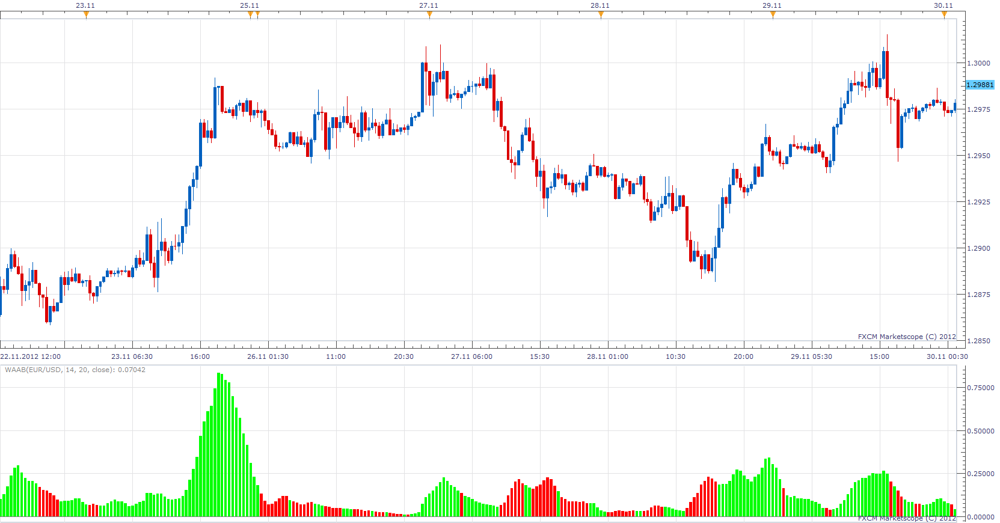
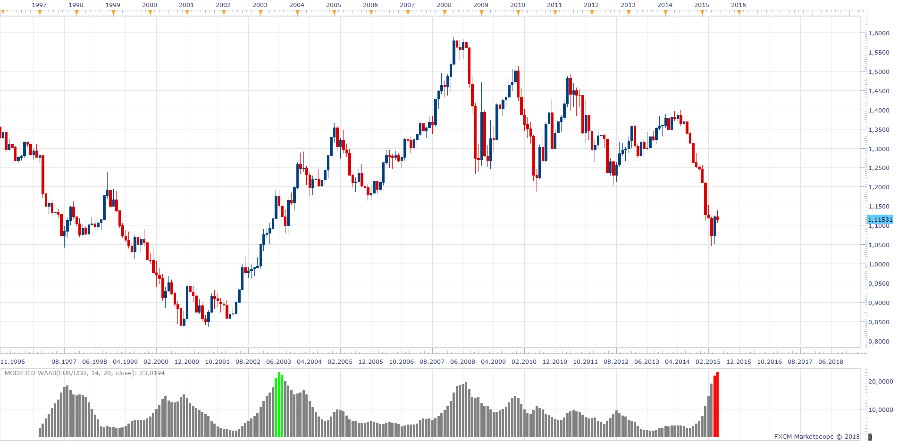

# Waddah Attar ADXxBollinger

> Source: https://fxcodebase.com/code/viewtopic.php?f=17&t=27291  
> Forum: 17 · Topic 27291 · 11 post(s)

---

## Waddah Attar ADXxBollinger

**Apprentice** · Sun Dec 02, 2012 7:02 am

WAAB = (BB TL - BB BL) * ADX

DIP > DIM
Green
DOP < DIM
Red

 [WAAB.lua](files/47653/WAAB.lua)

 [WAAB with Alert.lua](files/47653/WAAB%20with%20Alert.lua)

 [MTF WAAB with Alert.lua](files/47653/MTF%20WAAB%20with%20Alert.lua)

Alert will be given on WAAB/ Level Cross

The indicator was revised and updated

---

## Re: Waddah Attar ADXxBollinger

**Alexander.Gettinger** · Thu Sep 25, 2014 9:49 am

MQL4 version of Waddah Attar ADXxBollinger oscillator: [viewtopic.php?f=38&t=61256](https://fxcodebase.com/code/viewtopic.php?f=38&t=61256).

---

## Re: Waddah Attar ADXxBollinger

**FRO4EX** · Sat May 02, 2015 6:16 am

Hello Apprentice,

1- I would like the ability to add a horizontal line/s at any level.

2- Can an alert be added when the WAAB histogram bar moves above or below the set horizontal line. Alert options should be dialogue box,sound and email.

Thank you for your time and good work!

---

## Re: Waddah Attar ADXxBollinger

**Apprentice** · Mon May 04, 2015 3:23 am

WAAB with Alert.lua Added

---

## Re: Waddah Attar ADXxBollinger

**transformer** · Fri May 08, 2015 8:09 am

hi,

can you **add following option**in waddah attar adx

trend entry line: 20
trend exit line: 75

green: waddah attar adx > trend entry line and waddah attar adx < trend exit line and dip >dim
red:waddah attar adx > trend entry line and waddah attar adx < trend exit line and dip <dim
yellow: other wice

thank you

---

## Re: Waddah Attar ADXxBollinger

**Apprentice** · Mon May 11, 2015 5:07 am

 WAAB > Entry and WAAB < Exit and DIP > DIM then
	Up
 WAAB > Entry and WAAB < Exit and DIP < DIM then
	Down
	else
	Neutral

 [Modified WAAB.lua](files/100390/Modified%20WAAB.lua)

---

## Re: Waddah Attar ADXxBollinger

**FRO4EX** · Thu Oct 08, 2015 6:22 am

Hello Again,

I requested the Waab with Alert line and it's the perfect tool for me.

SO LET'S ADD MORE LINES!! HA

 I would like 3 more lines added ONLY if this modification can be added to prevent too many alerts.

Can each line be set to trigger their alert at a set and chosen Time Frame.
This will allow me to switch between Time Frames without having to RESET the line level to the new Time Frame.

 -All 4 lines will be on the same indicator.
 - Line A will be set at level 15 and active ONLY while indicator is in H1 TF.
 - Line B will be set at level 30 and active ONLY while in H4 TF.
 - And so on for the other lines.

 Additional feature if possible: Lines have option to be set in Background or not. (currently the line in WAAB WITH ALERT is default set to background. If additional lines cannot be added I would settle for the little mod.

Thanks again, You really do great work.

---

## Re: Waddah Attar ADXxBollinger

**Apprentice** · Mon Oct 12, 2015 5:50 am

Your request is added to the development list.

---

## Re: Waddah Attar ADXxBollinger

**Apprentice** · Mon Oct 19, 2015 9:37 am

MTF WAAB with Alert.lua Added.

---

## Re: Waddah Attar ADXxBollinger

**Apprentice** · Thu Dec 03, 2015 7:41 am

Compatibility issue Fix.
_Alert helper is not longer needed.

---

## Re: Waddah Attar ADXxBollinger

**Apprentice** · Sat Aug 05, 2017 4:07 am

The indicator was revised and updated.
