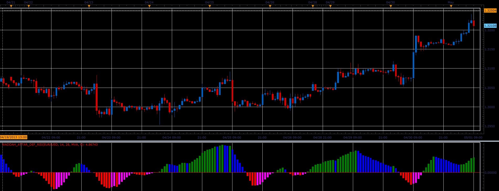

# Waddah_Attar_Def_RSI oscillator

> Source: https://fxcodebase.com/code/viewtopic.php?f=17&t=36266  
> Forum: 17 · Topic 36266 · 2 post(s)

---

## Waddah_Attar_Def_RSI oscillator

**Alexander.Gettinger** · Thu May 02, 2013 10:55 am

This indicator is a ported MQL5 indicator from [http://www.mql5.com/ru/code/1659](http://www.mql5.com/ru/code/1659) (in Russian).

Formula:
WA_Def_RSI[i]=MA(RSI1(Weighted price)-RSI2(Weighted price)).

 

Download:

 [Waddah_Attar_Def_RSI.lua](files/60893/Waddah_Attar_Def_RSI.lua)

For this indicator must be installed Averages indicator ([viewtopic.php?f=17&t=2430](https://fxcodebase.com/code/viewtopic.php?f=17&t=2430)).

The indicator was revised and updated

---

## Re: Waddah_Attar_Def_RSI oscillator

**Apprentice** · Thu May 11, 2017 1:20 pm

Indicator was revised and updated.
