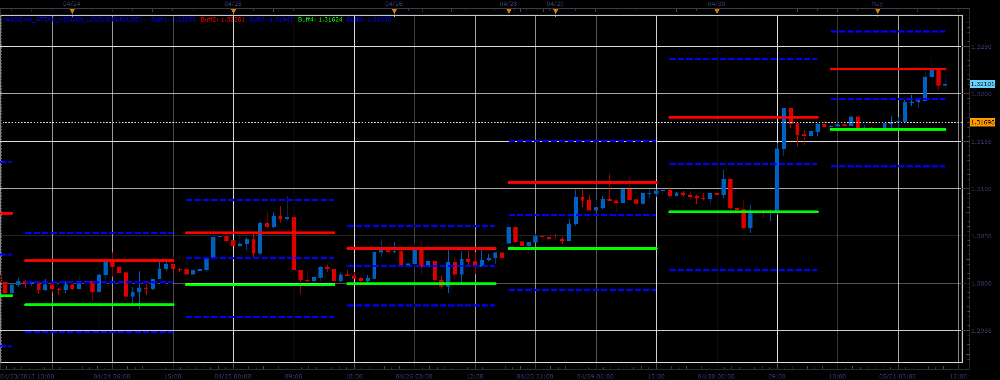

# Waddah Attar Hidden Levels

> Source: https://fxcodebase.com/code/viewtopic.php?f=17&t=36273  
> Forum: 17 · Topic 36273 · 4 post(s)

---

## Waddah Attar Hidden Levels

**Alexander.Gettinger** · Thu May 02, 2013 11:19 am

This indicator is a ported MQL5 indicator from [http://www.mql5.com/ru/code/1668](http://www.mql5.com/ru/code/1668) (in Russian).

The indicator draws support and resistance levels based on the daily charts.

 

Download:

 [Waddah_Attar_Hidden_Levels.lua](files/60900/Waddah_Attar_Hidden_Levels.lua)

The indicator was revised and updated

---

## Re: Waddah Attar Hidden Levels

**gezisLV** · Thu Jan 15, 2015 12:37 pm

Can you make it non-repainting?

---

## Re: Waddah Attar Hidden Levels

**Apprentice** · Mon Jan 19, 2015 3:21 am

Can you suggest how we can achieve this.
As it is now, indicator will reflect the changes in close / high / low price.

If we eliminate all three, it will be another indicator.
If we use the previous period data, the line will vary drastically.

---

## Re: Waddah Attar Hidden Levels

**Apprentice** · Tue Jul 18, 2017 7:42 am

The indicator was revised and updated.
