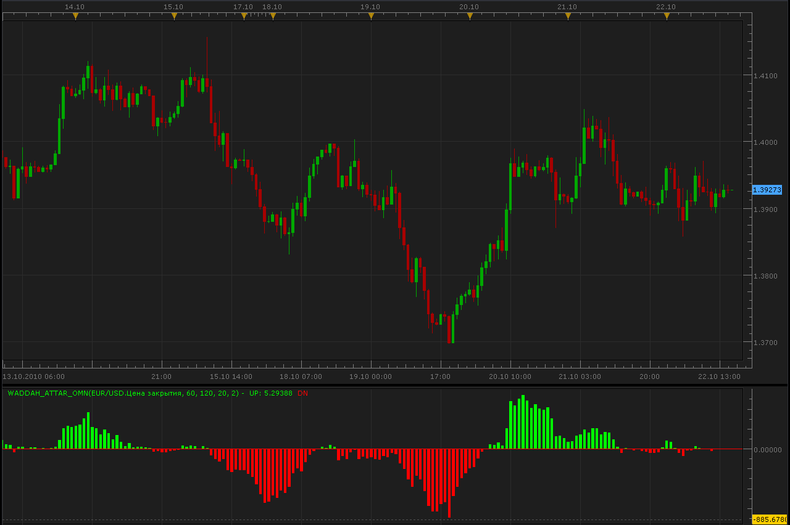

# Waddah_Attar_OMN oscillator

> Source: https://fxcodebase.com/code/viewtopic.php?f=17&t=2500  
> Forum: 17 · Topic 2500 · 2 post(s)

---

## Waddah_Attar_OMN oscillator

**Alexander.Gettinger** · Sun Oct 24, 2010 11:48 am

This is the port of another great Waddah Attar's OMN indicator.
The original indicator can be found here: [viewtopic.php?f=27&t=2479](https://fxcodebase.com/code/viewtopic.php?f=27&t=2479)

 

The indicator was revised and updated

---

## Re: Waddah_Attar_OMN oscillator

**Apprentice** · Mon Jan 30, 2017 7:10 am

Indicator was revised and updated.
