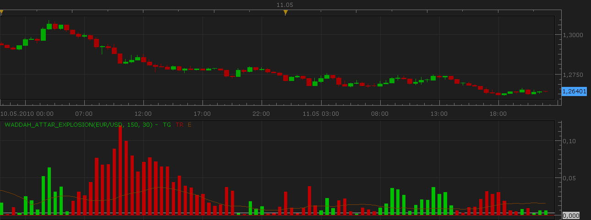
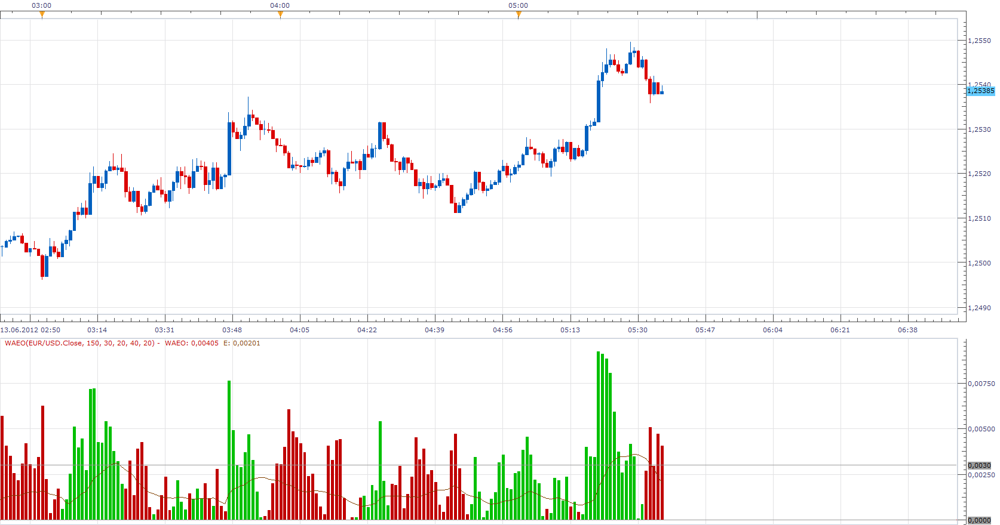

# Waddah Attar's Explosion Oscillator

> Source: https://fxcodebase.com/code/viewtopic.php?f=17&t=1011  
> Forum: 17 · Topic 1011 · 7 post(s)

---

## Waddah Attar's Explosion Oscillator

**Nikolay.Gekht** · Tue May 11, 2010 9:31 pm

This is the port of another great Waddah Attar's indicator.
The original indicator can be found here: [http://codebase.mql4.com/1000](http://codebase.mql4.com/1000)

 

The green bars shows the strength of the up trend.
The red bars shows the strength of the down trend.
The trend lines are calculates as difference b/w the current and the previous values EMA(20) - EMA(40) (the MACD line).

Brown line shows dynamics of volatility.
Brown line is a distance between 20 periods Bollinger's bands with factor 2.

The recommendation is to buy when up trend becomes stronger and volatility increases.
The recommendation is to sell when down trend becomes stronger and volatility increases.

Download:

 [Waddah_Attar_Explosion.lua](files/1892/Waddah_Attar_Explosion.lua)

See also [the signal](https://fxcodebase.com/code/viewtopic.php?f=29&t=1012) based on this indicator.

The indicator was revised and updated

---

## Re: Waddah Attar's Explosion Oscillator

**NID007** · Fri Mar 04, 2011 4:50 pm

Have you developed a stratergy that trades the Waddah Attar's Explosion Oscillator,,,
I have the Signal and indicator from this site ,just would like the stratergy file ,I think it would be very useful ,

many thanks in advance .
Nid007

---

## Re: Waddah Attar's Explosion Oscillator

**Apprentice** · Wed Jun 13, 2012 4:37 am

This is an updated version.
These changes are made.
Indicator is Now using the Tick as Source.
Indicator Output is now single stream.
Now is it possible to change individual parameters.
Indicator have Improved performance.

 [WAEO.lua](files/35443/WAEO.lua)

---

## Re: Waddah Attar's Explosion Oscillator

**Alexander.Gettinger** · Wed Jun 13, 2012 9:07 am

> **NID007 wrote:**
> Have you developed a stratergy that trades the Waddah Attar's Explosion Oscillator,,,
> I have the Signal and indicator from this site ,just would like the stratergy file ,I think it would be very useful ,
>
> many thanks in advance .
> Nid007

Strategy based on the Waddah Attar's Explosion Oscillator: [viewtopic.php?f=31&t=20168](https://fxcodebase.com/code/viewtopic.php?f=31&t=20168)

---

## Waddah Attar's Explosion Oscillator Sound Alerts

**Overtherainbow** · Sat Oct 27, 2012 5:21 am

Hi Apprentice! Can you please create a sound alert when the bar of waeo indicator change colour?
And, if possible, to create another sound alert when the bar, crossing the sensivity line give an entry signal?
Many thanks for your work and help.
Overtherainbow

---

## Re: Waddah Attar's Explosion Oscillator

**Apprentice** · Sun Oct 28, 2012 4:30 am

Your request is added to the development list.

---

## Re: Waddah Attar's Explosion Oscillator

**Apprentice** · Mon May 01, 2017 4:59 am

Indicator was revised and updated.
