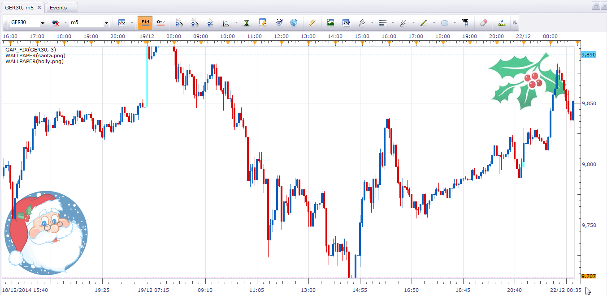
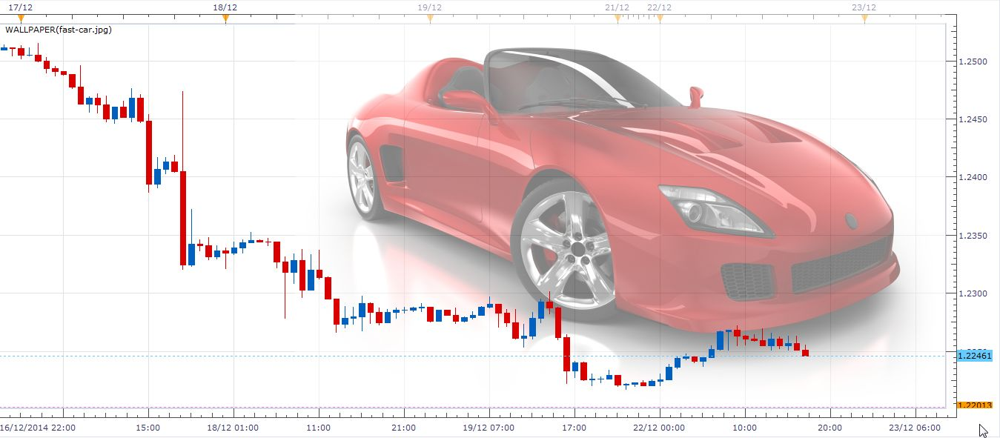
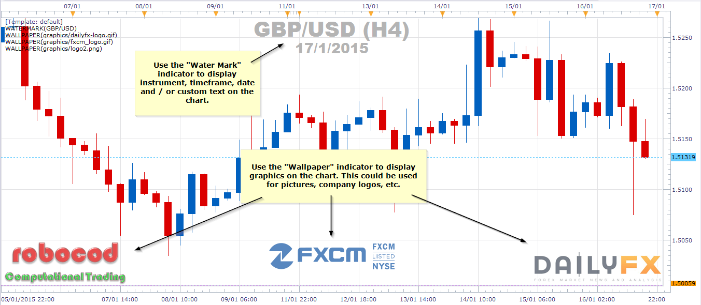

# Wallpaper for MarketScope

> Source: https://fxcodebase.com/code/viewtopic.php?f=17&t=61623  
> Forum: 17 · Topic 61623 · 5 post(s)

---

## Wallpaper for MarketScope

**robocod** · Mon Dec 22, 2014 9:32 am

Something I've been meaning to do for a while - a "wallpaper" tool for MarketScope. You can use it for anything, but since it's nearly Christmas - here's a little seasonal example for you.

 

Here's the indicator / tool:

 [wallpaper.lua](files/97827/wallpaper.lua)

Simply enter the full file-name of your graphic, the size of the graphic and the desired position (e.g. top-left, middle-centre, etc.). You can also select a colour for transparent mode, and the overall transparency.

Notes:

- The default path for finding the graphic files is normally the TradingStation install path, i.e. "C:\Program Files (x86)\Candleworks\FXTS2". But you can specify any path and file-name (remember to add the extension, e.g. png, bmp, jpeg, etc.). I think it is also case sensitive - sorry it is TradingStation limitation.
- You need to enter the graphic's size (width and height) manually. You can get this from Windows, e.g. file properties or mouse-over the file and it should tell you. Resize the graphic if required.

More information on my [blog](http://robocod.blogspot.co.uk/2014/12/a-gift-for-holidays.html).

Enjoy

The indicator was revised and updated

---

## Re: Wallpaper for MarketScope

**robocod** · Mon Dec 22, 2014 4:56 pm

Another example of the wallpaper tool for MarketScope 2.0. It supports several graphic formats (including png, bmp and jpeg). The tool can not do any resizing, so if necessary you might have to resize the graphic with an external editor (e.g. Paint, XnView or most graphics editing applications).

You can use it for your favourite car, dog, family pics, company logos, etc.

 

---

## Re: Wallpaper for MarketScope

**Valeria** · Mon Dec 22, 2014 11:47 pm

Hi robocod,

Great tool! I know the users who asked about the ability to upload wallpapers to the charts. Good Christmas gift for them Thank you.

---

## Re: Wallpaper for MarketScope

**robocod** · Sat Jan 17, 2015 8:45 am

Looks good with company logos.

 

---

## Re: Wallpaper for MarketScope

**Apprentice** · Sun Jul 02, 2017 12:56 pm

Bump up.
