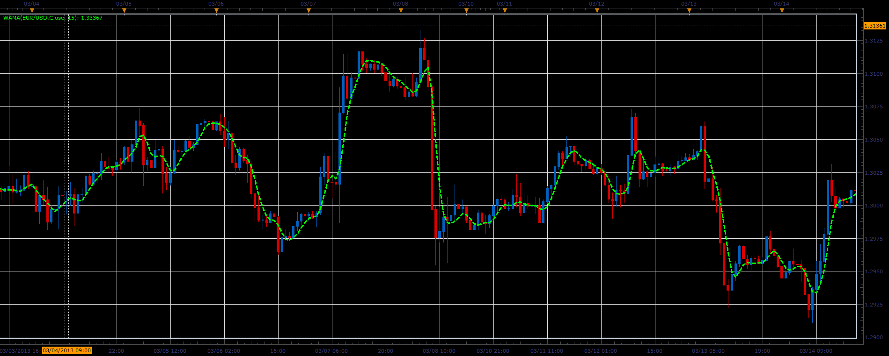

# Wama indicator

> Source: https://fxcodebase.com/code/viewtopic.php?f=17&t=41293  
> Forum: 17 · Topic 41293 · 2 post(s)

---

## Wama indicator

**Alexander.Gettinger** · Tue Jun 18, 2013 1:05 pm

This indicator is a ported MQL5 indicator from [http://www.mql5.com/en/code/1661](http://www.mql5.com/en/code/1661)

Formulas:
Wama[i] = EMA[i]+vel+acc/2+a/6, where
vel[i] = EMA[i]-EMA[i-Period/4],
acc[i] = EMA[i]-2*EMA[i-Period/4]+EMA[i-Period/8],
a[i] = EMA[i]-3*EMA[i-Period/4]+3*EMA[i-Period/8]-EMA[i-Period/12].

 

Download:

 [wama.lua](files/67516/wama.lua)

The indicator was revised and updated

---

## Re: Wama indicator

**Apprentice** · Sat May 27, 2017 11:39 am

Indicator was revised and updated.
