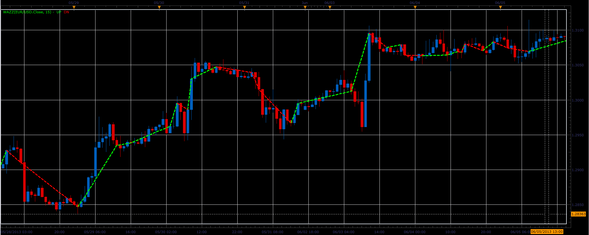

# Wama zigzag

> Source: https://fxcodebase.com/code/viewtopic.php?f=17&t=41304  
> Forum: 17 · Topic 41304 · 2 post(s)

---

## Wama zigzag

**Alexander.Gettinger** · Tue Jun 18, 2013 2:22 pm

The indicator takes on the basis of extremes of the Wama ([viewtopic.php?f=17&t=41293](https://fxcodebase.com/code/viewtopic.php?f=17&t=41293)).

 

Download:

 [wazz.lua](files/67531/wazz.lua)

The indicator was revised and updated

---

## Re: Wama zigzag

**Apprentice** · Sat May 27, 2017 11:45 am

Indicator was revised and updated.
