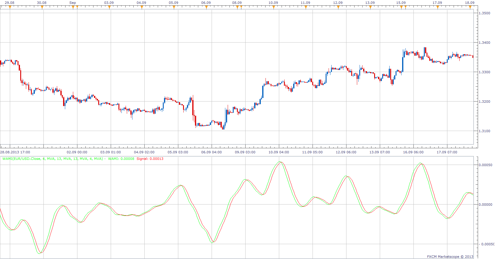

# Warren Momentum Indicator

> Source: https://fxcodebase.com/code/viewtopic.php?f=17&t=59583  
> Forum: 17 · Topic 59583 · 3 post(s)

---

## Warren Momentum Indicator

**Apprentice** · Thu Sep 26, 2013 4:09 am

As described in Article Optimizing Momentum by Anthony W. Warren, Ph.D.
S&C magazine, Apr 1994

 [WAMI.lua](files/89707/WAMI.lua)

---

## Re: Warren Momentum Indicator

**Alexander.Gettinger** · Fri Sep 12, 2014 3:47 pm

MQL4 version of Warren Momentum Indicator: [viewtopic.php?f=38&t=61133](https://fxcodebase.com/code/viewtopic.php?f=38&t=61133).

---

## Re: Warren Momentum Indicator

**Apprentice** · Wed Aug 08, 2018 3:59 am

The indicator was revised and updated.
