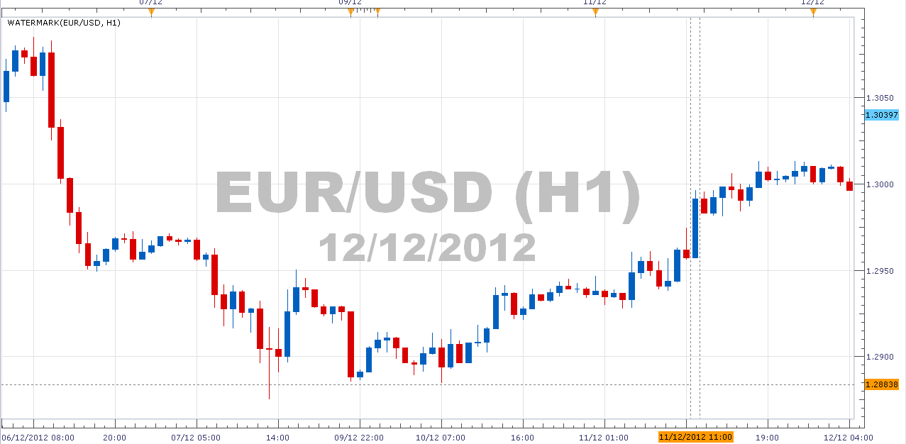
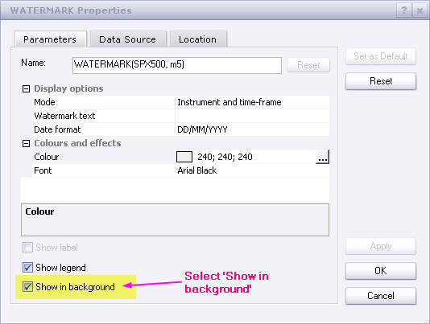

# Watermark

> Source: https://fxcodebase.com/code/viewtopic.php?f=17&t=27637  
> Forum: 17 · Topic 27637 · 29 post(s)

---

## Watermark

**robocod** · Wed Dec 12, 2012 12:19 pm

This indicator simply displays some 'watermark' text at the centre of the chart. This text is the instrument's name, or custom text that you can enter. The date can also be added, in DD/MM/YYYY or MM/DD/YYYY formats.

The indicator might be of use to you if you take screenshots of the charts for your journal or to post on forums.

For best result the text colour should be very close to the background colour, e.g. pale grey when using white background, or dark grey when using black background, etc. I made it a little darker than normal in the screenshot below - just so it would show up well on the screen capture. When displaying the instrument's name, there are 2 formats - with or without the timeframe period, e.g. "EUR/USD" or "EUR/USD (H1)".

Best shown by the following example...

 

The indicator should be put in the background, as shown here...

 

Here's the code (latest version, dated 27/June/2014) ...

 [watermark.lua](files/48351/watermark.lua)

MT4/MQ4 version
[viewtopic.php?f=38&t=70752](https://fxcodebase.com/code/viewtopic.php?f=38&t=70752)

---

## Re: Watermark

**robocod** · Wed Dec 12, 2012 3:06 pm

Bug-fix version up-loaded (I messed up with date value).

---

## Re: Watermark

**nazaar** · Fri Jan 18, 2013 3:10 pm

Hello,

could you add an option for user to adjust font size and location of watermark? top, bottom, left and right?

thanks.

---

## Re: Watermark

**robocod** · Fri Jan 18, 2013 7:47 pm

> **nazaar wrote:**
> Hello,
>
> could you add an option for user to adjust font size and location of watermark? top, bottom, left and right?
>
> thanks.

Hmm, this was trickier than I thought - messing around with point sizes (1/72 of inch) to get it spaced properly depending on font sizes, and position - but I think I managed it. Please see attached.

---

## Re: Watermark

**nazaar** · Sat Jan 19, 2013 11:08 am

> **robocod wrote:**
> Hmm, this was trickier than I thought - messing around with point sizes (1/72 of inch) to get it spaced properly depending on font sizes, and position - but I think I managed it. Please see attached.
>
>
>
> watermark.lua

Brilliant! Thank you!

---

## Re: Watermark

**Apprentice** · Sat Jan 19, 2013 5:26 pm

Here you can find a template that provides a basic mechanism for easy change of orientation for labels. Label Positioning Template Support top-right, top-lef, bottom-left, bottom-right, center and price orientations.
[download/file.php?id=5228](https://fxcodebase.com/code/download/file.php?id=5228)

---

## Re: Watermark

**rplust** · Mon Feb 18, 2013 6:34 am

Hi,
the watermark is great. I always was looking for something like this but actually to display the current price? Is it too much to ask if you can do that as an option to chose (price only and/or together)? Thank you!

---

## Re: Watermark

**robocod** · Mon Feb 25, 2013 1:28 pm

> **rplust wrote:**
> Hi,
> the watermark is great. I always was looking for something like this but actually to display the current price? Is it too much to ask if you can do that as an option to chose (price only and/or together)? Thank you!

Hi, thanks for your interest and question. However, I don't plan to add to current price to the indicator (I don't really see the value in it). Sorry.

---

## Re: Watermark

**Silverthorn** · Sun Dec 22, 2013 4:11 pm

Is it possible to make the Watermark Text specific to the currency pair. I have been using the Watermark text in my top down analysis. Sort of like a trading journal that lives on the chart.

At to centre I put M1 analysis eg. "M1-Long 3mth trend resistance at 1.3456"
Bottom Left W1 analysis eg. "W1-Short pin bar at top of rally"
Bottom Centre D1 analysis eg. "D1-Short 3rd bar of short trend"
Bottom Right H8 analysis eg. "H8-Range Bound 1.234-1.254"

That way I can see at a glance what my overall view of the pair is. The only problem is that I then have to save a snapshot to be able to recall for each pair. If I change the pair from the drop down I am looking at the analysis for the original pair displayed on the wrong chart and on a number of occasions this has almost been very costly.

I know this is not really what the Watermark was designed for but I find it a very useful but risky tool and one that I am sure others would find benefit in being able to keep notes specific to each pair n their charts. You can use the Label tool for this but it does not always stay visible on the chart when changing time frames or zooming like the watermark does.

---

## Re: Watermark

**Apprentice** · Mon Dec 23, 2013 11:47 am

This task is not appropriate for this indicator.
The best way to achieve this, is to write an entirely new indicator.
Which will have its own repository, and will be able to recognize chart Time Frame and currency pair.

---

## Re: Watermark

**Silverthorn** · Mon Dec 23, 2013 4:04 pm

Thanks for your reply but it only needs to recognise currency pair. The text needs to be the same and visible across all time frames. Are you able to add this to the development que?

---

## Re: Watermark

**Apprentice** · Mon Dec 23, 2013 4:11 pm

I hope this will be satisfactory.
[viewtopic.php?f=17&t=60142](https://fxcodebase.com/code/viewtopic.php?f=17&t=60142)

---

## Re: Watermark

**speedytina** · Sat Jan 18, 2014 1:02 pm

Hi;

Can positioning fields on this indicator be changed so that watermark can be placed anywhere on the chart that I choose. See [http://www.forex-tsd.com/metatrader-4/17336-text-writer-indicator.html](http://www.forex-tsd.com/metatrader-4/17336-text-writer-indicator.html) for an example of what I am looking for. I want to be able to build a multi-point "trading plan" template that I can always have in front of me on my charts. I would need more exact positioning capability than just top, bottom, left, right etc.

Thanks

> **Apprentice wrote:**
>
>
> watermark.png
>
>
> rplust Try My version.
>
>
> watermark.lua

---

## Re: Watermark

**Apprentice** · Sun Jan 19, 2014 5:43 am

I believe that for this purpose, the best tool is MarketScope Build in Lebel Tool.

---

## Re: Watermark

**speedytina** · Mon Jan 20, 2014 2:37 am

Thanks Apprentice; but won't labels move out of site as the chart advances? I'm looking for something that will always show along the left edge of the chart window in a similar way that chart "legends" are always in fixed positions. My Idea is to make a "layout" with my trading plan in list form which will always be visable at the left edge of the chart...

**EXAMPLE:**
Rule 1...
Rule 2...
Rule 3...
etc
etc

Thanks,
Ian

> **Apprentice wrote:**
> I believe that for this purpose, the best tool is MarketScope Build in Lebel Tool.

---

## Re: Watermark

**Apprentice** · Mon Jan 20, 2014 3:39 am

Something similar to Repository?
[viewtopic.php?f=17&t=60142](https://fxcodebase.com/code/viewtopic.php?f=17&t=60142)

---

## Re: Watermark

**speedytina** · Mon Jan 20, 2014 11:06 am

> **Apprentice wrote:**
> Something similar to Repository?
> [viewtopic.php?f=17&t=60142](https://fxcodebase.com/code/viewtopic.php?f=17&t=60142)

Ha! Great minds **DO** think alike.

I had already looked at the the "Repository.lua". In fact, it was that thread that gave me the idea to put my trading plan on every chart. All I need is the text line and the ability to place each line in an x/y axis so I can place each line under each other. See image for mock-up with with text at left edge of chart. I wouldnt need the stuff that is hi-lited in yellow in the top right corner. Display options are disabled. All the different colors for different time frames is not needed.
In short, all that is really needed are text line, font size and font color and positioning ability. Once I get everything set up I can save the layout and then apply it to all charts.

Apprentice, I feel bad that I'm taking up so much of your time on this. I am forever amazed at the work you guys do and how helpful you are.

Regards,
Ian

---

## Re: Watermark

**Apprentice** · Tue Jan 21, 2014 3:43 am

If I understood, U can have different (One) trading plan per time frame.

---

## Re: Watermark

**speedytina** · Tue Jan 21, 2014 8:44 pm

> **Apprentice wrote:**
> If I understood, U can have different (One) trading plan per time frame.

Right now I'm only interested in the daily time frame, but yes, in theory I could have different trading plans for different time frames. In that case I would just create separate trading plan layouts for each different time frame and apply them to charts as needed.

---

## Re: Watermark

**kitefrog** · Wed May 04, 2016 11:56 am

Can the watermark indicator be changed and given options to place it in the corners, or across the top, having it only in the middle is slightly annoying? thanks

---

## Re: Watermark

**Apprentice** · Thu May 05, 2016 4:18 am

Try it now (First/Topmost topic of this topic)

---

## Re: Watermark

**Apprentice** · Sun Feb 04, 2018 1:37 pm

The indicator was revised and updated.

---

## Re: Watermark

**Apprentice** · Sun Nov 01, 2020 3:52 pm

Watermark With Placement.lua added.

---

## Re: Watermark

**Apprentice** · Mon Dec 14, 2020 11:00 am

Updated.

---

## Re: Watermark

**Mountaintrader** · Fri Jan 06, 2023 1:40 pm

Hi Apprentice,

Can the .Lua tick charts accept the watermark indicator ?

Regards

Mountain Trader

---

## Re: Watermark

**Apprentice** · Sat Jan 07, 2023 5:37 am

Sure

---

## Re: Watermark

**Mountaintrader** · Thu Feb 16, 2023 12:28 pm

Hi Apprentice,

Thank you for the indicator.

When applied to either candle stick or tick charts, I found that with the Date Format selected to "OFF" the date is still permanently displayed, possible bug ?

Regards

Mountain Trader

---

## Re: Watermark

**Apprentice** · Wed Feb 22, 2023 3:23 am

Try it now.

---

## Re: Watermark

**Mountaintrader** · Wed Feb 22, 2023 9:41 am

Hi
