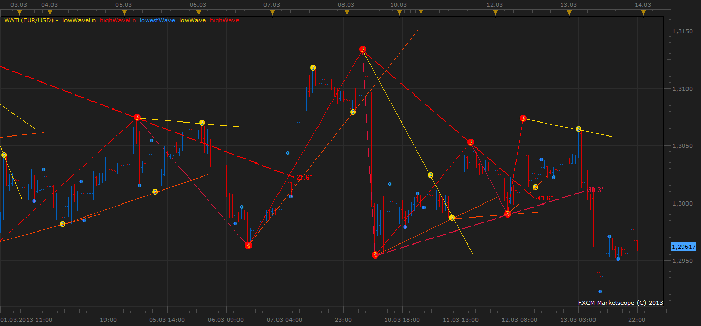

# WATL

> Source: https://fxcodebase.com/code/viewtopic.php?f=17&t=33299  
> Forum: 17 · Topic 33299 · 4 post(s)

---

## WATL

**GitSMR** · Wed Mar 13, 2013 11:32 pm

 

Indicator WATL is based on detection of waves by means of the analysis of intersections slow sliding by average fast sliding average. Waves in the indicator are defined three classes: the high, low and lowest periods. After determination of waves the indicator builds trend lines on points of the beginning and end of each wave.

 [WATL.lua](files/56526/WATL.lua)

---

## Re: WATL

**ericagnes** · Thu Mar 14, 2013 6:02 am

very great indicator, it's similar to wati indicator on mt4.

one question : this indicator repaints or not?

---

## Re: WATL

**GitSMR** · Thu Mar 14, 2013 7:32 am

Yes, repaints last semafor is possible, as the last formed bar is used.
Besides, the indicator always redefines the last semaphore of each class of waves
For the fast sliding it is used Simple Moving Average which uses the closing prices
For the slow sliding it is used Linear Weighted Moving Average which uses the weighed price

---

## Re: WATL

**Apprentice** · Wed Feb 21, 2018 6:40 am

The Indicator was revised and updated.
