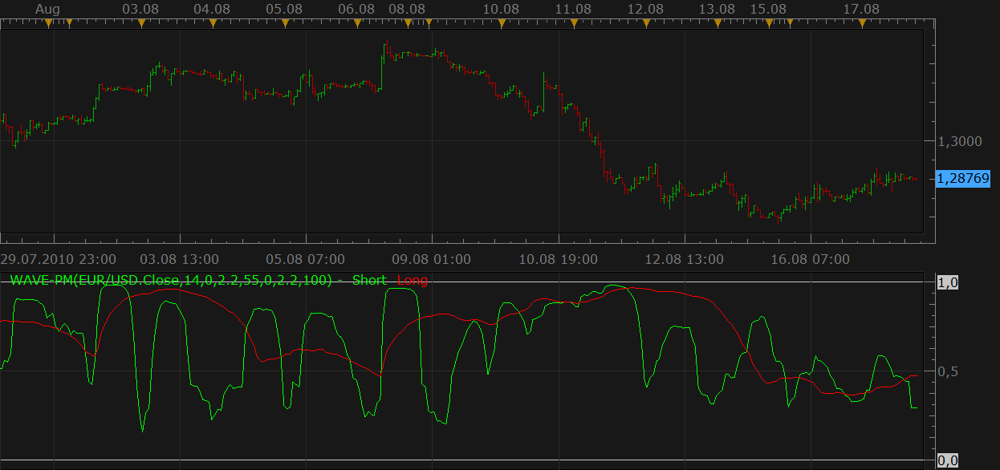

# WAVE-PM (Whistler's Active Volatility Energy - Price Mass)

> Source: https://fxcodebase.com/code/viewtopic.php?f=17&t=1848  
> Forum: 17 · Topic 1848 · 22 post(s)

---

## WAVE-PM (Whistler's Active Volatility Energy - Price Mass)

**Nikolay.Gekht** · Tue Aug 17, 2010 5:46 pm

The is a port of one of wonderful indicators described in the Mark Whistler's "Volatility illuminated" book. For details about the indicator please follow [www.fxvolatility.com](http://www.fxvolatility.com/) site to buy an e-book version of the book or buy a [paper version of the book](https://www.amazon.com/Volatility-Illuminated-Empowering-Options-Futures/dp/1441490795/ref=ntt_at_ep_dpt_4) at amazon. The book is really good and worth to buy it.

Note: The indicator is a bit optimized during porting, however the result are carefully checked against the MT4 version with different sets of the parameters.

 



Download the indicator:

 [WAVE-PM.lua](files/3686/WAVE-PM.lua)

MT4 / MQ4 version can be found here.
[viewtopic.php?f=38&t=64011](https://fxcodebase.com/code/viewtopic.php?f=38&t=64011)

The indicator was revised and updated

---

## Re: WAVE-PM (Whistler's Active Volatility Energy - Price Mass)

**sinbad** · Tue Aug 17, 2010 6:33 pm

Thank you very much !

Thanks again.

---

## Re: WAVE-PM (Whistler's Active Volatility Energy - Price Mass)

**patick** · Wed Aug 18, 2010 6:28 am

This is a game changer. I cannot remember the last time I, literally, could not stop reading a book from start to end.

I'm assuming as soon as volume is avail in MarketScope, you'll be converting the VWAP indicator, too?

Thank you very much for the WAVE PM! I could've made 50-75 pips tonight using it... if I could've stop reading the ebook But, there's always tomorrow.

---

## Re: WAVE-PM (Whistler's Active Volatility Energy - Price Mass)

**gcardo** · Sat Aug 28, 2010 9:22 am

Hi Nikolay,

Now that we have volume avail in MarketScope, is it possible to create a VWAP and WVAV indicators as described in the book?

Thank you
Gustavo

---

## Re: WAVE-PM (Whistler's Active Volatility Energy - Price Mass)

**Apprentice** · Sat Aug 28, 2010 2:49 pm

Indicator that you are looking for is already written.
It will be loaded as well as many other volume based indicators during the next week.

---

## Re: WAVE-PM (Whistler's Active Volatility Energy - Price Mass)

**gcardo** · Sat Sep 11, 2010 6:26 pm

Hi Apprentice,
Is VWAP and WVAV indicators already ready at marketscope 2.0?
I can't find them on my indicators.
If so, can you plwase send me a link where I can download them?

Thanks again
Gustavo

---

## Re: WAVE-PM (Whistler's Active Volatility Energy - Price Mass)

**Apprentice** · Sun Sep 12, 2010 4:17 am

Requested indicator has not yet officially available.
But you can download it here.

 [VAMA.lua](files/4415/VAMA.lua)

---

## Re: WAVE-PM (Whistler's Active Volatility Energy - Price Mass)

**gcardo** · Sun Sep 12, 2010 6:19 pm

Thanks

---

## Re: WAVE-PM (Whistler's Active Volatility Energy - Price Mass)

**fxdirekt** · Thu Apr 05, 2012 6:17 am

This is a great indicator. Thanks for programming it.
However I wonder whether it would be possible to improve the indicator by enabling to color code the slope of the indicator lines.

Thanks for considering this.

---

## Re: WAVE-PM (Whistler's Active Volatility Energy - Price Mass)

**Apprentice** · Thu Apr 05, 2012 7:15 am

Your request is added to the development list.

---

## Re: WAVE-PM (Whistler's Active Volatility Energy - Price Mas

**Apprentice** · Tue Oct 28, 2014 3:22 am

Update.

---

## Re: WAVE-PM (Whistler's Active Volatility Energy - Price Mas

**Asack55** · Thu Jun 16, 2016 12:51 pm

I second fxdirekt's comment. Color coded sloping would be a massive improvement. Any possibility for assistance on this? Thankyou!

---

## Re: WAVE-PM (Whistler's Active Volatility Energy - Price Mas

**Apprentice** · Sun Jun 19, 2016 3:32 am

Color Option Added.

---

## Re: WAVE-PM (Whistler's Active Volatility Energy - Price Mas

**jaricarr** · Sun Jun 19, 2016 1:28 pm

Hi all,

Just wanted to share this link to Mark Whistlers videos in YouTube.

[https://youtu.be/lfPehe_x8h0](https://youtu.be/lfPehe_x8h0)

Thanks,
JariCarr

---

## Re: WAVE-PM (Whistler's Active Volatility Energy - Price Mas

**jaricarr** · Tue Jun 21, 2016 1:14 pm

Hi,

Can someone please explain how to use this indicator ?

Thanks,

---

## Re: WAVE-PM (Whistler's Active Volatility Energy - Price Mas

**Asack55** · Fri Jun 24, 2016 8:31 am

To get a really clear view of how this works you need to read the book Volatility illuminated. Essentially it is two normalized bollinger bands, readings below .5 tells us that the market is compressed and that there may be a strong move soon .9 tells us that the move is pushing full throttle. The indicator is not directional, it is only concerned with volatility. Take a look at your chart on the daily and mark places where the short term and long term compression are below .5 and what happens as price moves above .5 to get an idea of how this works.

---

## Re: WAVE-PM (Whistler's Active Volatility Energy - Price Mas

**jaricarr** · Sun Jun 26, 2016 6:01 pm

Thanks for your reply Asack5,

Will give your recommendations a try.

Be well,
JariCarr

---

## Re: WAVE-PM (Whistler's Active Volatility Energy - Price Mas

**Asack55** · Tue Aug 09, 2016 2:33 pm

Is it possible to create an alert strategy when the long line crosses above .5?

---

## Re: WAVE-PM (Whistler's Active Volatility Energy - Price Mas

**Apprentice** · Wed Aug 10, 2016 4:31 am

Strategy is available here.
[viewtopic.php?f=31&t=63746](https://fxcodebase.com/code/viewtopic.php?f=31&t=63746)

---

## Re: WAVE-PM (Whistler's Active Volatility Energy - Price Mas

**Asack55** · Fri Oct 21, 2016 6:43 pm

Anybody know if there is an MT4 version of this indicator? Been looking and the links to purchse them are dead.

---

## Re: WAVE-PM (Whistler's Active Volatility Energy - Price Mas

**Apprentice** · Sat Oct 22, 2016 6:25 am

MT4 / MQ4 version can be found here.
[viewtopic.php?f=38&t=64011](https://fxcodebase.com/code/viewtopic.php?f=38&t=64011)

---

## Re: WAVE-PM (Whistler's Active Volatility Energy - Price Mas

**Asack55** · Sun Nov 20, 2016 4:53 pm

Is it possible to port over a version of WVAV? I noticed the VAMA indicator used time based periods instead of the 5000/10000 tick levels used in WVAV.

```
Copyright © Mark Whistler 2009 / fxVolatility.com.   //+--------------------------------------------------+ //|Whistler Volume Adjusted Volatility - WVAV       | //|                                                 | //| Copyright 2009, fxVolatility.com                | //| Authors: Mark Whistler/EcTrader.net             | //| [[email protected]](https://fxcodebase.com/cdn-cgi/l/email-protection)                     | //|www.WallStreetRockStar.com|www.fxVolatility.com. | //+--------------------------------------------------+ #property copyright "Copyright 2009, Mark Whistler" #property link "http://www.wallstreetrockstar.com"     //---- #property indicator_chart_window #property indicator_buffers 5 #property indicator_color1 Red #property indicator_color2 DarkGoldenrod #property indicator_color3 Black   #property indicator_color4 Black #property indicator_color5 Black //---- input parameters extern int MA_Ticks = 10000; extern int MA_Shift = 0; extern int MA_Start = 500; //---- indicator parameters1 extern string aa="*****************************"; //---- indicator parameters extern bool MidBandVisible=false; extern int    BandsPeriod=14; extern int    BandsShift=0; extern double BandsDeviations=3.2;   //---- indicator buffers double ExtMapBuffer[]; double ExpVolBuffer[]; //---- buffers //---- double MovingBuffer[]; double UpperBuffer[]; double LowerBuffer[]; //--------------     //+---------------------------------------------------+ //|Custom Indicator Initialization                    | //+---------------------------------------------------+     int init()   { //----    SetIndexStyle(0, DRAW_LINE);

   SetIndexShift(0, MA_Shift); //---- indicator buffers mapping    SetIndexBuffer(0, ExtMapBuffer);    SetIndexStyle(1, DRAW_NONE);    SetIndexBuffer(1, ExpVolBuffer);    SetIndexDrawBegin(0, 0);  //---- initialization done //---- indicators    SetIndexStyle(2,DRAW_LINE);    SetIndexBuffer(2,ExtMapBuffer);    SetIndexStyle(3,DRAW_LINE);    SetIndexBuffer(3,UpperBuffer);    SetIndexStyle(4,DRAW_LINE);    SetIndexBuffer(4,LowerBuffer);   //----    SetIndexDrawBegin(2,BandsPeriod+BandsShift);    SetIndexDrawBegin(3,BandsPeriod+BandsShift);    SetIndexDrawBegin(4,BandsPeriod+BandsShift);    return(0);   }   //+---------------------------------------------------+ //|Custom Indicator Initialization                    | //+---------------------------------------------------+     int start()   {    int counted_bars = IndicatorCounted();

   int rest  = Bars - counted_bars;    int restt = Bars - counted_bars;    double sumVol;                                  int ts;                                      int evol;                                    int volsum;    int j;    int i;      //---------------Begin Add MA-----------------------    double deviation;    double sum, oldval,newres; //----    if(Bars<=BandsPeriod) return(0); //---- initial zero    if(counted_bars<1)       for(i=1;i<=BandsPeriod;i++)         {          ExtMapBuffer[Bars-i]=EMPTY_VALUE;          UpperBuffer[Bars-i]=EMPTY_VALUE;          LowerBuffer[Bars-i]=EMPTY_VALUE;         }   int limit=Bars-counted_bars;    if(counted_bars>0) limit++;    for(i=0; i<limit; i++)       {         ExtMapBuffer[i]=iMA(NULL,0,BandsPeriod,BandsShift,MODE_SMA,PRICE_CLOSE,i);       }

   //---------------End Add MA-----------------------     //---------Begin Volume MA--------------------------      while(restt >= 0)      {        volsum = 0;        for(int k = 0; k < 30; k++)            volsum += iVolume(NULL, 0, restt + k*24);        ExpVolBuffer[restt] = volsum / 30;        restt--;      } //----    while(ExpVolBuffer[rest] == 0 && rest >= 0)        rest--;    rest -= MA_Ticks / 200;    if(rest > MA_Start)        rest = MA_Start;  //----    while(rest >= 0)      {        sumVol = 0;        ts = 0;        j = rest;        while(ts < MA_Ticks)          {            evol = ExpVolBuffer[j];   //----         Print("Evol = ", evol);            if(ts + evol < MA_Ticks)              {

               sumVol += evol * Open[j];                ts += evol;              }            else              {                sumVol += (MA_Ticks - ts) * Open[j];                ts = MA_Ticks;              }            j++;          }        ExtMapBuffer[rest] = sumVol / MA_Ticks;        rest--;      }     //----------------------End Volume MA-----------------    //---------------------Begin Bollinger Band-----------     //----      i=Bars-BandsPeriod+1;    if(counted_bars>BandsPeriod-1) i=Bars-counted_bars-1;    while(i>=0)      {       sum=0.0;       k=i+BandsPeriod-1;       oldval=ExtMapBuffer[i];       while(k>=i)         {          newres=Close[k]-oldval;          sum+=newres*newres;

         k--;         }       deviation=BandsDeviations*MathSqrt(sum/BandsPeriod);       UpperBuffer[i]=oldval+deviation;       LowerBuffer[i]=oldval-deviation;       i--;      } //----   //-----------------------End Band--------------------- //----    return(0);
```
