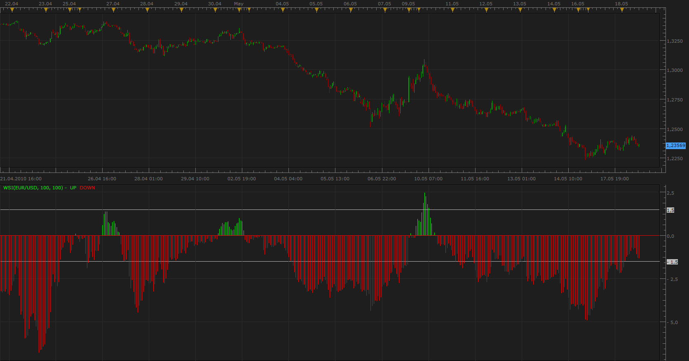

# Wave Segregation Index - WSI

> Source: https://fxcodebase.com/code/viewtopic.php?f=17&t=1060  
> Forum: 17 · Topic 1060 · 6 post(s)

---

## Wave Segregation Index - WSI

**Apprentice** · Wed May 19, 2010 9:13 am

*WSI*

The indicator has been written on request and based on the concept given by the user.

WSI = (CCI[100]*TypicalPrice * ADX[100]) / 1000

Purpose of indicators is Elliot wave count.
The overbought & oversold lines for this indicator are +1.5 & -1.5

 [WSI.lua](files/2012/WSI.lua)

MT4/Mq4 version.
[viewtopic.php?f=38&t=64458](https://fxcodebase.com/code/viewtopic.php?f=38&t=64458)

The indicator was revised and updated

---

## Re: Wave Segregation Index - WSI

**WWMMACAU** · Fri May 21, 2010 10:43 am

Hi Apprentice,
Can you explain how to Elliot wave count.

Thanks

---

## Re: Wave Segregation Index - WSI

**Apprentice** · Sat May 22, 2010 4:57 am

The indicator has been written on request from Summerset.

[http://fxcodebase.com/code/viewtopic.php?f=27&t=1049&start=0](https://fxcodebase.com/code/viewtopic.php?f=27&t=1049&start=0)

I think he is the authority for this indicator.

I have not had time to do analysis.

It seems that Crossover of WSI below or above the zero line indicate the formation of a new Elliot wave.

---

## Re: Wave Segregation Index - WSI

**summerset** · Sat May 22, 2010 1:12 pm

The indicator filters out wave 3 breakouts pending a wave 1-2, on the assumption that a trader can only trade a wave 3 breakout on any frame.

When ever the cycle WSI (100 periods) breaks > 1.5 or <-1.5, a bull or bear w-3 has broken out. And can be counted into a 5-3 sequence on the pulse WSI (14 periods).

The oscillator has the following applications;-

1- The trader can take signals of the 14 period WSI, once the cycle (100 period) WSI is >1.5 or below 1.5.

2- The trader can acurately count a complete Elliot cycle using the pulse WSI between 2 cycle bottoms on the cycle WSI, enabling the trader to enter at the end of a cyclic correction.

3- Using specific values from the WSI higher cycle, the trader can tell when a Wave 1-2 swing pivot is about to breakout into a wave -3 to make an early entry.

These 3 aspects are best explained, and how to implement them- with examples, on slides that I will mail WWMMACAU , and any other interested parties in the Oscillator's use.

All the Best
Sincere Regards
Summerset

---

## Re: Wave Segregation Index - WSI

**Alexander.Gettinger** · Tue Feb 01, 2011 11:22 pm

Modification of indicator with border line for suitable use in strategies.
Download:

 [WSI2.lua](files/7861/WSI2.lua)

---

## Re: Wave Segregation Index - WSI

**Apprentice** · Thu Mar 02, 2017 8:05 am

Indicator was revised and updated.
