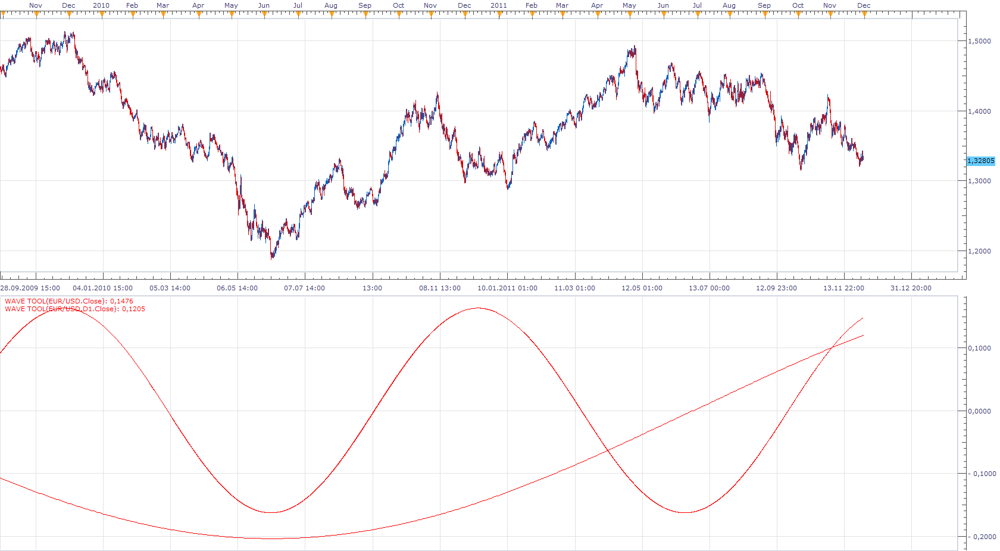
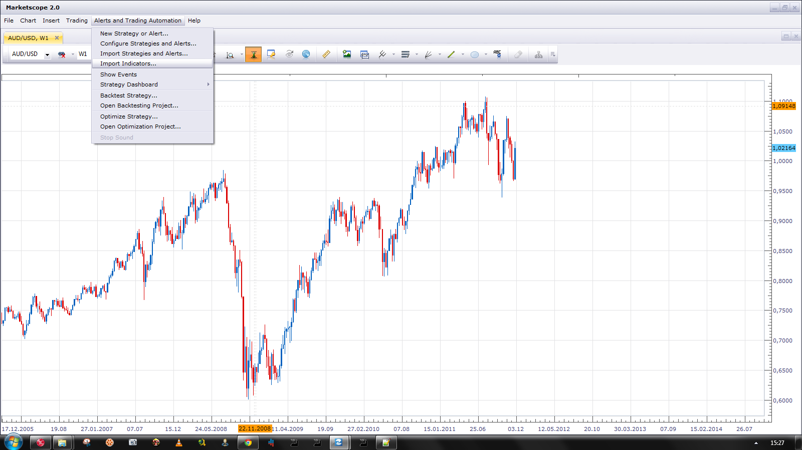

# Wave Tool

> Source: https://fxcodebase.com/code/viewtopic.php?f=17&t=4650  
> Forum: 17 · Topic 4650 · 14 post(s)

---

## Wave Tool

**Apprentice** · Wed Jun 08, 2011 5:16 am

Wave extremes are defined by maximum or minimum value for a chart.

This tool supports several options.
Wave Type
Absolute - range corresponds with the actual proportions of the wave
Relative - range is from 1 to -1

Wave Asymmetric Option
Every trader knows that the impulse and corrective waves do not have the same duration.
Down swing is usually steeper than the upswing.
This option allows you to define the correction factor in percentage.

You can add price overlay.

I found small bug.
If you plan to use Ovelay, Select it during the first addition of Indicators.

 [Wave Tool.bin](files/11477/Wave%20Tool.bin)

---

## Re: Wave Tool

**luigipg** · Wed Jun 08, 2011 11:53 am

Hi, would be very interesting to have the big tf of this indicator. Thanks! Luigi!!!

---

## Re: Wave Tool

**Blackcat2** · Thu Jun 09, 2011 7:09 pm

Hi apprentice,

Could I please have line style and width option?

Thanks heap
BC

---

## Re: Wave Tool

**Apprentice** · Mon Nov 21, 2011 4:20 am

Bin file recompiled for new version of TS.

---

## Re: Wave Tool

**Apprentice** · Wed Nov 30, 2011 3:56 am

Bigger time frame version is now unnecessary.
It is possible to have this, by changing the time frame of the data source.

---

## Re: Wave Tool

**MickJack** · Wed Nov 30, 2011 4:57 pm

Hello, please can you give me an explanation for the folder wave Tool.bin, what directory to place, how the associated file, I would like to see the waves of Elliot on my chart but I can not find how. Thanks for your help.

---

## Re: Wave Tool

**Apprentice** · Thu Dec 01, 2011 9:25 am

I'm not sure whether I understand your question.
Bin and Lua, extensions are used in the same way.

Use Import Indicators interface to Load indicator in Marketscope.

 

---

## Re: Wave Tool

**jahan jafari** · Tue Jan 07, 2014 2:44 am

Alexander.Gettinger

Hello Alexander
could you please convert Wave Tool.bin to mq4.
I have to be able use it like stochastic out of chart

wave Type Absolute
show overlay yes
use Asymmetric yes
correction(%) 10.0

Drawing mode Middle-to- Middle
show lable No
show legend yes
show in background no

Best Regards Jahan Jafari

---

## Re: Wave Tool

**Apprentice** · Wed Jan 08, 2014 5:30 am

Your request is added to the development list.

---

## Re: Wave Tool

**tmdabc** · Fri Oct 23, 2015 8:22 am

looks perfect，thanks

---

## Re: Wave Tool

**Apprentice** · Wed Jul 26, 2017 9:43 am

The indicator was revised and updated.

---

## Re: Wave Tool

**marcelo2k9** · Thu Sep 04, 2025 11:58 am

Please Sir, can we have the mt5 version of this indicator thank you so much.

---

## Re: Wave Tool

**Apprentice** · Thu Sep 04, 2025 2:52 pm

We have added your request to the development list.
Development reference 569

---

## Re: Wave Tool

**Apprentice** · Tue Dec 30, 2025 7:28 am

MT5 version
[https://fxcodebase.com/code/viewtopic.php?f=38&t=76507](https://fxcodebase.com/code/viewtopic.php?f=38&t=76507)
