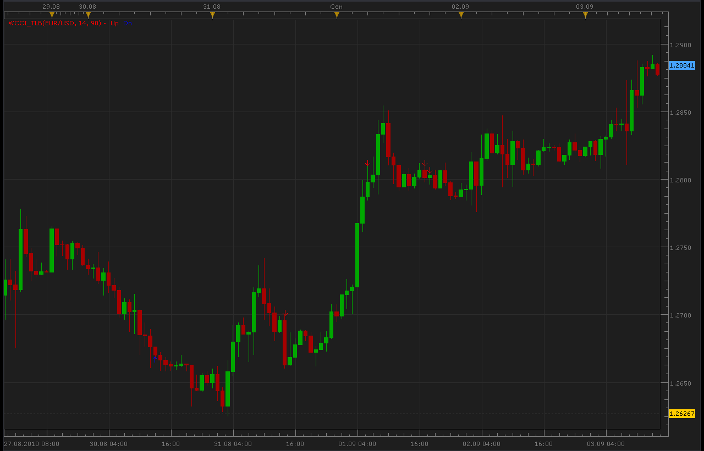

# WCCI TLB indicator

> Source: https://fxcodebase.com/code/viewtopic.php?f=17&t=2074  
> Forum: 17 · Topic 2074 · 7 post(s)

---

## WCCI TLB indicator

**Alexander.Gettinger** · Mon Sep 06, 2010 4:47 am

[viewtopic.php?f=27&t=2037](https://fxcodebase.com/code/viewtopic.php?f=27&t=2037)

 

The indicator was revised and updated

---

## Re: WCCI TLB indicator

**clodhoppes** · Mon Sep 06, 2010 8:00 am

Nice work!
Unfortunately, there are some misleading arrows in the chart. As i know, the noise makes CCI work abnormally. Renko charts, kagi charts or ranging bar charts can avoid much of the noise.
I compiled a CCI indicator on the basis of the kagi chart, but it does not update itself. Please help me out!

---

## Re: WCCI TLB indicator

**Alexander.Gettinger** · Mon Sep 06, 2010 10:39 pm

You want use kagiCCI instead of standard CCI?

---

## Re: WCCI TLB indicator

**clodhoppes** · Tue Sep 07, 2010 9:59 am

Yes, that's what I need.

---

## WCCI TLB indicator

**Kactassem** · Fri Sep 10, 2010 12:58 am

You know , I installed this via the indicator manager and restarted NT , but Im
not seeing it . It doesnt look like something you can copy and paste . Be nice
to see what it looks like .

---

## Re: WCCI TLB indicator

**Nikolay.Gekht** · Fri Sep 10, 2010 10:50 am

> **Kactassem wrote:**
> NT

Excuse me, but what is NT?

---

## Re: WCCI TLB indicator

**Apprentice** · Mon Jan 23, 2017 6:10 am

Indicator was revised and updated.
