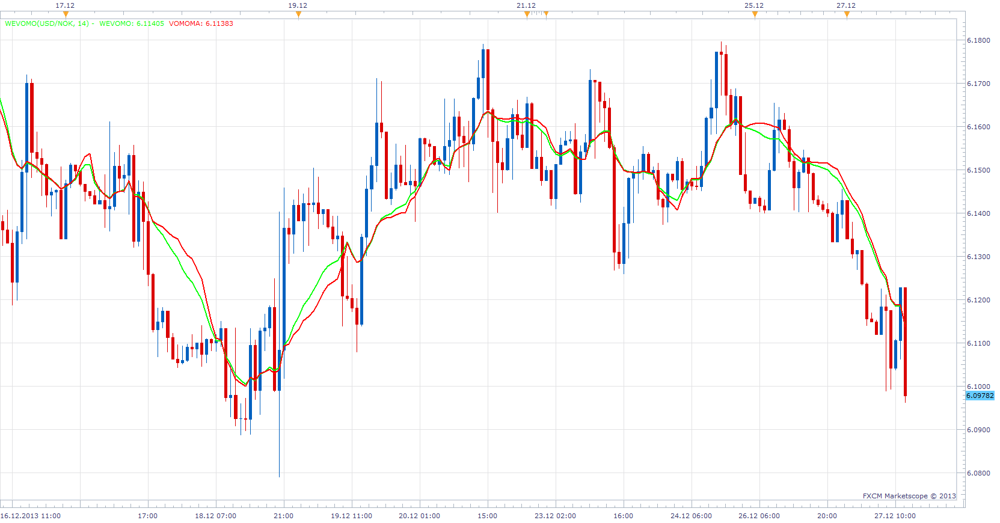

# Weight Volume Move-Adjusted Moving Average

> Source: https://fxcodebase.com/code/viewtopic.php?f=17&t=60155  
> Forum: 17 · Topic 60155 · 3 post(s)

---

## Weight Volume Move-Adjusted Moving Average

**Apprentice** · Fri Dec 27, 2013 6:36 am

As described in Article by Stephan Bisse from April 2005 issue of S & C Magazine

First MOMA. Then VOMOMA. And Now… Weight + Volume + Move-Adjusted
Moving Average: It’s WEVOMO!

 [WEVOMO.lua](files/91721/WEVOMO.lua)

The indicator was revised and updated

---

## Re: Weight Volume Move-Adjusted Moving Average

**Alexander.Gettinger** · Mon Aug 18, 2014 1:56 pm

MQL4 version of Weight Volume Move-Adjusted Moving Average: [viewtopic.php?f=38&t=61047](https://fxcodebase.com/code/viewtopic.php?f=38&t=61047).

---

## Re: Weight Volume Move-Adjusted Moving Average

**Apprentice** · Sun Jun 25, 2017 1:35 pm

The indicator was revised and updated.
