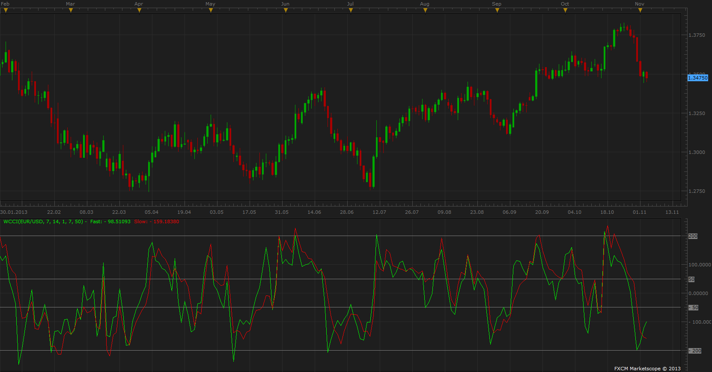

# Weighted CCI

> Source: https://fxcodebase.com/code/viewtopic.php?f=17&t=59805  
> Forum: 17 · Topic 59805 · 7 post(s)

---

## Weighted CCI

**Apprentice** · Tue Nov 05, 2013 1:52 pm

Written according to request.
[viewtopic.php?f=27&t=59803](https://fxcodebase.com/code/viewtopic.php?f=27&t=59803)

 [WCCI.lua](files/90586/WCCI.lua)

The indicator was revised and updated

---

## Re: Weighted CCI

**cersoz** · Wed Nov 06, 2013 12:41 am

thanks for r effort!..

but can u make slow cci plotted as histogram?.. like original indicator i sended to u?

---

## Re: Weighted CCI

**Apprentice** · Wed Nov 06, 2013 4:03 am

Bar Style Option Added.

 [WCCI.lua](files/90601/WCCI.lua)

---

## Re: Weighted CCI

**cersoz** · Wed Nov 06, 2013 12:35 pm

i think u make a mistake about translation!..
i sended indicator and this compare any time frame any currencies .. its completely different chart?

please check and fix this !.

best regards

---

## Re: Weighted CCI

**Apprentice** · Thu Nov 07, 2013 4:19 am

The original version used weight 2
My version use 1.
If you change this parameter, they are identical.

---

## Re: Weighted CCI

**Alexander.Gettinger** · Fri Nov 29, 2013 2:28 pm

MQL4 version of Weighted CCI: [viewtopic.php?f=38&t=60025](https://fxcodebase.com/code/viewtopic.php?f=38&t=60025).

---

## Re: Weighted CCI

**Apprentice** · Thu Jun 22, 2017 7:00 am

The indicator was revised and updated.
