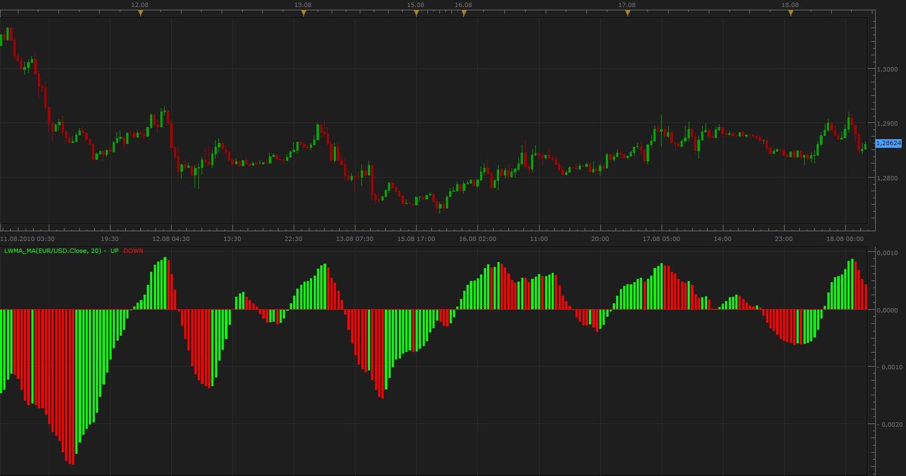

# Weighted Moving Average / Simple Moving Average Oscillator

> Source: https://fxcodebase.com/code/viewtopic.php?f=17&t=1866  
> Forum: 17 · Topic 1866 · 2 post(s)

---

## Weighted Moving Average / Simple Moving Average Oscillator

**Apprentice** · Thu Aug 19, 2010 10:02 am

This indicator is the result of testing various SDK features.
To make the task more interesting, I tested some theories of technical analysis.

The result is here.
Simple LWMA/MVA oscillator.

When I will have Volume available, I am especially interested in a similar relationship between VAMA and LWMA.

 [LWMA_MA.lua](files/3748/LWMA_MA.lua)

MT4/Mq4 version.
[viewtopic.php?f=38&t=63897](https://fxcodebase.com/code/viewtopic.php?f=38&t=63897)

The indicator was revised and updated

---

## Re: Weighted Moving Average / Simple Moving Average Oscillat

**Apprentice** · Thu Jan 12, 2017 8:24 am

Indicator was revised and updated.
