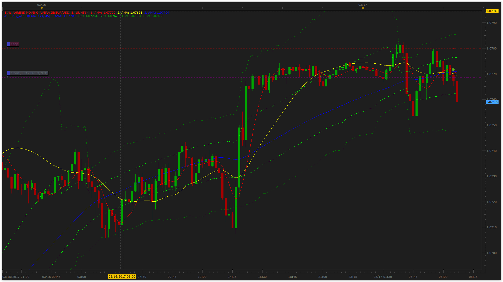

# Weighted Side Standard Deviation

> Source: https://fxcodebase.com/code/viewtopic.php?f=17&t=64525  
> Forum: 17 · Topic 64525 · 2 post(s)

---

## Weighted Side Standard Deviation

**Apprentice** · Wed Mar 15, 2017 5:26 am

Based on.
[https://ctdn.com/algos/indicators/show/1281](https://ctdn.com/algos/indicators/show/1281)
Does calculates weighted standard deviation per side to get the upper and lower volatility the advantage of differentiating the volatilities.

 [Weighted Side Standard Deviation.lua](files/111463/Weighted%20Side%20Standard%20Deviation.lua)

The indicator was revised and updated

---

## Re: Weighted Side Standard Deviation

**Gentle** · Fri Mar 17, 2017 10:54 am

I attached this deviation calculus to Ahrens MA, and result has been some volatility bands:

 

