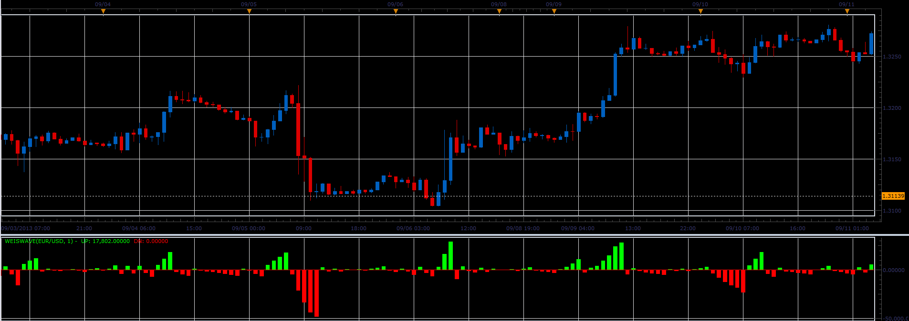
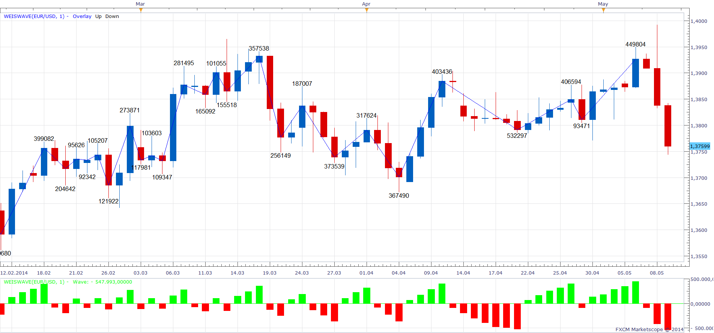
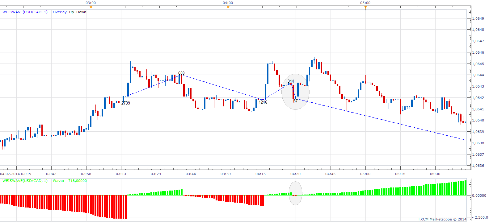

# Weis Wave Volume Indicator

> Source: https://fxcodebase.com/code/viewtopic.php?f=17&t=59573  
> Forum: 17 · Topic 59573 · 32 post(s)

---

## Weis Wave Volume Indicator

**Alexander.Gettinger** · Wed Sep 25, 2013 2:03 pm

The indicator is written on request
 [viewtopic.php?f=27&t=53115](https://fxcodebase.com/code/viewtopic.php?f=27&t=53115).

 [WeisWave.lua](files/89682/WeisWave.lua)

 

WeisWave Volume Modification is written on request
[viewtopic.php?f=27&t=65398&p](https://fxcodebase.com/code/viewtopic.php?f=27&t=65398&p)

 [WeisWave Volume Modification.lua](files/89682/WeisWave%20Volume%20Modification.lua)

The indicator was revised and updated

---

## Re: Weis Wave Volume Indicator

**forextrader77** · Sat May 10, 2014 5:47 pm

Hi. This is awsome. Could you please add a volume label count on the price chart for the wave as in the original indicator (see picture)

[http://weisonwyckoff.com/wp-content/upl ... _page2.png](http://weisonwyckoff.com/wp-content/uploads/2011/08/weis_wave_plugin_page2.png)

---

## Re: Weis Wave Volume Indicator

**Apprentice** · Sun May 11, 2014 7:29 am

Overlay Wave Added.
Added volume label.

 [WeisWave.lua](files/93954/WeisWave.lua)

---

## Re: Weis Wave Volume Indicator

**upwave** · Mon May 12, 2014 10:31 am

Hi,

this is a very good indi. thanks.

it seems there is a conflict between labels and wave printing on the chart. An error occurs each time when marketscope tries to print the new wave.

Rgds,

---

## Re: Weis Wave Volume Indicator

**Apprentice** · Tue May 13, 2014 2:29 am

Fixed. Please Re-Download.

---

## Re: Weis Wave Volume Indicator

**StefPasc** · Fri May 16, 2014 6:12 am

Apprentice hi,

can you please explain the parameter "dif" in the calculation part ?
thank you in advance

---

## Re: Weis Wave Volume Indicator

**Apprentice** · Sat May 17, 2014 2:01 am

Dif will be minimal difference in Price (in pips),
to be registered as a change in trend.

---

## Re: Weis Wave Volume Indicator

**TraderPham** · Sun May 18, 2014 5:24 am

Hi Apprentice,

I am interested in your Weiswave custom indicator.
Can you please show me How to convert your Lua file
into MQ4 for MT4 .

Thanks in advance for your help and contribution.

Regards,
TP

---

## Re: Weis Wave Volume Indicator

**Apprentice** · Mon May 19, 2014 2:42 am

Direct conversion is not possible.
Someone needs to re-write this for MT4.

I'm not sure, if such a implementation is possible on MT4.

---

## Re: Weis Wave Volume Indicator

**all_in** · Fri Jul 04, 2014 2:41 am

Hi,

Would be awesome to base this on "Real Volume"

Cheers Guys

---

## Re: Weis Wave Volume Indicator

**all_in** · Fri Jul 04, 2014 5:47 am

Hi,

Here is what the 1 pip reversal wave should look like (on MT4) :-

 

This is what this indi looks like on the same chart (Marketscope) :-

 

Hope this helps.

P.S. Happy 4th of July to all in the US

---

## Re: Weis Wave Volume Indicator

**Apprentice** · Sun Jul 06, 2014 4:02 am

Please Re-Download

---

## Re: Weis Wave Volume Indicator

**all_in** · Sun Jul 06, 2014 5:30 am

> **Apprentice wrote:**
> Please Re-Download

Thanks, but it hasn't changed.

Could you post a USD/CAD M1 chart on the 4th like mine, to compare?

---

## Re: Weis Wave Volume Indicator

**Apprentice** · Sun Jul 06, 2014 7:56 am

I am satisfied with the current implementation.
Will not offer further updates until further notice.

Seemingly bad signals are possible.
If we have short break in a trend.

---

## Re: Weis Wave Volume Indicator

**all_in** · Sun Jul 06, 2014 1:33 pm

> **Apprentice wrote:**
>
>
> WeisWave.png
>
>
> I am satisfied with the current implementation.
> Will not offer further updates until further notice.
>
> Seemingly bad signals are possible.
> If we have short break in a trend.

It seems to me that in an upwave, it's plotting the lows, when it should be plotting the highs and vice versa. (See my MT4 chart)

You can't have bad signals, a bar/s either closes more than the reversal size and starts a new wave or it doesn't and continues the wave.

But fair enough, appreciate your time anyway.

---

## Re: Weis Wave Volume Indicator

**Yodian** · Wed Aug 27, 2014 11:06 am

> **all_in wrote:**
> Hi,
>
> Would be awesome to base this on "Real Volume"
>
> Cheers Guys

I agree.
Dear Apprentice, can you please make these work with the real volume indicator?

Thank you in advance,

Yodian

---

## Re: Weis Wave Volume Indicator

**Apprentice** · Thu Aug 28, 2014 5:30 am

We have try to implement Real Volume,
Unfortunately, Real Volume does not play nicely with other Indicators.
Will try any way.

---

## Re: Weis Wave Volume Indicator

**md2324** · Mon Jan 19, 2015 9:51 pm

Good evening,
I was wondering if there is way that I could have the " Volume " all turned upright ( the down red bar volume ) ?

I have attached a chart showing what it currently looks like on my chart and another screenshot showing it all upright

Thanks so much, I really appreciate it - Michael

---

## Re: Weis Wave Volume Indicator

**Apprentice** · Tue Jan 20, 2015 2:55 am

Please use Absolute option of WeisWave.lua
[http://fxcodebase.com/code/download/file.php?id=11713](https://fxcodebase.com/code/download/file.php?id=11713)

---

## Re: Weis Wave Volume Indicator

**md2324** · Wed Jan 21, 2015 6:08 pm

Thank you Apprentice,
I am about to re-save the Indicator and change the setting to " Absolute "

I appreciate it

---

## Re: Weis Wave Volume Indicator

**Apprentice** · Sun Jul 02, 2017 12:52 pm

The indicator was revised and updated.

---

## Re: Weis Wave Volume Indicator

**Mohamed85** · Sun Jan 28, 2018 2:58 pm

Hi Apprentice, Thanks in advance for all your efforts.
Can you please add one more option to show the volume label format in (hundreds, thouands or mils),
as it currently turning the higher time frame messy with 6 and 7 figures numbers at each swing.

Regards.

---

## Re: Weis Wave Volume Indicator

**Apprentice** · Mon Jan 29, 2018 5:40 am

Divisor option added.

---

## Re: Weis Wave Volume Indicator

**Mohamed85** · Mon Jan 29, 2018 7:23 am

Thank you so much, that definitely did the trick.
Regards

---

## Re: Weis Wave Volume Indicator

**Alexander.Gettinger** · Tue Dec 11, 2018 5:35 pm

> **TraderPham wrote:**
> Hi Apprentice,
>
> I am interested in your Weiswave custom indicator.
> Can you please show me How to convert your Lua file
> into MQ4 for MT4 .
>
> Thanks in advance for your help and contribution.
>
> Regards,
> TP

Please, try this MQL4 version of indicator:

 [WeisWave.mq4](files/122694/WeisWave.mq4)

---

## Re: Weis Wave Volume Indicator

**Alexander.Gettinger** · Wed Mar 13, 2019 8:43 pm

> **Yodian wrote:**
>
>
> > **all_in wrote:**
> > Dear Apprentice, can you please make these work with the real volume indicator?
> >
> > Yodian

Please try this indicator:

 [WeisWave_Real_Volume.lua](files/124396/WeisWave_Real_Volume.lua)

---

## Re: Weis Wave Volume Indicator

**cheeetah** · Mon Mar 01, 2021 12:54 pm

Greetings Apprentice,
It is it possible to show the time length of the wave,placed at the end of the zigzag?
The picture attached is the weiswave applied to a renko chart

---

## Re: Weis Wave Volume Indicator

**Apprentice** · Tue Mar 02, 2021 5:06 am

Your request is added to the development list.
Development reference 240.

---

## Re: Weis Wave Volume Indicator

**Apprentice** · Thu Mar 04, 2021 12:54 pm

[WeisWave_Real_Volume.lua](files/141044/WeisWave_Real_Volume.lua)

Try this version.

---

## Re: Weis Wave Volume Indicator

**cheeetah** · Fri Mar 05, 2021 11:49 am

Hi Apprentice,
I tested the above and thought i d give it feedback.
The down bar count tends to hide behind its bars as shown below.
It takes some time to load and it doesn't work at all on a renko view.

Suggestions:
-Perhaps the count can be placed at the zigzag as shown in picture 2.
-Time to be shown in some sort of hh/mm/ss format

On a side note,i did find an indicator that measures wave time,but it needs the start and
the end of it to be placed manually.I thought its code might be useful.

Thank you very much for your time!

---

## Re: Weis Wave Volume Indicator

**bryanferry** · Wed Mar 17, 2021 9:59 am

> **Apprentice wrote:**
>
>
> WeisWave.png
>
>
> Overlay Wave Added.
> Added volume label.
>
>
> WeisWave.lua

please convert to MT5

ty all

---

## Re: Weis Wave Volume Indicator

**Apprentice** · Wed Mar 17, 2021 1:31 pm

Your request is added to the development list.
Development reference 286.
