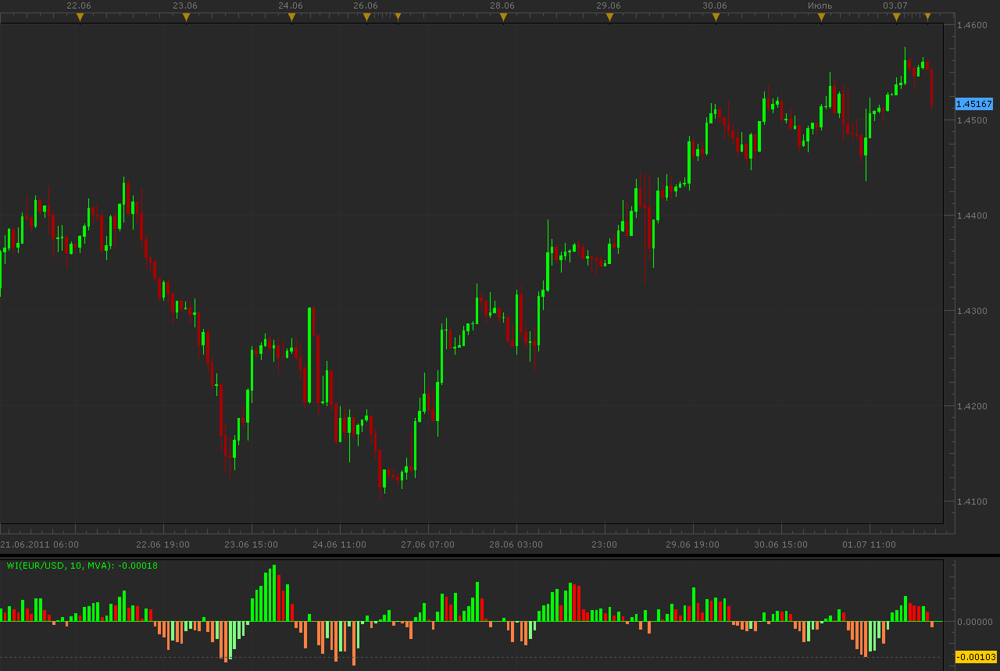

# WI oscillator

> Source: https://fxcodebase.com/code/viewtopic.php?f=17&t=4966  
> Forum: 17 · Topic 4966 · 4 post(s)

---

## WI oscillator

**Alexander.Gettinger** · Mon Jul 04, 2011 12:40 am

WI is a Moving Average of (2*Close-High-Low).

 

Download:

 [wi.lua](files/12278/wi.lua)

For WI must be installed Averages indicator ([viewtopic.php?f=17&t=2430](https://fxcodebase.com/code/viewtopic.php?f=17&t=2430)).

The indicator was revised and updated

---

## Re: WI oscillator

**boursicoton** · Tue Jul 05, 2011 2:57 pm

16 july at home, with some traders, day of wi and idea , theorics and practice
and good foods !

thanks alexander !

---

## Re: WI oscillator

**Alexander.Gettinger** · Fri Jun 29, 2012 1:40 pm

MQL4 version of WI oscillator: [viewtopic.php?f=38&t=20678](https://fxcodebase.com/code/viewtopic.php?f=38&t=20678)

---

## Re: WI oscillator

**Apprentice** · Tue Apr 04, 2017 6:09 am

Indicator was revised and updated.
