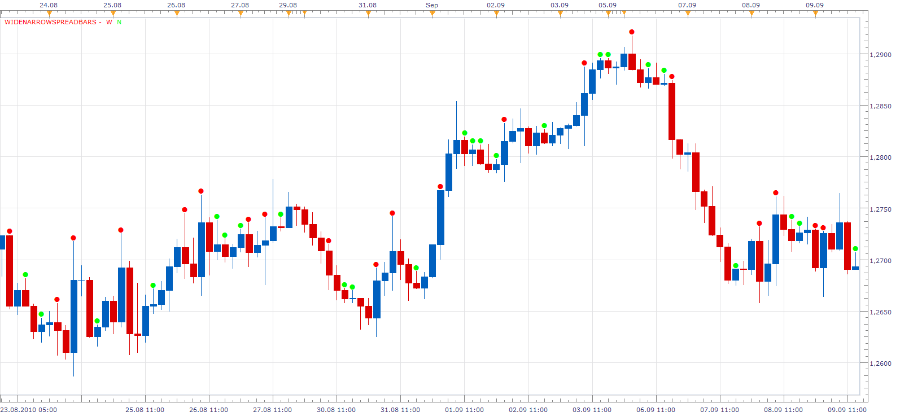

# Wide/Narrow Spread

> Source: https://fxcodebase.com/code/viewtopic.php?f=17&t=2255  
> Forum: 17 · Topic 2255 · 9 post(s)

---

## Wide/Narrow Spread

**Apprentice** · Fri Sep 24, 2010 7:19 am

Bar is Wide / Narrow if it's longest / shortest, measured from High to Low for the observed period.

 [WideNarrowSpread.lua](files/4766/WideNarrowSpread.lua)

The indicator was revised and updated

---

## Re: Wide/Narrow Spread

**Jeffreyvnlk** · Thu Aug 21, 2014 3:04 pm

> **Apprentice wrote:**
>
>
> WideNarrowSpread.png
>
>
> Bar is Wide / Narrow if it's longest / shortest, measured from High to Low for the observed period.
>
>
> WideNarrowSpread.lua

Fantastic, hope you can do more like 2NR, 3NR according to Toby Crabel

---

## Re: Wide/Narrow Spread

**Apprentice** · Fri Aug 22, 2014 2:30 am

Can you provide a web reference.
Explain what 2NR, 3NR is.

---

## Re: Wide/Narrow Spread

**Jeffreyvnlk** · Tue Aug 26, 2014 3:51 am

> **Apprentice wrote:**
> Can you provide a web reference.
> Explain what 2NR, 3NR is.

According to Toby Crabel:
2NR is the narrowest range from high to low of any 2-day period relative to any 2-day period within previous 20 days
3NR is the narrowest range from high to low of any 3-day period relative to any 3-day period within previous 20 days
4NR is the narrowest range from high to low of any 4-day period relative to any 4-day period within previous 40 days
8NR is the narrowest range from high to low of any 8-day period relative to any 8-day period within previous 40 days

Thanks

---

## Re: Wide/Narrow Spread

**Apprentice** · Thu Aug 28, 2014 5:40 am

Can you provide code or web reference.
I'm not sure, Will this indicator re-paint retroactively.
Or is it only calculated for the current candle.

---

## Re: Wide/Narrow Spread

**Apprentice** · Thu Aug 28, 2014 6:12 am

Try this version.
[viewtopic.php?f=17&t=61080](https://fxcodebase.com/code/viewtopic.php?f=17&t=61080)

---

## Re: Wide/Narrow Spread

**Jeffreyvnlk** · Tue Sep 02, 2014 2:59 am

> **Apprentice wrote:**
> Try this version.
> [viewtopic.php?f=17&t=61080](https://fxcodebase.com/code/viewtopic.php?f=17&t=61080)

Great, thank you

---

## Re: Wide/Narrow Spread

**Alexander.Gettinger** · Thu Apr 30, 2015 9:59 am

MQL4 version of Wide/Narrow spread indicator: [viewtopic.php?f=38&t=62168](https://fxcodebase.com/code/viewtopic.php?f=38&t=62168).

---

## Re: Wide/Narrow Spread

**Apprentice** · Mon Jul 03, 2017 8:19 am

The indicator was revised and updated.
