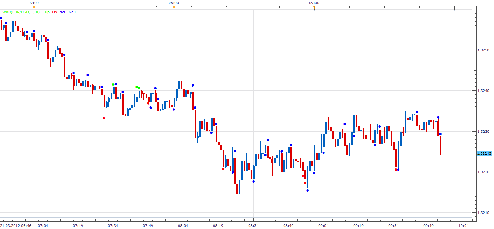

# Wide Range Body

> Source: https://fxcodebase.com/code/viewtopic.php?f=17&t=14989  
> Forum: 17 · Topic 14989 · 8 post(s)

---

## Wide Range Body

**Apprentice** · Wed Mar 21, 2012 8:53 am

Wide Range Body is candles, whose body size is greater than body of previous three candles.
However, this indicator has the possibility of using other periods, not only third.
Distinguishes three types of WRB,
n consecutive up candles,
n consecutive down candles,
series of n candles with different orientation.

 [WRB.lua](files/28404/WRB.lua)

---

## Re: Wide Range Body

**Apprentice** · Wed Mar 21, 2012 10:28 am

Minor Bug Fix.

---

## Re: Wide Range Body

**Alexander.Gettinger** · Tue Nov 18, 2014 5:01 pm

MQL4 version of Wide Range Body indicator: [viewtopic.php?f=38&t=61475](https://fxcodebase.com/code/viewtopic.php?f=38&t=61475).

---

## Re: Wide Range Body

**Samurai 24** · Tue Apr 21, 2015 8:06 am

Can you make this indicator only mark candle with body size higher than 30,0 pips or another body size setting?

Thanks for your help.

---

## Re: Wide Range Body

**Apprentice** · Tue Apr 28, 2015 4:51 am

"Minimum Body Size" Filter Added.

---

## Re: Wide Range Body

**Coondawg71** · Tue Feb 16, 2016 12:54 pm

Can we please request the painting of price candle based on Wide Range Body high low range.

For example, high - low range greater than lookback 20 periods = painting of price bar blue.
Thanks!

sjc

---

## Re: Wide Range Body

**Apprentice** · Wed Feb 17, 2016 6:04 am

Requested can be found here.
[viewtopic.php?f=17&t=63162](https://fxcodebase.com/code/viewtopic.php?f=17&t=63162)

---

## Re: Wide Range Body

**Apprentice** · Sat Sep 15, 2018 5:19 am

The indicator was revised and updated.
