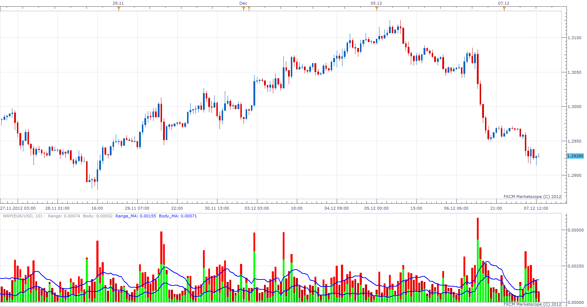

# Wide Range Predictor

> Source: https://fxcodebase.com/code/viewtopic.php?f=17&t=27461  
> Forum: 17 · Topic 27461 · 6 post(s)

---

## Wide Range Predictor

**Apprentice** · Fri Dec 07, 2012 7:24 am

MQ5 indicator conversion.
[http://www.mql5.com/en/code/1125](http://www.mql5.com/en/code/1125)

 [WRP.lua](files/48061/WRP.lua)

 [WRP with Alert.lua](files/48061/WRP%20with%20Alert.lua)

The indicator was revised and updated

---

## Re: Wide Range Predictor

**transformer** · Fri Dec 07, 2012 9:05 am

hi programmers,

this is also nice indicator.

can you create signal based on this indicator:

condition:

1. range(period)(close)>range ma
2.range (previous 3 bars )< range ma

alert message: **" potentional trend reversal area"**
alert : sound1
email : optional

i request this like signal like below signal

example for signal:
[viewtopic.php?f=29&t=16111](http://www.fxcodebase.com/code/viewtopic.php?f=29&t=16111)

---

## Re: Wide Range Predictor

**Apprentice** · Sun Dec 09, 2012 4:57 am

Your request is added to the development list.

---

## Re: Wide Range Predictor

**Alexander.Gettinger** · Thu Sep 25, 2014 9:41 am

MQL4 version of Wide Range Predictor: [viewtopic.php?f=38&t=61252](https://fxcodebase.com/code/viewtopic.php?f=38&t=61252).

---

## Re: Wide Range Predictor

**Apprentice** · Fri Jun 09, 2017 10:14 am

The indicator was revised and updated.

---

## Re: Wide Range Predictor

**Apprentice** · Fri Jun 09, 2017 10:50 am

WRP with Alert.lua added.
