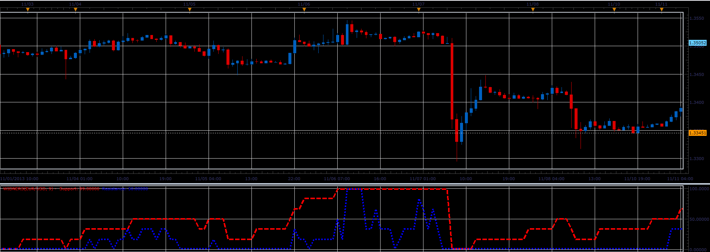

# Widners oscillator

> Source: https://fxcodebase.com/code/viewtopic.php?f=17&t=59984  
> Forum: 17 · Topic 59984 · 4 post(s)

---

## Widners oscillator

**Alexander.Gettinger** · Tue Nov 26, 2013 3:35 pm

This indicator is a ported MQL5 indicator from [http://www.mql5.com/ru/code/1890](http://www.mql5.com/ru/code/1890) (in Russian).

 

Download:

 [Widners.lua](files/91138/Widners.lua)

---

## Re: Widners oscillator

**Cactus** · Thu Jul 28, 2016 6:47 pm

Can you explain this indicator further? I don't mean formula but a way of using it? I am fascinated by support and resistance indicators. Shouldn't it be drawn on price chart then? And why is support higher than resistance whereas I believe it should be the other way around? Is there a way to fit it around price if it actually shows suggested s/r levels?

---

## Re: Widners oscillator

**Apprentice** · Tue Aug 02, 2016 7:28 am

We have done conversion only.
Try to google it, MQ4/Mq5 Forums forums.

---

## Re: Widners oscillator

**Apprentice** · Fri Aug 31, 2018 5:16 am

The indicator was revised and updated.
