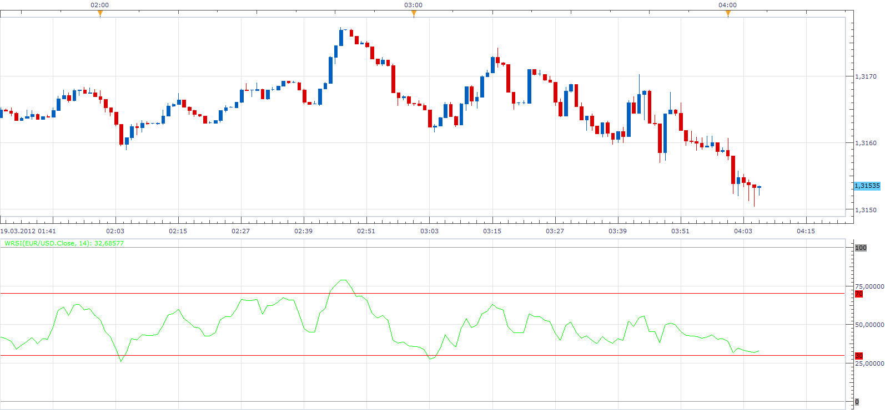

# Wilder's RSI

> Source: https://fxcodebase.com/code/viewtopic.php?f=17&t=14923  
> Forum: 17 · Topic 14923 · 3 post(s)

---

## Wilder's RSI

**Apprentice** · Mon Mar 19, 2012 3:07 am

The formula for calculation is identical to that used in the calculation of the RSI.
Wilder's RSI, uses Wilder moving average for smoothing.

 [WRSI.lua](files/28269/WRSI.lua)

The indicator was revised and updated

---

## Re: Wilder's RSI

**Alexander.Gettinger** · Tue Nov 18, 2014 5:04 pm

MQL4 version of Wilder's RSI oscillator: [viewtopic.php?f=38&t=61476](https://fxcodebase.com/code/viewtopic.php?f=38&t=61476).

---

## Re: Wilder's RSI

**Apprentice** · Wed Jun 28, 2017 5:23 am

The indicator was revised and updated.
