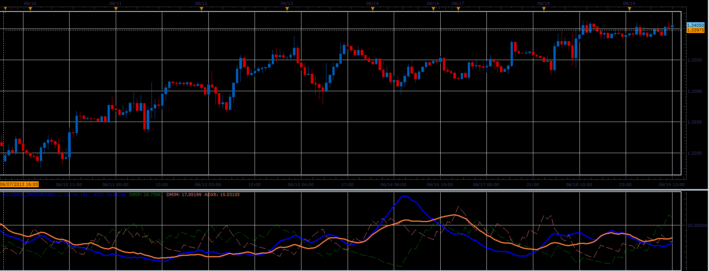

# Wilders DMI oscillator

> Source: https://fxcodebase.com/code/viewtopic.php?f=17&t=41450  
> Forum: 17 · Topic 41450 · 2 post(s)

---

## Wilders DMI oscillator

**Alexander.Gettinger** · Wed Jun 19, 2013 2:39 pm

This indicator is a ported MQL5 indicator from [http://www.mql5.com/ru/code/1742](http://www.mql5.com/ru/code/1742) (in Russian).

 

Download:

 [Wilders_DMI.lua](files/67698/Wilders_DMI.lua)

The indicator was revised and updated

---

## Re: Wilders DMI oscillator

**Apprentice** · Tue May 23, 2017 6:45 am

Indicator was revised and updated.
