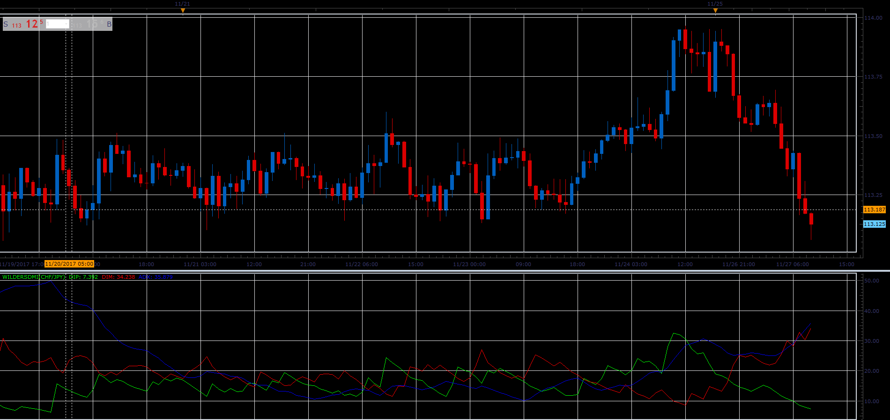

# Wilders DMI

> Source: https://fxcodebase.com/code/viewtopic.php?f=17&t=65402  
> Forum: 17 · Topic 65402 · 6 post(s)

---

## Wilders DMI

**Alexander.Gettinger** · Mon Nov 27, 2017 11:15 am

MT4/MQ4 version
[viewtopic.php?f=38&t=65625&p=116994&hilit=Wilders+DMI#p116994](https://fxcodebase.com/code/viewtopic.php?f=38&t=65625&p=116994&hilit=Wilders+DMI#p116994)

 

Download:

 [WildersDMI.lua](files/116245/WildersDMI.lua)

 [WildersDMI with Alert.lua](files/116245/WildersDMI%20with%20Alert.lua)

The indicator was revised and updated

---

## Re: Wilders DMI

**nookie** · Wed Jan 10, 2018 5:19 am

If possible would be good to have few things added:

1. alert when adx > 20 and rate of change is +1 or more, for example 18:00 ADX is 20.04, 19:00 ADX is 21.44 > raise with 1.4 which is providing an alert
2. some additional arrows or points adx is rising with a specific amount at a candle
3. audio or mail alert for the same

---

## Re: Wilders DMI

**Apprentice** · Wed Jan 10, 2018 2:15 pm

WildersDMI with Alert.lua added.

---

## Re: Wilders DMI

**bartwas1** · Fri Jan 12, 2018 7:30 am

Hi Apprentice

I have tried using Wilders DMI no alert version - it's working fine, but would you mind to add line option, thank you. The other thing I wanted to mention is an option for showing DMI only - it doesn't work. With 'yes' on I've still got three lines: DMI+, DMI- and ADX. Basically ADX showing trend strength is useful, however when changing price source and displaying on the current chart is losing its usefulness, therefore switching it off is convenient. Altogether isn't that problematic, but if you'd have some time to make this feature working it'd be greatly appreciated.

Thank you
Bart

---

## Re: Wilders DMI

**nookie** · Fri Jan 12, 2018 3:16 pm

An MT4 version would be much appreciated if possible

---

## Re: Wilders DMI

**Apprentice** · Sat Jan 13, 2018 7:16 am

Try this version.
[viewtopic.php?f=38&t=65625&p=116994&hilit=Wilders+DMI#p116994](https://fxcodebase.com/code/viewtopic.php?f=38&t=65625&p=116994&hilit=Wilders+DMI#p116994)
