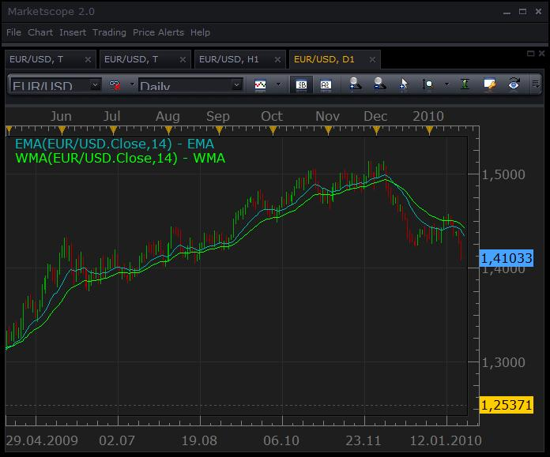

# Wilders Smoothing (Wilders Moving Average)

> Source: https://fxcodebase.com/code/viewtopic.php?f=17&t=248  
> Forum: 17 · Topic 248 · 5 post(s)

---

## Wilders Smoothing (Wilders Moving Average)

**Nikolay.Gekht** · Wed Jan 20, 2010 6:45 pm

**Wilders Smoothing (Wilders Moving Average)**

Developed by Welles Wilder, this indicator is similar to the Exponential Moving Average, but it is a bit slower to reflect price changes.

The most common formular is
WMA[n] = EMA[2 * n - 1]

 

**Download**

 [WMA.lua](files/375/WMA.lua)

The indicator was revised and updated

---

## Re: Wilders Smoothing (Wilders Moving Average)

**Apprentice** · Sun Nov 07, 2010 10:55 am

Style Option Added.

---

## Re: Wilders Smoothing (Wilders Moving Average)

**alpha24** · Sat May 02, 2015 5:04 pm

MT4 version Please

---

## Re: Wilders Smoothing (Wilders Moving Average)

**Apprentice** · Sun May 03, 2015 5:03 am

Mq4 version can be found here.
[viewtopic.php?f=38&t=59621&p=96428&hilit=Wilders#p96428](https://fxcodebase.com/code/viewtopic.php?f=38&t=59621&p=96428&hilit=Wilders#p96428)

---

## Re: Wilders Smoothing (Wilders Moving Average)

**Apprentice** · Mon Jul 03, 2017 8:06 am

The indicator was revised and updated.
