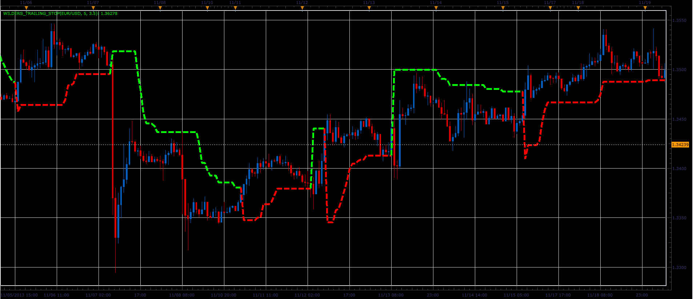

# Wilders Trailing Stop indicator

> Source: https://fxcodebase.com/code/viewtopic.php?f=17&t=60028  
> Forum: 17 · Topic 60028 · 10 post(s)

---

## Wilders Trailing Stop indicator

**Alexander.Gettinger** · Fri Nov 29, 2013 3:37 pm

Formulas:
WTS[i] = Max(WTS[i-1], Close[i]-loss), if Close[i]>WTS[i-1] and Close[i-1]>WTS[i-1],
WTS[i] = Min(WTS[i-1], Close[i]+loss), if Close[i]<WTS[i-1] and Close[i-1]<WTS[i-1],
WTS[i] = Close[i]-loss, if Close[i]>WTS[i-1],
WTS[i] = Close[i]+loss, in other cases, where
loss = Coeff*ATR,
ATR - Average True Range with Period.

 

Download:

 [Wilders_Trailing_Stop.lua](files/91250/Wilders_Trailing_Stop.lua)

 [Wilders_Trailing_Stop with Alert.lua](files/91250/Wilders_Trailing_Stop%20with%20Alert.lua)

 [Wilders_Trailing_Stop Overlay.lua](files/91250/Wilders_Trailing_Stop%20Overlay.lua)

---

## Re: Wilders Trailing Stop indicator

**Alexander.Gettinger** · Fri Nov 29, 2013 3:39 pm

MQL4 version of Wilders Trailing Stop indicator: [viewtopic.php?f=38&t=60029](https://fxcodebase.com/code/viewtopic.php?f=38&t=60029).

---

## Re: Wilders Trailing Stop indicator

**Apprentice** · Mon Nov 03, 2014 5:33 am

A.K.A. Average True Range Trailing Stop

---

## Re: Wilders Trailing Stop indicator

**Apprentice** · Mon Nov 03, 2014 5:48 am

Strategy based on this indicator can be found here.
[viewtopic.php?f=31&t=61404](https://fxcodebase.com/code/viewtopic.php?f=31&t=61404)

---

## Re: Wilders Trailing Stop indicator

**Coondawg71** · Fri Mar 20, 2015 2:56 pm

Can we please request Alert function added to this indicator.

Alert would be triggered upon "touch" or "cross" of the user specified ATR Stop Level.

Thanks!

sjc

---

## Re: Wilders Trailing Stop indicator

**Apprentice** · Sun Mar 22, 2015 2:38 pm

Wilders_Trailing_Stop with Alert.lua Added.

---

## Re: Wilders Trailing Stop indicator

**Apprentice** · Mon Dec 14, 2015 4:29 am

Compatibility issue Fixed. _Alert helper is not longer needed.

If you want to use updated version of this indicator,
please make sure to use TS Version 01.14.101415. or higher.

---

## Re: Wilders Trailing Stop indicator

**Apprentice** · Sat Aug 26, 2017 5:41 am

The indicator was revised and updated.

---

## Re: Wilders Trailing Stop indicator

**easytrading** · Tue Jul 03, 2018 4:12 pm

Hello Apprentice,
if you please, could we have price overlay for Wilders_Trailing_Stop.lua with my appreciation.

---

## Re: Wilders Trailing Stop indicator

**Apprentice** · Wed Jul 04, 2018 1:38 pm

Wilders_Trailing_Stop Overlay added.
