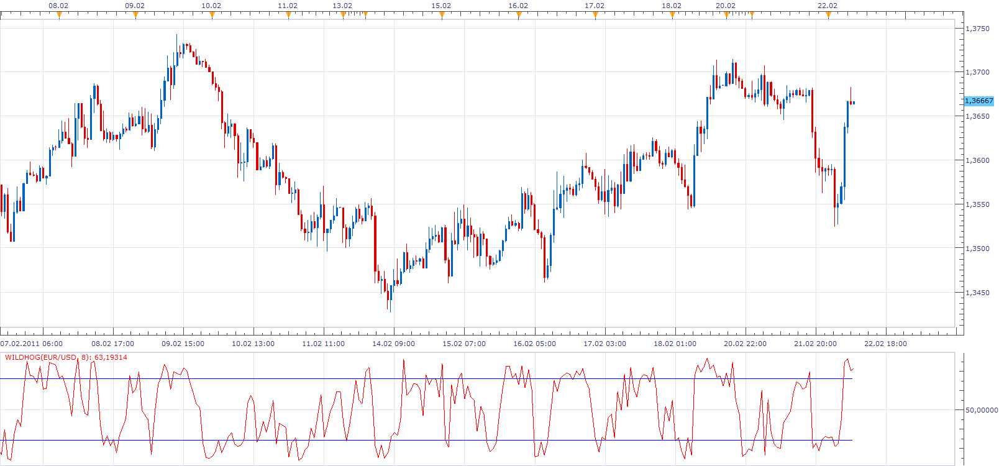

# Wildhog Oscillator

> Source: https://fxcodebase.com/code/viewtopic.php?f=17&t=3499  
> Forum: 17 · Topic 3499 · 9 post(s)

---

## Wildhog Oscillator

**Apprentice** · Tue Feb 22, 2011 8:02 am

This oscillator is written upon request.

The formula is.
Wildhog[period] = ((((source.close[period]-min)/(max-min))*100)/3 )+ (Wildhog[period-1] / 3)*2;

 [Wildhog.lua](files/8342/Wildhog.lua)

Wildhog can you describe this indicator.
The manner in which it is used.

The indicator was revised and updated

---

## Re: Wildhog Oscillator

**wildhog** · Tue Feb 22, 2011 7:31 pm

The Oscillator is used like Stockastics in that as the number rises it becomes more overbought and as it declines it becomes more oversold. It is new to me so Iam experimenting with it. It should work on any time frame, with 5 and 15 minute good quick signals.Here is what your looking for.As the number changes direction get ready to consider a trade in that direction if the number or line is in the Overbought or Oversold area's which are the blue lines.
The system is based on the last 8 bars HIGH,LOW and CLOSE.

---

## Re: Wildhog Oscillator

**wildhog** · Tue Feb 22, 2011 7:43 pm

Thanks for the Oscillator, I like how its shape is clean and pointed.Good Job!

---

## Re: Wildhog Oscillator

**wildhog** · Tue Feb 22, 2011 9:16 pm

I dont know why but the numbers seem to stop after 65 area and they should climb up to as high as the 80 - 90 area. Same with the low numbers they should go as low as 20 and a little below. You can do this on a spread sheet as well, and should get the same numbers as the graph, but not in this case.

---

## Re: Wildhog Oscillator

**Apprentice** · Wed Feb 23, 2011 3:42 am

I tried to consolidate your formula.
It's possible that I enter a bug.

Can you check if formula is correct.
Wildhog[period] = ((((source.close[period]-min)/(max-min))*100)/3 )+ (50 / 3)*2;

min and max are lowest and highest value within a given period, i use high and low data.

---

## Re: Wildhog Oscillator

**Apprentice** · Wed Feb 23, 2011 6:36 pm

Update

---

## Re: Wildhog Oscillator

**wildhog** · Wed Feb 23, 2011 7:13 pm

Thanks for the update! Its not so jumpy looks good!

---

## Re: Wildhog Oscillator

**Alexander.Gettinger** · Wed Nov 26, 2014 3:32 pm

MQL4 version of Wildhog oscillator: [viewtopic.php?f=38&t=61553](https://fxcodebase.com/code/viewtopic.php?f=38&t=61553).

---

## Re: Wildhog Oscillator

**Apprentice** · Mon Jun 26, 2017 10:17 am

The indicator was revised and updated.
