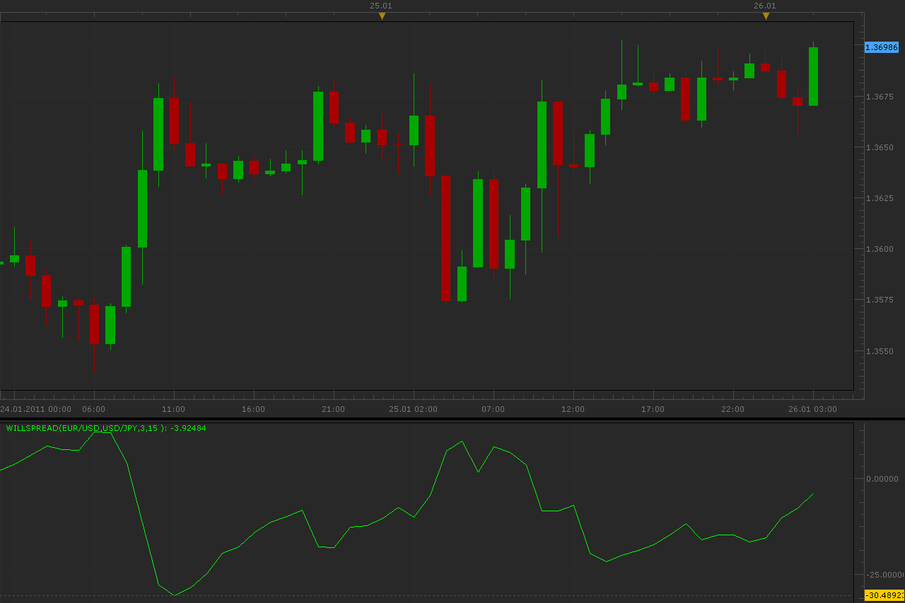

# Will spread oscillator

> Source: https://fxcodebase.com/code/viewtopic.php?f=17&t=3253  
> Forum: 17 · Topic 3253 · 5 post(s)

---

## Will spread oscillator

**Alexander.Gettinger** · Wed Jan 26, 2011 3:41 am

Source code: [viewtopic.php?f=27&t=3237](https://fxcodebase.com/code/viewtopic.php?f=27&t=3237)

Formulas:
WillSpread=FastEMA(Spread)-SlowEMA(Spread),
Spread=Price(Symbol)*100/Price(Current symbol) for Correlation="direct" or
Spread=Price(Current symbol)*100/Price(Symbol) for Correlation="inverse"

 

Download:

 [WillSpread.lua](files/7710/WillSpread.lua)

The indicator was revised and updated

---

## Re: Will spread oscillator

**boursicoton** · Wed Jan 26, 2011 5:48 pm

thanks !!!!
 i try this indicator tomorrow ! it's too late in french at this time !

---

## Zero Line

**Jeffreyvnlk** · Thu Sep 05, 2013 11:19 am

Could you add a Zero Line.Thank you

---

## Re: Will spread oscillator

**Apprentice** · Fri Sep 06, 2013 3:45 am

Zero Line Added.

---

## Re: Will spread oscillator

**Apprentice** · Sun Jun 04, 2017 6:11 am

The indicator was revised and updated.
