# William Blau's Indicators

> Source: https://fxcodebase.com/code/viewtopic.php?f=17&t=10878  
> Forum: 17 · Topic 10878 · 28 post(s)

---

## William Blau's Indicators

**Apprentice** · Tue Jan 03, 2012 11:26 am

Candlestick Momentum

 

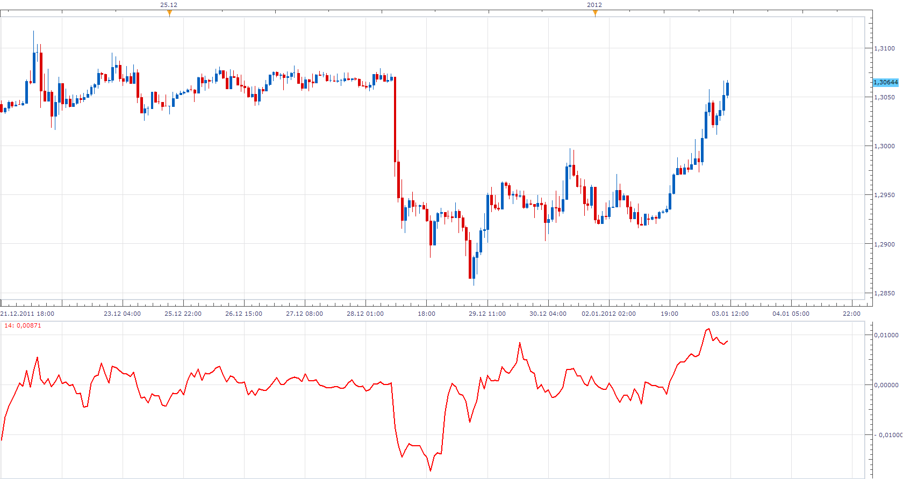

Candlestick Momentum = Price - Price N Periods Ago

 [William Blau Candlestick Momentum.lua](files/22305/William%20Blau%20Candlestick%20Momentum.lua)

Candlestick Index

 

CSI =100 * EMA(EMA(EMA( Candlestick Momentum (period) ))) / EMA(EMA(EMA( HH-LL))))

 [William Blau Candlestick Index.lua](files/22305/William%20Blau%20Candlestick%20Index.lua)

True Strength Index

 

CSI =100 * EMA(EMA(EMA( Candlestick Momentum (period) ))) / EMA(EMA(EMA( ABS(Candlestick Momentum (period))))))

 [William Blau TSI.lua](files/22305/William%20Blau%20TSI.lua)

Directional Trend Index

 

 [William Blau Directional Trend Index.lua](files/22305/William%20Blau%20Directional%20Trend%20Index.lua)

Trend Momentum

 

 [William Blau Trend Momentum .lua](files/22305/William%20Blau%20Trend%20Momentum%20.lua)

A complete description can be found here.
[http://www.mql5.com/en/articles/190#Blau](http://www.mql5.com/en/articles/190#Blau)

---

## Re: William Blau's Indicators

**marejp** · Tue Jan 03, 2012 2:34 pm

Thank you, much appreciated.

---

## Re: William Blau's Indicators

**Alexander.Gettinger** · Mon Jan 13, 2014 1:11 pm

**Blau Stochastic Index**

Formulas:
Stochastic[i] = 100*Diff[i]/Range[i]-50,
Signal[i] = 100*Diff_MA3[i]/Range_MA3[i]-50, where
Diff_MA3 = MA(Diff_MA2, Method, Signal smooth period),
Diff_MA2 = MA(Diff_MA1, Method, Second smooth period),
Diff_MA1 = MA(Diff, Method, First smooth period),
Range_MA3 = MA(Range_MA2, Method, Signal smooth period),
Range_MA2 = MA(Range_MA1, Method, Second smooth period),
Range_MA1 = MA(Range, Method, First smooth period),
Diff[i] = Close[i]-Min,
Range[i] = Max-Min,
Max, Min - maximum and minimum prices at range from (i-Period+1) to (i).

 

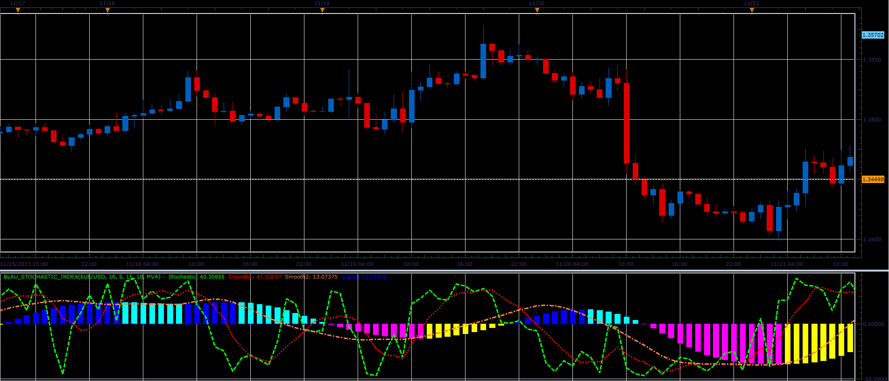

Download:

 [Blau_Stochastic_Index.lua](files/91970/Blau_Stochastic_Index.lua)

For this indicator must be installed Averages indicator ([viewtopic.php?f=17&t=2430](https://fxcodebase.com/code/viewtopic.php?f=17&t=2430)).

---

## Re: William Blau's Indicators

**Alexander.Gettinger** · Mon Jan 13, 2014 1:14 pm

**Blau Momentum**

Formulas:
Blau_Momentum[i] = EMA(EMA(EMA(Mtm, Smooth period 1), Smooth period 2), Smooth period 3), where
Mtm[i] = Price[i] - Price[i-Period+1].

 

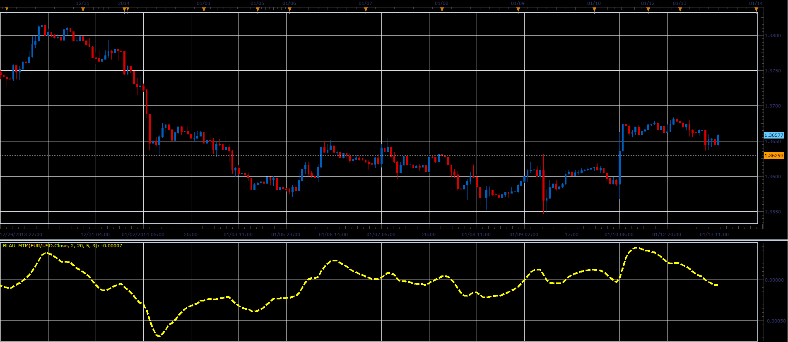

Download:

 [Blau_Mtm.lua](files/91971/Blau_Mtm.lua)

---

## Re: William Blau's Indicators

**Alexander.Gettinger** · Mon Jan 13, 2014 1:17 pm

**Blau Stochastic**

Formulas:
Blau_Stochastic = EMA(EMA(EMA(Stoch, Smooth period 1), Smooth period 2), Smooth period 3), where
Stoch[i] = Price[i]-Min,
Min - minimum price at range from (i-Period+1) to (i).

 

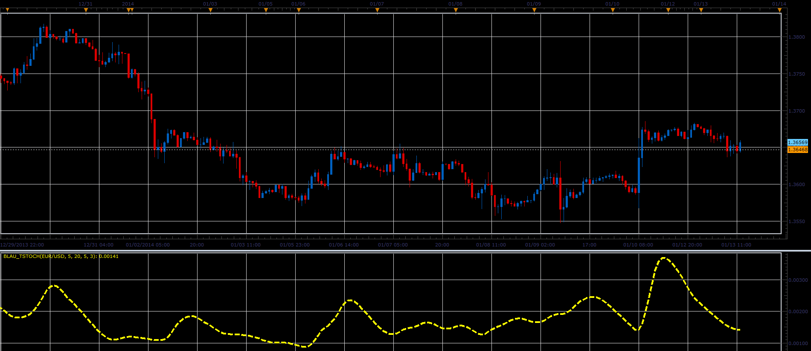

Download:

 [Blau_TStoch.lua](files/91972/Blau_TStoch.lua)

---

## Re: William Blau's Indicators

**Alexander.Gettinger** · Mon Jan 13, 2014 1:21 pm

**Blau Stochastic Oscillator**

Formulas:
Blau_TStoch = 100*Stoch_EMA3/HH_EMA3,
Signal = EMA(Blau_TStoch, Signal period), where
Stoch_EMA3 = EMA(EMA(EMA(Stoch, Smooth period 1), Smooth period 2), Smooth period 3),
HH_EMA3 = EMA(EMA(EMA(HH, Smooth period 1), Smooth period 2), Smooth period 3),
Stoch [i] = Price[i]-Min,
HH[i] = Max-Min,
Max, Min - maximum and minimum prices at range from (i-Period+1) to (i).

 

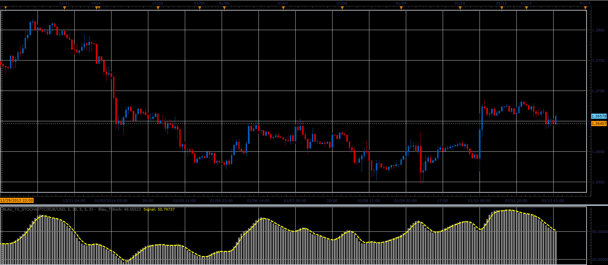

Download:

 [Blau_TS_Stochastic.lua](files/91973/Blau_TS_Stochastic.lua)

---

## Re: William Blau's Indicators

**Alexander.Gettinger** · Mon Jan 13, 2014 1:24 pm

**Blau Stochastic Momentum**

Formulas:
Blau_SM = EMA(EMA(EMA(HH, Smooth period 1), Smooth period 2), Smooth period 3), where
HH[i] = Price[i]-(Max+Min)/2,
Max, Min - maximum and minimum prices at range from (i-Period+1) to (i).

 

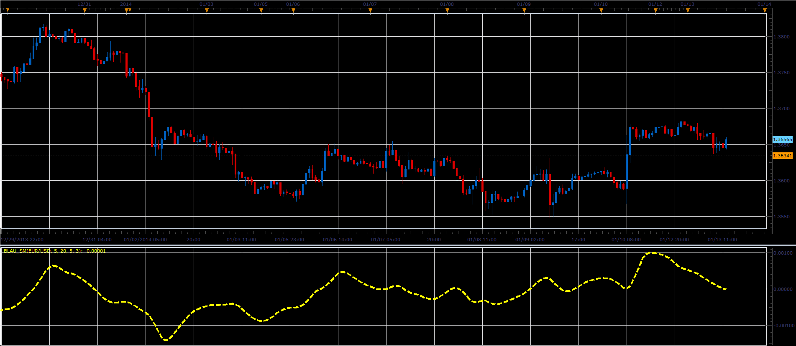

Download:

 [Blau_SM.lua](files/91974/Blau_SM.lua)

---

## Re: William Blau's Indicators

**Alexander.Gettinger** · Mon Jan 13, 2014 1:28 pm

**Blau Stochastic Momentum Index**

Formulas:
Blau_SMI = 100*EMA3/Half_EMA3, where
EMA3 = EMA(EMA(EMA(HH, Smooth period 1), Smooth period 2), Smooth period 3),
Half_EMA3 = EMA(EMA(EMA(Half_HH, Smooth period 1), Smooth period 2), Smooth period 3),
HH[i] = Price[i]-(Max+Min)/2,
Half_HH[i] = (Max-Min)/2,
Max, Min - maximum and minimum prices at range from (i-Period+1) to (i).

 

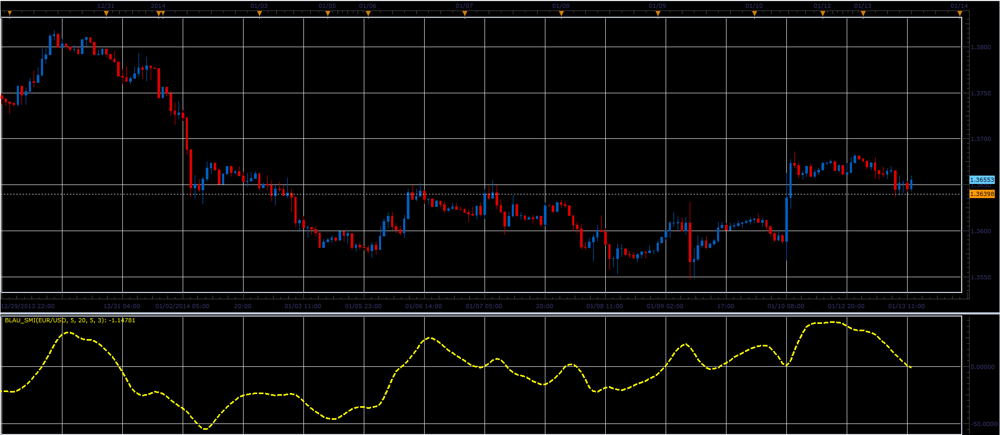

Download:

 [Blau_SMI.lua](files/91975/Blau_SMI.lua)

---

## Re: William Blau's Indicators

**Alexander.Gettinger** · Mon Jan 13, 2014 1:32 pm

**Blau Stochastic Momentum Oscillator**

Formulas:
Blau_SM_Stoch = 100*HH_EMA3/Half_HH_EMA3,
Signal = EMA(Blau_SM_Stoch, Signal period), where
HH_EMA3 = EMA(EMA(EMA(HH, Smooth period 1), Smooth period 2), Smooth period 3),
Half_HH_EMA3 = EMA(EMA(EMA(Half_HH, Smooth period 1), Smooth period 2), Smooth period 3),
HH[i] = Price[i]-(Max+Min)/2,
Half_HH[i] = (Max-Min)/2,
Max, Min - maximum and minimum prices at range from (i-Period+1) to (i).

 

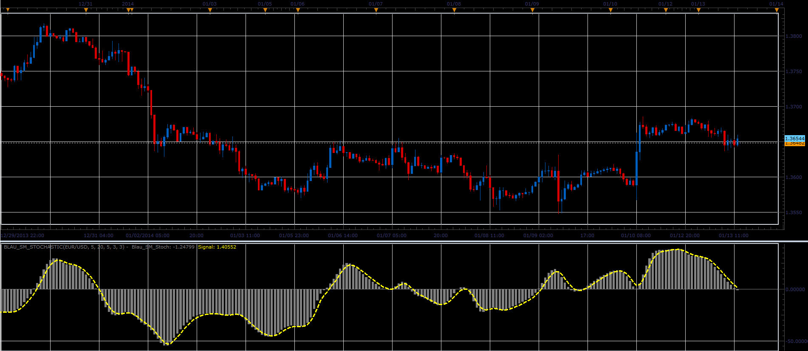

Download:

 [Blau_SM_Stochastic.lua](files/91976/Blau_SM_Stochastic.lua)

---

## Re: William Blau's Indicators

**Alexander.Gettinger** · Mon Jan 13, 2014 1:35 pm

**Blau Mean Deviation Index**

Formulas:
Blau_MDI = EMA(EMA(MD, Smooth period 2), Smooth period 3), where
MD[i] = Price[i]-EMA(Price, Smooth period 1).

 

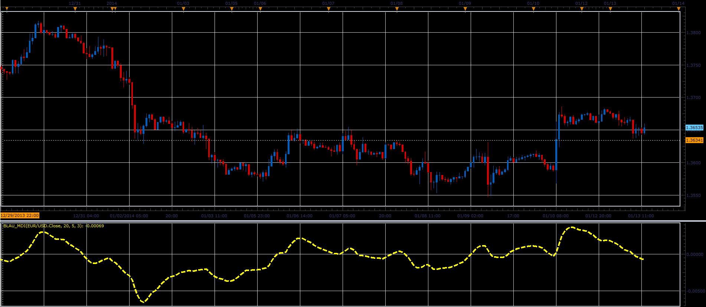

Download:

 [Blau_MDI.lua](files/91978/Blau_MDI.lua)

---

## Re: William Blau's Indicators

**Alexander.Gettinger** · Mon Jan 13, 2014 3:08 pm

**Blau Ergodic MDI oscillator**

Formulas:
Blau_EMDI=EMA(EMA(MD, Smooth period 2), Smooth period 3),
Signal = EMA(Blau_EMDI, Signal period), where
MD[i] = Price[i]-EMA(Price, Smooth period 1).

 

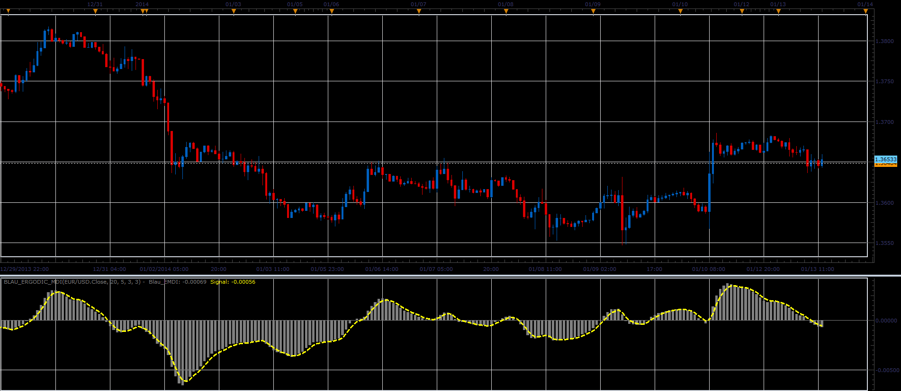

Download:

 [Blau_Ergodic_MDI.lua](files/91981/Blau_Ergodic_MDI.lua)

---

## Re: William Blau's Indicators

**Alexander.Gettinger** · Mon Jan 13, 2014 3:11 pm

**Blau MACD**

Formulas:
Blau_MACD = EMA(MACD, Smooth period 3), where
MACD = EMA(Price, Smooth period 2)-EMA(Price, Smooth period 1).

 

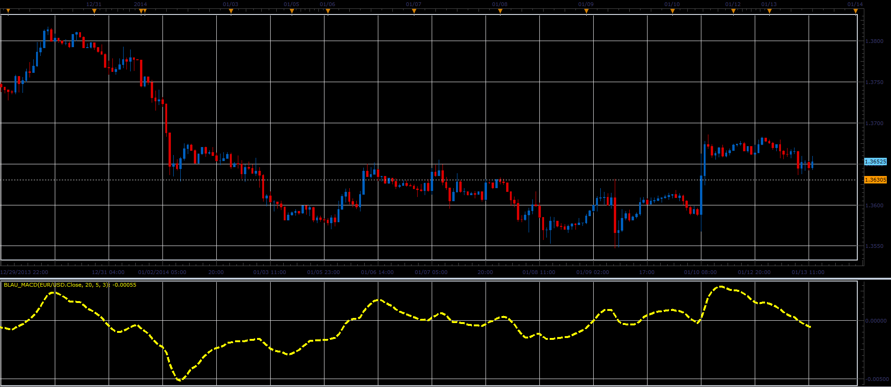

Download:

 [Blau_MACD.lua](files/91982/Blau_MACD.lua)

---

## Re: William Blau's Indicators

**Alexander.Gettinger** · Mon Jan 13, 2014 3:13 pm

**Blau Ergodic MACD**

Formulas:
Blau_MACD = EMA(MACD, Smooth period 3),
Signal = EMA(Blau_MACD, Signal period), where
MACD = EMA(Price, Smooth period 2)-EMA(Price, Smooth period 1).

 

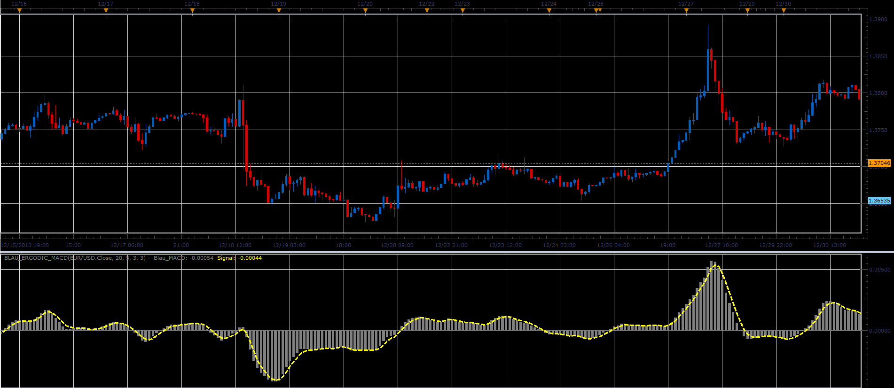

Download:

 [Blau_Ergodic_MACD.lua](files/91983/Blau_Ergodic_MACD.lua)

---

## Re: William Blau's Indicators

**Alexander.Gettinger** · Mon Jan 13, 2014 3:16 pm

**Blau Ergodic Oscillator**

Formulas:
Blau_Er = 100*EMA3/AbsEMA3,
Signal = EMA(Blau_Er, Signal period), where
EMA3 = EMA(EMA(EMA(Mtm, Smooth period 1), Smooth period 2), Smooth period 3),
AbsEMA3 = EMA(EMA(EMA(AbsMtm, Smooth period 1), Smooth period 2), Smooth period 3),
Mtm[i] = Price[i]-Price[i-Period+1],
AbsMtm[i] = Abs(Mtm[i]).

 

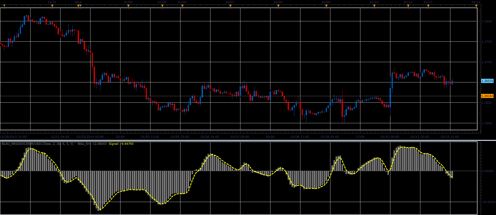

Download:

 [Blau_Ergodic.lua](files/91985/Blau_Ergodic.lua)

---

## Re: William Blau's Indicators

**Alexander.Gettinger** · Mon Jan 13, 2014 3:19 pm

**Blau Candlestick Momentum Index**

Formulas:
Blau_CMI = 100*EMA3/AbsEMA3, where
EMA3 = EMA(EMA(EMA(CM, Smooth period 1), Smooth period 2), Smooth period 3),
AbsEMA3 = EMA(EMA(EMA(AbsCM, Smooth period 1), Smooth period 2), Smooth period 3),
CM[i] = Price1[i]-Price2[i-Period+1],
AbsCM[i] = Abs(CM[i]).

 

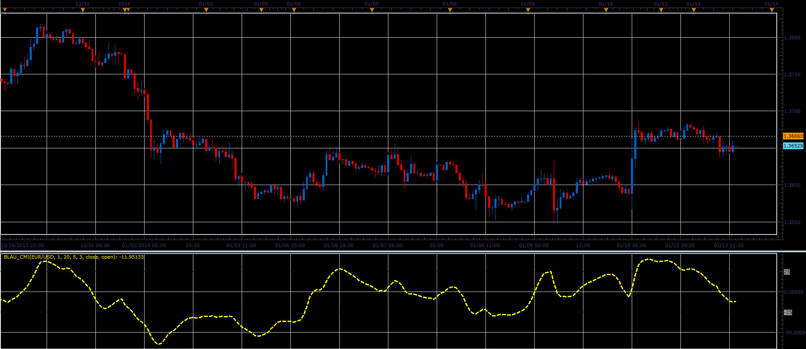

Download:

 [Blau_CMI.lua](files/91986/Blau_CMI.lua)

---

## Re: William Blau's Indicators

**Alexander.Gettinger** · Mon Jan 13, 2014 3:21 pm

**Blau Ergodic Candlestick Momentum Index**

Formulas:
Blau_CMI = 100*EMA3/AbsEMA3,
Signal = EMA(Blau_CMI, Signal period), where
EMA3 = EMA(EMA(EMA(CM, Smooth period 1), Smooth period 2), Smooth period 3),
AbsEMA3 = EMA(EMA(EMA(AbsCM, Smooth period 1), Smooth period 2), Smooth period 3),
CM[i] = Price1[i]-Price2[i-Period+1],
AbsCM[i] = Abs(CM[i]).

 

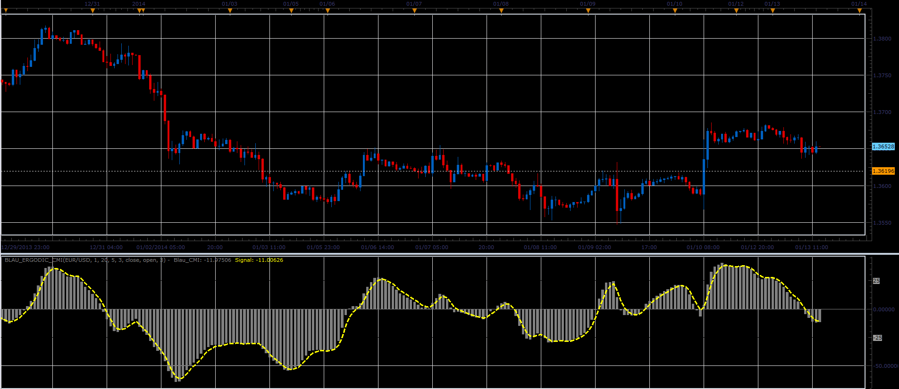

Download:

 [Blau_Ergodic_CMI.lua](files/91987/Blau_Ergodic_CMI.lua)

---

## Re: William Blau's Indicators

**Alexander.Gettinger** · Mon Jan 13, 2014 3:24 pm

**Blau Ergodic Candlestick Index**

Formulas:
Blau_CSI = 100*CM_EMA3/HH_EMA3,
Signal = EMA(Blau_CSI, Signal period), where
CM_EMA3 = EMA(EMA(EMA(CM, Smooth period 1), Smooth period 2), Smooth period 3),
HH_EMA3 = EMA(EMA(EMA(HH, Smooth period 1), Smooth period 2), Smooth period 3),
CM[i] = Price1[i]-Price2[i-Period+1],
HH[i] = Max-Min,
Max, Min - maximum and minimum prices at range from (i-Period+1) to (i).

 

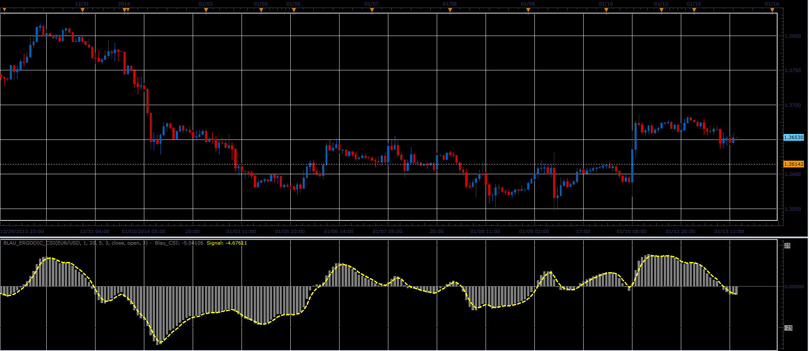

Download:

 [Blau_Ergodic_CSI.lua](files/91988/Blau_Ergodic_CSI.lua)

---

## Re: William Blau's Indicators

**Alexander.Gettinger** · Mon Jan 13, 2014 3:26 pm

**Blau Composite High-Low Momentum**

Formulas:
Blau_HLM = EMA(EMA(EMA(HLM, Smooth period 1), Smooth period 2), Smooth period 3), where
HLM[i] = HM[i]-LM[i],
HM[i] = High[i]-High[i-Period+1],
LM[i] = Low[i-Period+1]-Low[i].

 

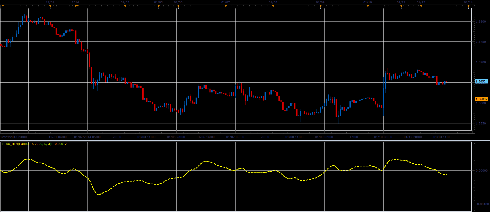

Download:

 [Blau_HLM.lua](files/91989/Blau_HLM.lua)

---

## Re: William Blau's Indicators

**Alexander.Gettinger** · Mon Jan 13, 2014 3:30 pm

**Blau Ergodic DTI-Oscillator**

Formulas:
Blau_DTI = 100*EMA3/AbsEMA3,
Signal = EMA(Blau_DTI, Signal period), where
EMA3 = EMA(EMA(EMA(HLM, Smooth period 1), Smooth period 2), Smooth period 3),
AbsEMA3 = EMA(EMA(EMA(AbsHLM, Smooth period 1), Smooth period 2), Smooth period 3),
HLM[i] = HM[i]-LM[i],
AbsHLM[i] = Abs(HLM[i]),
HM[i] = High[i]-High[i-Period+1],
LM[i] = Low[i-Period+1]-Low[i].

 

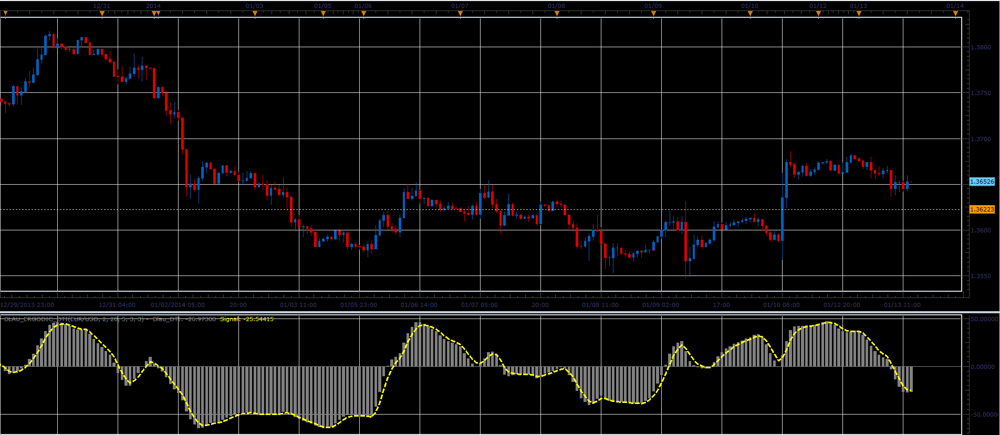

Download:

 [Blau_Ergodic_DTI.lua](files/91990/Blau_Ergodic_DTI.lua)

---

## Re: William Blau's Indicators

**Alexander.Gettinger** · Mon Jan 13, 2014 4:20 pm

MQL4 version of William Blau's Indicators: [viewtopic.php?f=38&t=60201](https://fxcodebase.com/code/viewtopic.php?f=38&t=60201).

---

## Re: William Blau's Indicators

**nookie** · Tue Aug 11, 2015 10:24 am

I think this one is not in the list and if possible can we translate it Tick Volume Indicator v2 ?

Link to the file in mq4

[https://www.mql5.com/ru/code/download/10550/TVI_v2.mq4](https://www.mql5.com/ru/code/download/10550/TVI_v2.mq4)

The Tick Volume Indicator was invented by William Blau and has been published in his book "Momentum, Direction and Divergence" (1995, page 43).

The indicator starts with separating the upticks and downticks in each price bar. The resulting arrays are smoothed with DEMA (two-pass EMA with periods r and s subsequently). The raw TVI is calculated with the following formula:

DEMA(upticks) - DEMA(downticks)
TVI_Raw = 100 * ---------------------------------

DEMA(upticks) + DEMA(downticks)

---

## Re: William Blau's Indicators

**nookie** · Tue Aug 11, 2015 10:32 am

This one is also from Blau on volume implemented in the form of a color histogram: [https://www.mql5.com/en/code/11437](https://www.mql5.com/en/code/11437)

[https://www.mql5.com/en/code/download/11437/blautvi.mq5](https://www.mql5.com/en/code/download/11437/blautvi.mq5) blautvi.mq5

---

## Re: William Blau's Indicators

**rose123** · Fri Aug 14, 2015 6:05 am

HI ,
I REQUEST A STRATEGY BASED ON BLAU STOCHASTIC INDEX INDIATICATOR

BUY LEVEL :0
SELL LEVEL:0

BUY:
1. SMOOTH 1 > SMOOTH 2 AND SMOOTH 2 > BUY LEVEL AND
2. SIGNAL > BUY LEVEL AND SIGNAL(PERIOD)>SIGNAL (PERIOD-1) AND
3. STOCHATIC CROSSES OVER SMOOTH 1

SELL:
1.SMOOTH 1 < SMOOTH 2 AND SMOOTH 2<SELL LEVEL AND
2. SIGNAL <SELL LEVEL AND SIGNAL(PERIOD)<SIGNAL(PERIOD-1) AND
3.STOCHATIC CROSSES UNDER SMOOTH 1

THANK YOU

---

## Re: William Blau's Indicators

**Apprentice** · Sun Aug 16, 2015 4:51 am

Your request is added to the development list.

---

## Re: William Blau's Indicators

**rose123** · Wed Aug 26, 2015 1:40 pm

HI APPRENDICE,

STRATEGY BASED ON BLAU STOCHATIC INDEX WILL BE MORE USEFUL IN DETECTING TREND AND ENTRY POINT.

THANK FOR ADDING THIS STRATEGY REQUEST IN DEVELOPMENT QUE.

---

## Re: William Blau's Indicators

**Apprentice** · Thu Aug 27, 2015 8:37 am

Requested can be found here.
[viewtopic.php?f=31&t=62597](https://fxcodebase.com/code/viewtopic.php?f=31&t=62597)

---

## Re: William Blau's Indicators

**rose123** · Thu Aug 27, 2015 10:37 am

thank you apprendice

---

## Re: William Blau's Indicators

**Apprentice** · Mon Feb 05, 2018 10:39 am

The indicator was revised and updated.
