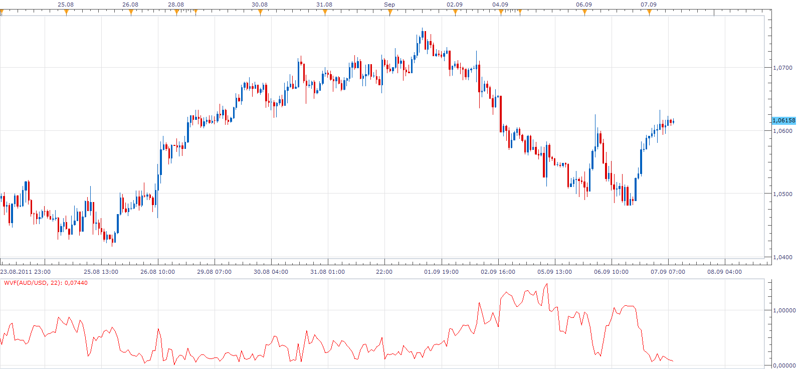

# William Vix Fix indicator

> Source: https://fxcodebase.com/code/viewtopic.php?f=17&t=6362  
> Forum: 17 · Topic 6362 · 12 post(s)

---

## William Vix Fix indicator

**Apprentice** · Wed Sep 07, 2011 8:07 am

William’s VIX Fix is a synthetic VIX (CBOE Volatility Index) calculation which can be used in any market to mimic the performance (but not the quotes) of the well-known volatility index (the WVF is not based on option’s implied volatility but derived from historical and intraday prices only).
William’s original formula:
WVF = [Highest (Close,22) - Low) / (Highest(Close,22)] * 100

 [WVF.lua](files/14632/WVF.lua)

 

Alternate version based on the request.
[viewtopic.php?f=27&t=61782](https://fxcodebase.com/code/viewtopic.php?f=27&t=61782)

 [William VIX FIX.lua](files/14632/William%20VIX%20FIX.lua)

Strategy is available here.
[viewtopic.php?f=31&t=64170](https://fxcodebase.com/code/viewtopic.php?f=31&t=64170)

---

## Re: William Vix Fix indicator

**bronson** · Fri May 24, 2013 4:12 pm

Hello Apprentice,

Could you added an option to this indicator for a look like " Histogrammes" ?

---

## Re: William Vix Fix indicator

**Apprentice** · Sun Jun 02, 2013 12:05 pm

Your request is added to the development list.

---

## Re: William Vix Fix indicator

**Apprentice** · Mon Jun 03, 2013 11:11 am

Bar Option Added.

---

## Re: William Vix Fix indicator

**bronson** · Sat Jun 08, 2013 11:07 am

> **Apprentice wrote:**
> Bar Option Added.

Thank you very much !!

---

## Re: William Vix Fix indicator

**Alexander.Gettinger** · Wed Aug 14, 2013 2:49 pm

MQL4 version of William Vix Fix indicator: [http://www.fxcodebase.com/code/viewtopi ... 38&t=59125](http://www.fxcodebase.com/code/viewtopic.php?f=38&t=59125).

---

## Re: William Vix Fix indicator

**Apprentice** · Thu Feb 05, 2015 3:49 am

William VIX FIX.lua Added.

---

## Re: William Vix Fix indicator

**hansenlauw** · Thu Feb 05, 2015 6:42 am

Thank's a lot

> **Apprentice wrote:**
> William VIX FIX.lua Added.

---

## Re: William Vix Fix indicator

**rose123** · Fri Dec 02, 2016 6:20 am

hi apprendice,

can you create strategy based on this strategy.

**buy:range high < upper band and wvf cross over range high and price closed > price open**

**sell:range high < upper band and wvf cross over range high and price closed < price open**

---

## Re: William Vix Fix indicator

**Apprentice** · Sat Dec 03, 2016 6:37 am

Try this version.
[viewtopic.php?f=31&t=64170](https://fxcodebase.com/code/viewtopic.php?f=31&t=64170)

---

## Re: William Vix Fix indicator

**Steve_W** · Sun Apr 06, 2025 9:59 am

I've extended this indicator to include both upside and downside volatility. The original formula emulates the VIX calculation looking for downward price expansion. This version includes an inverted formula and may be more suitable for other instruments as opposed to indices
Display options are
- Downside - the original formula
- Upside - new formula
- Upside-Downside - difference giving a swing oscillator
- Average Upside & Downside - average volatility
An internal RSI may also be enabled to help filter the signal

 

*Upside-Downside volatility - also with RSI option*

 [WVF_extended.lua](files/158879/WVF_extended.lua)

---

## Re: William Vix Fix indicator

**Steve_W** · Sat Apr 12, 2025 3:02 am

Some further options added to this Oscillator
- upside-downside normalised
- power function to compress signal - adjust power factor or leave as 1 to disable
- multiply by tick volume - enhances areas of high volatility where volume is also high (divide option also available). Including volume adds information - there may be better ways to do it than here.

The chart shows several instances with various settings. The last one is with exaggerated compression - signal raised to power 5 and then normalised.

 

*5 various configurations compared*

 [WVF_extended.lua](files/158938/WVF_extended.lua)
