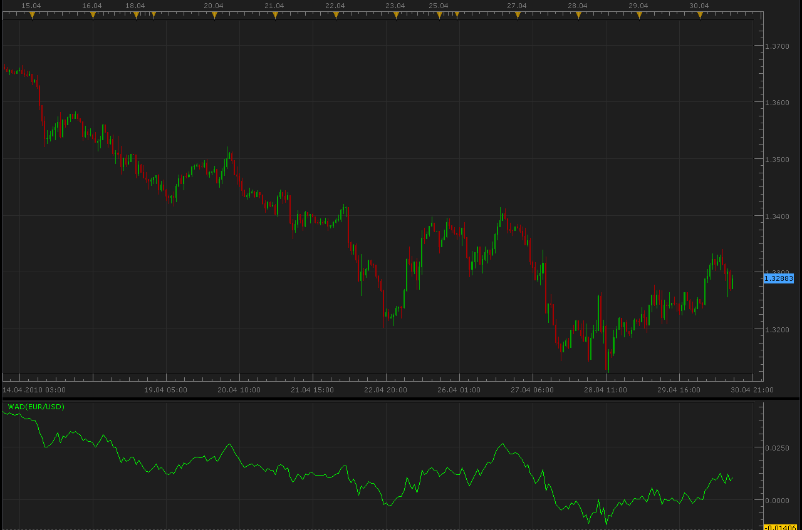

# Williams Accumulation/Distribution (WAD)

> Source: https://fxcodebase.com/code/viewtopic.php?f=17&t=901  
> Forum: 17 · Topic 901 · 12 post(s)

---

## Williams Accumulation/Distribution (WAD)

**Alexander.Gettinger** · Fri Apr 30, 2010 12:33 pm

Williams AD is the accumulated sum of positive "accumulational" and negative "distributional" price movements.

Calculation:

To calculate the accumulation/distribution indicator, first you have to find a "True Range High" (TRH) and "True Range Low" (TRL):

TRH (i) = MAX (HIGH (i) || CLOSE (i - 1))
TRL (i) = MIN (LOW (i) || CLOSE (i - 1))

Then you must find the current value of accumulation/distribution by comparing today and yesterday's closing prices.

 1. If the current closing price is higher than the previous one, then:

 CurА/D = CLOSE (i) - ТRL (i)

 2. If the current closing price is lower than the previous one, then:

 CurА/D = CLOSE (i) - ТRH (i)

 3. If current and previous closing prices coincide then:

 CurА/D = 0

Williams accumulation/distribution indicator is a growing sum of these values for each day:

WА/D (i) = CurА/D + WА/D (i - 1)

Where:
TRH (i) — the True Range High;
TRL (i) — the True Range Low;
MIN — the minimum value;
MAX — the maximum value;
|| — the logical OR;
LOW (i) — the minimum price of the current bar;
HIGH (i) — the maximum price of the current bar;
CLOSE (i) — the closing price of the current bar;
CLOSE (i - 1) — the closing price of the previous bar;
CurА/D — means current value of accumulation/distribution;
WА/D (i) — the current value of Williams Accumulation/Distribution indicator;
WА/D (i - 1) — the value of Williams Accumulation/Distribution indicator on the previous bar.

Code: [Select all](https://fxcodebase.com/code/)
`function Init()
    indicator:name("Williams Accumulation/Distribution (WAD)");
    indicator:description("Williams Accumulation/Distribution (WAD)");
    indicator:requiredSource(core.Bar);
    indicator:type(core.Oscillator);
   
    indicator.parameters:addColor("clrWAD", "Color of WAD", "Color of WAD", core.rgb(0, 255, 0));
end

local first;
local source = nil;
local WAD;

function Prepare()
    source = instance.source;
    first=source:first()+2;
    local name = profile:id() .. "(" .. source:name() .. ")";
    instance:name(name);
    WAD = instance:addStream("WAD", core.Line, name .. ".WAD", "WAD", instance.parameters.clrWAD, first);
end

function Update(period, mode)
    if (period>first+1) then
     local TRH=math.max(source.high[period],source.close[period-1]);
     local TRL=math.min(source.low[period],source.close[period-1]);
     local AD;
     if source.close[period]>source.close[period-1]+source:pipSize() then
      AD=source.close[period]-TRL;
     elseif source.close[period]<source.close[period-1]-source:pipSize() then
      AD=source.close[period]-TRH;
     else
      AD=0.;
     end
     WAD[period]=WAD[period-1]+AD;
    else
     WAD[period]=0.;
    end
end`

 [WAD.lua](files/1643/WAD.lua)

 [WAD Price Overlay.lua](files/1643/WAD%20Price%20Overlay.lua)

---

## Re: Williams Accumulation/Distribution (WAD)

**Jeffreyvnlk** · Wed May 29, 2013 11:35 am

Can i ask who Williams ? Larry Williams or Bill Williams ? I guess it is Larry

---

## Re: Williams Accumulation/Distribution (WAD)

**Apprentice** · Sun Jun 02, 2013 11:31 am

Williams Accumulation Distribution was created by Larry Williams.

---

## Re: Williams Accumulation/Distribution (WAD)

**Jeffreyvnlk** · Mon Aug 12, 2013 8:06 am

Now I realized this indicator was just a part of Williams AD formula because the volume element was taken out. However I expressed thank to Alexander for bringing this up because IMHO, tick volume is kind of joke so AD without volume might be more practical in Forex. Btw, you should change the name of this indicator. In his book, Larry originally called it as Net Change Price

---

## Re: Williams Accumulation/Distribution (WAD)

**Jeffreyvnlk** · Mon Aug 12, 2013 10:17 am

Btw, could you make it overlay (behind the price) , please.Thank you

---

## Re: Williams Accumulation/Distribution (WAD)

**Apprentice** · Tue Aug 13, 2013 2:26 am

Your request is added to the development list.

---

## Re: Williams Accumulation/Distribution (WAD)

**Apprentice** · Sun Aug 25, 2013 6:24 am

WAD Price Overlay added.

---

## Re: Williams Accumulation/Distribution (WAD)

**Jeffreyvnlk** · Sun Sep 07, 2014 2:21 pm

> **Apprentice wrote:**
> WAD Price Overlay added.

And based on real volume appreciated. Would be a fine gem finally.Thanks

---

## Re: Williams Accumulation/Distribution (WAD)

**Apprentice** · Tue Sep 09, 2014 2:24 am

As I stated already, for now it is impossible to implement real volume for use within indicators.

---

## Re: Williams Accumulation/Distribution (WAD)

**Coondawg71** · Mon Apr 13, 2015 3:00 am

Can we please request an amendment to this Williams Accumulation Distribution indicator.

I would like to see color fill between the Zero line and the indicator value.

Green if value is above Zero line.

Red if value is below Zero line.

Thanks!

sjc

---

## Re: Williams Accumulation/Distribution (WAD)

**Apprentice** · Wed Apr 15, 2015 5:26 am

Color fill added.

---

## Re: Williams Accumulation/Distribution (WAD)

**Apprentice** · Mon Oct 29, 2018 7:28 am

The indicator was revised and updated.
