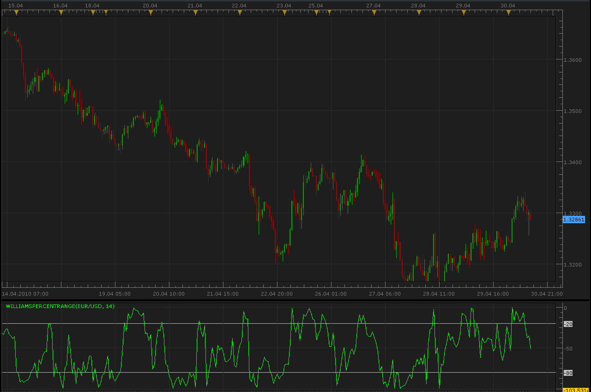

# Williams Percent Range (WPR)

> Source: https://fxcodebase.com/code/viewtopic.php?f=17&t=898  
> Forum: 17 · Topic 898 · 8 post(s)

---

## Williams Percent Range (WPR)

**Alexander.Gettinger** · Fri Apr 30, 2010 11:35 am

Williams Percent Range Technical Indicator is a dynamic technical indicator, which determines whether the market is overbought/oversold.

Calculation:

WPR = (HIGH(i-n)-CLOSE)/(HIGH(i-n)-LOW(i-n))*100

Where:
CLOSE — is today’s closing price;
HIGH(i-n) — is the highest high over a number (n) of previous periods;
LOW(i-n) — is the lowest low over a number (n) of previous periods.

 

 [WilliamsPercentRange.lua](files/1640/WilliamsPercentRange.lua)

 [Two Line WilliamsPercentRange.lua](files/1640/Two%20Line%20WilliamsPercentRange.lua)

 

 [MTF MCP Williams Percent Range heatmap.lua](files/1640/MTF%20MCP%20Williams%20Percent%20Range%20heatmap.lua)

The indicator was revised and updated

---

## Re: Williams Percent Range (WPR)

**virgilio** · Wed Feb 16, 2011 11:08 am

Hi dear,
is it possible to have a strategy that triggers buys/sells when the Williams Percent Range (WPR) reaches a certain level? The levels would have to be flexible so I can decide if I want a buy at -20 or -45 or -50, ectetera. Also the periods would have to be flexible (for example, 14-period, or 50-period or whatever I decide).
Thank you so much for your help.

---

## Re: Williams Percent Range (WPR)

**Alexander.Gettinger** · Thu Feb 17, 2011 4:09 am

> **virgilio wrote:**
> Hi dear,
> is it possible to have a strategy that triggers buys/sells when the Williams Percent Range (WPR) reaches a certain level? The levels would have to be flexible so I can decide if I want a buy at -20 or -45 or -50, ectetera. Also the periods would have to be flexible (for example, 14-period, or 50-period or whatever I decide).
> Thank you so much for your help.

OK.
I will work on it.

---

## Re: Williams Percent Range (WPR)

**Alexander.Gettinger** · Mon Feb 21, 2011 1:32 am

Strategy may be find here: [viewtopic.php?f=31&t=3482](https://fxcodebase.com/code/viewtopic.php?f=31&t=3482)

---

## Re: Williams Percent Range (WPR)

**Coondawg71** · Wed Oct 15, 2014 8:52 am

Can we please request a MTF MCP heatmap of Williams Percent Range in Lua.

Thanks,

sjc

---

## Re: Williams Percent Range (WPR)

**Apprentice** · Mon Feb 27, 2017 4:43 am

Two Line WilliamsPercentRange.lua added.

---

## Re: Williams Percent Range (WPR)

**Apprentice** · Mon Feb 27, 2017 5:46 am

MTF MCP Williams Percent Range heatmap.lua added.

---

## Re: Williams Percent Range (WPR)

**Apprentice** · Tue Apr 03, 2018 4:54 am

The indicator was revised and updated
