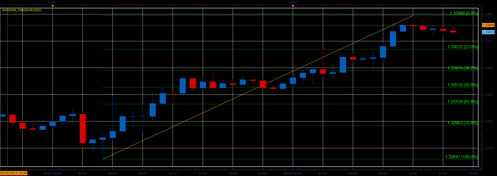
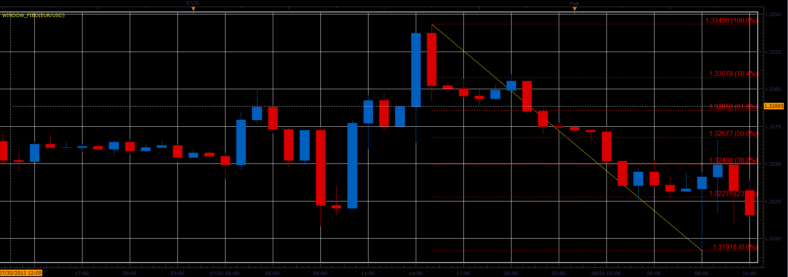

# Window fibo

> Source: https://fxcodebase.com/code/viewtopic.php?f=17&t=58796  
> Forum: 17 · Topic 58796 · 49 post(s)

---

## Window fibo

**Alexander.Gettinger** · Thu Aug 08, 2013 3:51 pm

The indicator finds the maximum and minimum in the chart window and shows the Fibo levels.

 

 

Download:

 [Window_Fibo.lua](files/88140/Window_Fibo.lua)

 [Window_Fibo With Scaling.lua](files/88140/Window_Fibo%20With%20Scaling.lua)

 [Tick Window_Fibo.lua](files/88140/Tick%20Window_Fibo.lua)

---

## Re: Window fibo

**evgeniyn** · Fri Aug 09, 2013 2:46 am

Hi,
I have the error on the row 34: instance:ownerDrawn(true);(nil value)

---

## Re: Window fibo

**Alexander.Gettinger** · Fri Aug 09, 2013 8:44 am

> **evgeniyn wrote:**
> Hi,
> I have the error on the row 34: instance:ownerDrawn(true);(nil value)

Are you using a beta version [viewtopic.php?f=30&t=57814](http://www.fxcodebase.com/code/viewtopic.php?f=30&t=57814)?

---

## Re: Window fibo

**speakinmymind** · Fri Aug 09, 2013 10:02 am

I get the same error, and I am using the beta version.

---

## Re: Window fibo

**evgeniyn** · Fri Aug 09, 2013 12:21 pm

No, I use regular version 01.12.060413. If this indicator created only to using in beta?

---

## Re: Window fibo

**Alexander.Gettinger** · Fri Aug 09, 2013 1:01 pm

Yes, this indicator requires the use beta version [viewtopic.php?f=30&t=57814](http://www.fxcodebase.com/code/viewtopic.php?f=30&t=57814).

---

## Re: 2013-II Beta: Window fibo

**Coondawg71** · Sun Aug 18, 2013 4:18 am

This is truly a great and extremely useful indicator! Huge time saver.

Can we please request the option of allowing the levels selected to be toggled on/off.

Thanks,

sjc

---

## Re: 2013-II Beta: Window fibo

**toxxum** · Fri Oct 11, 2013 1:39 pm

I second that, it is one of the most useful indicators I have come along!

Just one tiny thing is bothering me: Could the Fib percentages made a bit smaller so that they match the font size of the scale? Also, it would be great if there was an option which levels to show.

Thanks very much in advance, I truly appreciate your efforts!

---

## Re: 2013-II Beta: Window fibo

**Apprentice** · Sat Oct 12, 2013 4:31 am

Level selector Added.

---

## Re: 2013-II Beta: Window fibo

**toxxum** · Sat Oct 12, 2013 10:21 pm

Woa, terrific! Thanks a bunch!

Could you make the font smaller so it matches the font size of the scale and perhaps move the percentage labels to the left of the chart?

---

## Re: Window fibo

**Apprentice** · Tue Oct 15, 2013 1:37 am

Bump Up

---

## Re: Window fibo

**toxxum** · Mon Oct 21, 2013 12:56 pm

A really great indicator!!!

Could you make the font smaller so it matches the font size of the scale and perhaps move the percentage labels to the left of the chart?

---

## Re: Window fibo

**Apprentice** · Tue Oct 22, 2013 4:10 am

Please test version with scaling,
also label can now be turned off, moved to the left side.

---

## Re: Window fibo

**toxxum** · Tue Oct 22, 2013 6:18 am

Awesome!! Thank you very much!

---

## Re: Window fibo

**mjf1288** · Tue Oct 22, 2013 9:24 am

There seems to be an issue with this. The fib levels are not corresponding to the lines. There seems to be a 40 pip difference.

---

## Re: Window fibo

**Apprentice** · Tue Oct 22, 2013 5:03 pm

Can you show this on example,
in my testing I have NOT found discrepancies.

---

## Re: Window fibo

**mjf1288** · Wed Oct 23, 2013 12:11 pm

> **Apprentice wrote:**
> Can you show this on example,
> in my testing I have NOT found discrepancies.

It doesn't seem to be doing it now, but 2 days ago it was. I will try to reproduce the same, but it looks fine now.

---

## Re: Window fibo

**mjf1288** · Thu Oct 24, 2013 12:18 am

> **mjf1288 wrote:**
>
>
> > **Apprentice wrote:**
> > Can you show this on example,
> > in my testing I have NOT found discrepancies.
>
>
>
>
> It doesn't seem to be doing it now, but 2 days ago it was. I will try to reproduce the same, but it looks fine now.

Here is the issue I found, it seems to be doing it again.

---

## Re: Window fibo

**Apprentice** · Thu Oct 24, 2013 1:51 am

U have to post the entire screen, with visible axes.
As presented, can not have fix reference.

---

## Re: Window fibo

**Lyka122** · Mon Oct 28, 2013 12:37 am

Love this indicator!

Was wondering if two extra levels could be added so user can add his own values, like 11.8 and 88.6 as shown on enclosed chart?

---

## Re: Window fibo

**Apprentice** · Mon Oct 28, 2013 3:05 am

[Window_Fibo With Scaling.lua](files/90401/Window_Fibo%20With%20Scaling.lua)

Try this Version

---

## Re: Window fibo

**speakinmymind** · Mon Oct 28, 2013 9:23 am

can you please create a version of this that can be used on indicators and oscillators? thanks

---

## Re: Window fibo

**Lyka122** · Mon Oct 28, 2013 10:37 am

> **Apprentice wrote:**
>
>
> Window_Fibo With Scaling.lua
>
>
> Try this Version

Oh WOW! Thank your very much it fits in my style of trading!

---

## Re: Window fibo

**Apprentice** · Tue Oct 29, 2013 2:32 am

speakinmymind, Tick Window_Fibo added.
it can be applied to oscillator, simply select the appropriate location.

---

## Re: Window fibo

**Lyka122** · Thu Oct 31, 2013 3:14 pm

Not sure if this the place I should post , but I would like to share something with the group.

As I said before I love this indicator, but ran into a problem when I simply entered a trade based on the indexing and color change of the grid only to find that it indexed again because there was a strong trend. What I have done to help me with that is I added the**RSI_PK** indicator with a setting of 5 period and with both overbought and oversold set at 50. What I do now is wait for a cross over and retest of the 50 level in conjunction with the indexing and color change of the Window-Fibo indicator as can be seen in the attached chart.

---

## Re: Window fibo

**tjunjie1983** · Fri Dec 20, 2013 8:09 pm

Hi, Is there a way to remove the trendline drawn by the fib indicator?I mean on the default one too.Doesnt seems to be able to do so.

---

## Re: Window fibo

**Apprentice** · Sat Dec 21, 2013 7:37 am

Try Mon Oct 28, 2013 Version
I just added this functionality.

---

## Re: Window fibo

**tjunjie1983** · Wed Dec 25, 2013 9:57 am

> **Apprentice wrote:**
> Try Mon Oct 28, 2013 Version
> I just added this functionality.

Thank you

---

## Re: Window fibo

**Cactus** · Sat Aug 06, 2016 9:47 am

Could you make the Window Fibo give out output streams, for each level? So it can be used within strategies

---

## Re: Window fibo

**Apprentice** · Mon Aug 08, 2016 3:05 am

Your request is added to the development list, Under Id Number 3586
If someone is interested to do this or any task other from list please contact me.

---

## Re: Window fibo

**daveb1058** · Mon Aug 22, 2016 11:51 am

Great indicator great time saver super work thanks

---

## Re: Window fibo

**Apprentice** · Sat Sep 02, 2017 5:11 am

The indicator was revised and updated.

---

## Re: Window fibo

**Alexander.Gettinger** · Sat Nov 25, 2017 2:21 am

> **Cactus wrote:**
> Could you make the Window Fibo give out output streams, for each level? So it can be used within strategies

Please, try this version of the indicator:

 [Window_Fibo2.lua](files/116206/Window_Fibo2.lua)

---

## Re: Window fibo

**Apprentice** · Mon Apr 23, 2018 8:14 am

The indicator was revised and updated.

---

## Re: Window fibo

**Gilles** · Sat Jul 20, 2019 3:37 pm

hi Apprentice,

WINDOW_FIBO WITH SCALING stategy please !

a strategy that retains this peculiarity to adapt to the windows of the graph to calculate the levels fibo is extraordinary and it will relieve me in clicks.

thanks!

---

## Re: Window fibo

**Apprentice** · Sun Jul 21, 2019 4:38 am

Can you define an entry/exit condition?

---

## Re: Window fibo

**Gilles** · Tue Jul 23, 2019 8:39 am

of course dear apprentice. for me, the resizing of the graphic window is extra.

As I said, I use Window-Fibo With Scaling indicator.

The signal is detected by the setting of the graphic window, which dynamically resizes.

Example, right now my chart is currently in m5 (6 hours) but I open a new position with each new m1 or t1 (trading-source).

Activate allowmultiple and close on opposite.

before starting trading, Allowtrade is false, I take my time to adjust the chart to determine the current trend. So, I choose my time unit and adjust my scale on the graph. Then I activate allotrade to open my first order in the direction of the fibo line.

If Up fibo color - open a BUY order with a Limit order set at 0.0% and the stop order at 100.0%.

If Dn fibo color - open a SELL order with a Limit order at 0.0% and the order stop at 100.0%.

When the bars disappear from the grpahic, the Source.high or Source.low are recalculated. The fibo line tells us whether the price is going up or down right now.

Thank you apprentice for your support.

As I am French I hope my English is understandable.

---

## Re: Window fibo

**Apprentice** · Fri Jul 26, 2019 4:06 am

I don't think this strategy has any use. The only way to do this is to make a trading indicator. But this indicator changes its output based on chart scale. Any manipulation with the FXTS2 window will change its output and the trading may be random.

---

## Re: Window fibo

**Gilles** · Fri Jul 26, 2019 11:03 am

Apprentice, you're absolutely right. However, I would like to use it to adapt my current strategy, which is based solely on price study, variation, deviations and other study and range detection. I would have liked to use the Window-Fibo-With-Scaling-Strategy.lua version as a support to adapt mine. My strategy uses no indicators, just 2 Time Frames and price study. To be more precise, I study the price over 100 periods. Among other things, I detect the highest price with mathex.max and the lowest with mathex.min. Then I set the typical price. To avoid signal noise, I use Source.open instead of Source.close in the formula. I also added many dynamic parameters (GrossPL, Quantity, number of positions, P/L by position type by questioning the tradetable and closed trades.

My first results are correct. As you know, we can always do better.
I think I can make progress with Window-Fibo-With-Scaling-Strategy.lua.

If it's possible for you.

Thank you apprentice for your support.

See you soon!

---

## Re: Window fibo

**Apprentice** · Sat Jul 27, 2019 7:17 am

Sure, it would be feasible if the fibo period is fixed, via parameter, for example.

---

## Re: Window fibo

**Gilles** · Sat Jul 27, 2019 7:49 am

Hi apprentice!
Thank you for your response. So I suggest you set the number of periods at 100.
Thank you very much.

---

## Re: Window fibo

**Apprentice** · Sat Jul 27, 2019 9:45 am

Your request is added to the development list under Id Number 4809

---

## Re: Window fibo

**Apprentice** · Wed Jul 31, 2019 6:00 am

[Window_Fibo_with_trading.lua](files/127650/Window_Fibo_with_trading.lua)

Try this version.

---

## Re: Window fibo

**Gilles** · Wed Jul 31, 2019 11:04 am

Thank you apprentice, I'll test this tomorrow and ask you my questions next. It's going to take me a little while to get into your code. I'll ask you my questions next. see you soon

---

## Re: Window fibo

**jrichardson83** · Wed Sep 04, 2019 9:11 am

Can an iteration of this indicator be developed utilizing the Fib Expansion tool?

---

## Re: Window fibo

**Apprentice** · Thu Sep 05, 2019 5:10 am

You want to add extra levels to Window_Fibo_with_trading.lua?

---

## Re: Window fibo

**jrichardson83** · Thu Sep 05, 2019 11:17 pm

> **Apprentice wrote:**
> You want to add extra levels to Window_Fibo_with_trading.lua?

I was wanting to see whether an indicator could be developed using the Fib Expansion rather than the Fib Retracement.

---

## Re: Window fibo

**Apprentice** · Sat Sep 07, 2019 5:32 am

Your request is added to the development list.
Development reference 45.

---

## Re: Window fibo

**Apprentice** · Tue Sep 10, 2019 5:50 am

I need an algorithm for the third point
