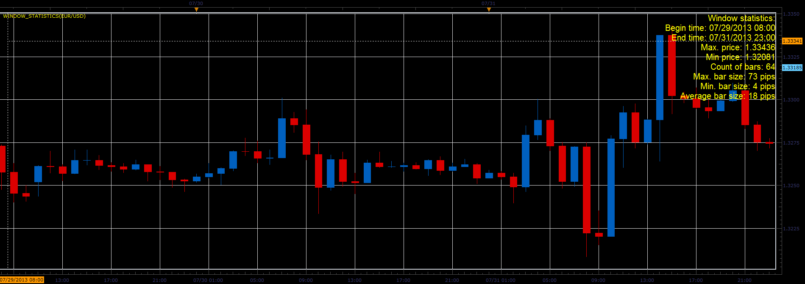

# Window statistics

> Source: https://fxcodebase.com/code/viewtopic.php?f=17&t=58746  
> Forum: 17 · Topic 58746 · 2 post(s)

---

## Window statistics

**Alexander.Gettinger** · Wed Aug 07, 2013 8:29 pm

The indicator shows statistics of the bars in the current window.

 

Download:

 [Window_Statistics.lua](files/88069/Window_Statistics.lua)

The indicator was revised and updated

---

## Re: Window statistics

**Apprentice** · Mon Jun 12, 2017 5:42 am

The indicator was revised and updated.
