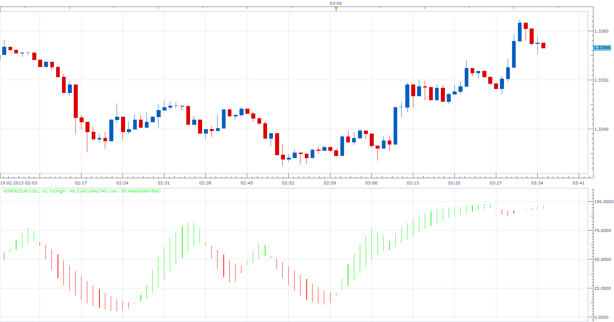

# Winer

> Source: https://fxcodebase.com/code/viewtopic.php?f=17&t=32203  
> Forum: 17 · Topic 32203 · 8 post(s)

---

## Winer

**Apprentice** · Tue Feb 19, 2013 4:59 am

 [Winer.lua](files/54896/Winer.lua)

MT4 version
[https://fxcodebase.com/code/viewtopic.p ... 09#p160509](https://fxcodebase.com/code/viewtopic.php?f=38&t=76302&p=160509#p160509)

---

## Re: Winer

**StefPasc** · Mon Feb 25, 2013 3:12 am

Dear Apprentice can you please write some words about this indicator ? For example how should we use it, etc. or maybe a link where we can find any information. Thanks in advance

---

## Re: Winer

**Apprentice** · Mon Feb 25, 2013 5:53 am

Unfortunately I do not have a lot of information on this topic.
Try this link, not much information there also.
[http://www.mql5.com/en/code/1492](http://www.mql5.com/en/code/1492)
As I understand the intent open Long position on Green, Open Short on Red.

---

## Re: Winer

**StefPasc** · Mon Feb 25, 2013 1:04 pm

Apprentice, thank you for your reply

---

## Re: Winer

**Apprentice** · Wed May 03, 2017 2:09 pm

Indicator was revised and updated.

---

## Re: Winer

**marcelo2k9** · Sun Aug 17, 2025 8:00 am

Please apprentice, can I have the mt5 version of this indicator, your help has really added confidence to my trading and I will surprise you .

---

## Re: Winer

**Apprentice** · Mon Aug 18, 2025 7:06 am

We have added your request to the development list.
Development reference 516

---

## Re: Winer

**Apprentice** · Tue Sep 09, 2025 4:05 am

MT4 version
[https://fxcodebase.com/code/viewtopic.p ... 09#p160509](https://fxcodebase.com/code/viewtopic.php?f=38&t=76302&p=160509#p160509)
