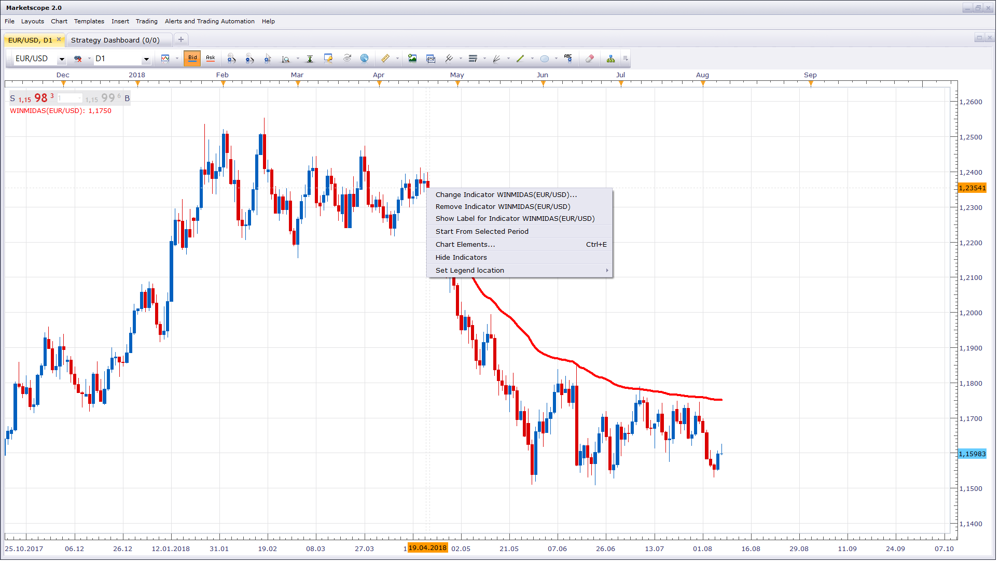

# WinMidas

> Source: https://fxcodebase.com/code/viewtopic.php?f=17&t=66476  
> Forum: 17 · Topic 66476 · 4 post(s)

---

## WinMidas

**Apprentice** · Wed Aug 08, 2018 5:08 am

Based on the original.
[http://trader-online.tk/MSZ/e-w-WinMida ... _Code.html](http://trader-online.tk/MSZ/e-w-WinMidas_Ammended_Code.html)

 

Make sure to define calculation start point.

 [WinMidas.lua](files/120441/WinMidas.lua)

---

## WinMidas_Count

**Apprentice** · Wed Aug 08, 2018 9:17 am

 [WinMidas_Count.lua](files/120446/WinMidas_Count.lua)

---

## Re: WinMidas

**james.tse** · Tue Mar 01, 2022 8:50 pm

The indicator WinMidas.lua is good and works fine. Its parameters, however, is not saved after Maketscope is closed. Is it possible to make it save the parameter?

Many many thanks.

---

## Re: WinMidas

**Apprentice** · Wed Mar 02, 2022 10:14 am

[34535](files/145211/Bez%20naslova.png)

You can use templates or layouts.
