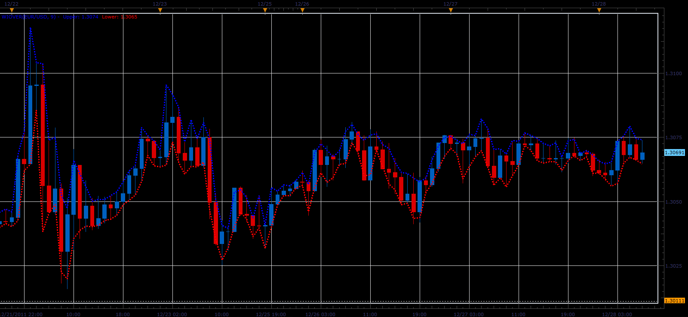

# WiOver indicator

> Source: https://fxcodebase.com/code/viewtopic.php?f=17&t=10548  
> Forum: 17 · Topic 10548 · 2 post(s)

---

## WiOver indicator

**Alexander.Gettinger** · Wed Dec 28, 2011 7:36 am

This indicator is a ported MQL5 indicator from [http://www.mql5.com/en/code/698](http://www.mql5.com/en/code/698).

Original description:

> The indicator shows the average percentage value of the last candlesticks overlap. It is useful for those, who enters the market manually using limit orders during price consolidation, as it allows to select order direction. Blue line - recommended BUY-LIMIT, red one - SELL-LIMIT.

 

Download:

 [WiOver.lua](files/21838/WiOver.lua)

The indicator was revised and updated

---

## Re: WiOver indicator

**Apprentice** · Mon Mar 20, 2017 8:27 am

Indicator was revised and updated.
