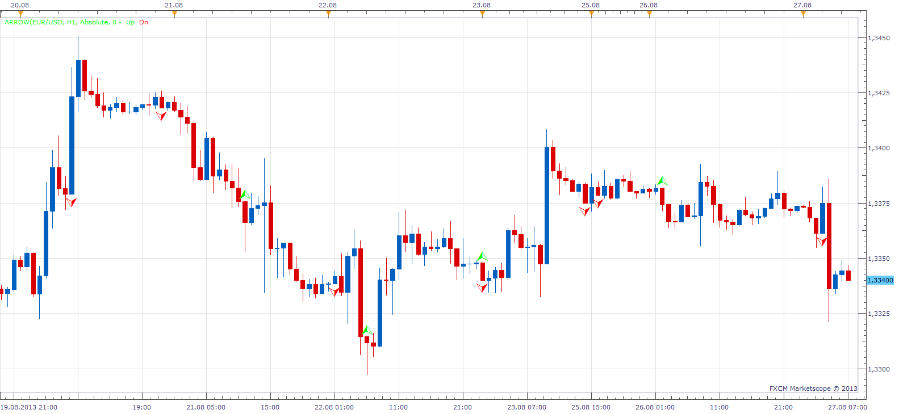

# Without Wick (Left Over Orders)

> Source: https://fxcodebase.com/code/viewtopic.php?f=17&t=59312  
> Forum: 17 · Topic 59312 · 8 post(s)

---

## Without Wick (Left Over Orders)

**Apprentice** · Tue Aug 27, 2013 6:37 am

This tool will puts an arrow to point out candles that do not have,
or have wick smaller than specified.

Absolute given in Pips
Relativ given in percentage of body

If Direction Candle Filter is applied.
For up candles only lower wichs will be shown.
For down candles only upper wicks will be shown.

 [Without Wick.lua](files/88943/Without%20Wick.lua)

The indicator was revised and updated

---

## Re: Without Wick (Left Over Orders)

**speakinmymind** · Tue Aug 27, 2013 7:04 pm

This is great thanks!

Can you please make the arrows disappear once price has retraced above/below the arrow? With an option for a touch or a close that causes the arrows to disappear?

Thanks!

---

## Re: Without Wick (Left Over Orders)

**Apprentice** · Wed Aug 28, 2013 1:39 am

You mean in subsequent candles.

---

## Re: Without Wick (Left Over Orders)

**speakinmymind** · Wed Aug 28, 2013 6:08 am

> **Apprentice wrote:**
> You mean in subsequent candles.

Yes

---

## Re: Without Wick (Left Over Orders)

**Apprentice** · Thu Aug 29, 2013 1:34 am

Your request is added to the development list.

---

## Re: Without Wick (Left Over Orders)

**speakinmymind** · Thu Sep 12, 2013 10:19 am

In addition to making them disappear once touched, can you please add a horizonal line as well as the arrows?

Thanks, much appreciated.

---

## Re: Without Wick (Left Over Orders)

**speakinmymind** · Thu Oct 17, 2013 11:06 am

Any update on this?

---

## Re: Without Wick (Left Over Orders)

**Apprentice** · Thu Jun 22, 2017 6:42 am

The indicator was revised and updated.
