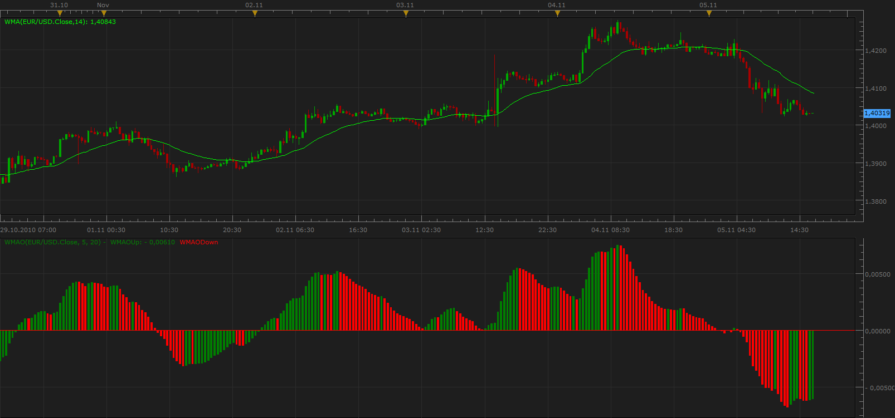

# WMA Oscillator

> Source: https://fxcodebase.com/code/viewtopic.php?f=17&t=2615  
> Forum: 17 · Topic 2615 · 2 post(s)

---

## WMA Oscillator

**Apprentice** · Sun Nov 07, 2010 10:45 am

WMAO [period] = Wilders MA(5) - Wilders MA(20)

 [WMAO.lua](files/5877/WMAO.lua)

With this oscillator, also install the WMA indicator.
[viewtopic.php?f=17&t=248&p=375&hilit=wma#p375](https://fxcodebase.com/code/viewtopic.php?f=17&t=248&p=375&hilit=wma#p375)

MT4/MQ4 Version
[viewtopic.php?f=38&t=64191](https://fxcodebase.com/code/viewtopic.php?f=38&t=64191)

The indicator was revised and updated

---

## Re: WMA Oscillator

**xpertizetrading** · Mon Jan 09, 2017 6:17 am

Thanks Apprentice. Excellent work
