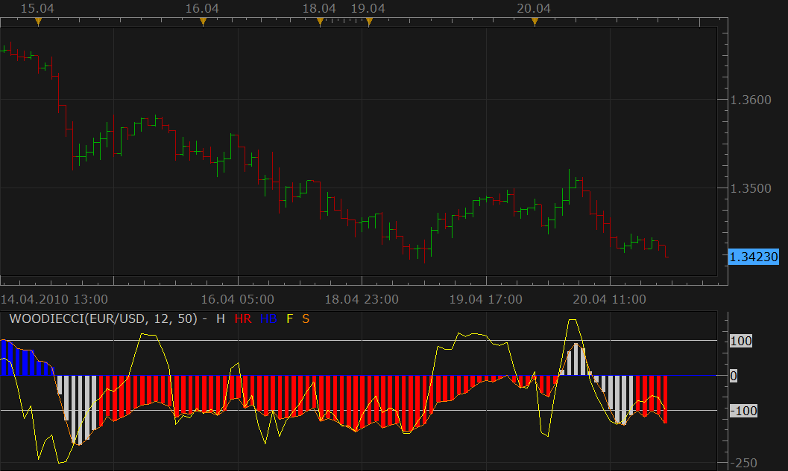

# Woodie CCI

> Source: https://fxcodebase.com/code/viewtopic.php?f=17&t=719  
> Forum: 17 · Topic 719 · 29 post(s)

---

## Woodie CCI

**Nikolay.Gekht** · Tue Apr 20, 2010 6:13 pm

This is another port of the [Scriptor's](http://www.mql4.com/users/Scriptor) MT4 indicator to lua. The original indicator is [here](http://codebase.mql4.com/1965).

The indicator shows fast and slow CCI and also highlights neutral zone for the slow CCI for the first N periods after the slow CCI crosses zero.

 

download the indicator:

 [WOODIE_CCI.lua](files/1305/WOODIE_CCI.lua)

The old version

 [WOODIECCI.lua](files/1305/WOODIECCI.lua)

Use it when the compatibility is problem.

Code: [Select all](https://fxcodebase.com/code/)
`-- Indicator profile initialization routine
-- Defines indicator profile properties and indicator parameters
-- TODO: Add minimal and maximal value of numeric parameters and default color of the streams
function Init()
    indicator:name("Woodie CCI with histogramm coloring");
    indicator:description("");
    indicator:requiredSource(core.Bar);
    indicator:type(core.Oscillator);

   indicator.parameters:addGroup("Calculation");
    indicator.parameters:addInteger("F", "Fast CCI Periods", "", 12);
    indicator.parameters:addInteger("S", "Slow CCI periods", "", 50);
    indicator.parameters:addInteger("N", "Length of neutral zone in bars", "", 6);
   
   indicator.parameters:addGroup("Overbought / Oversold Levels");
   indicator.parameters:addInteger("Overbought", "Overbought", "",100);
   indicator.parameters:addInteger("Oversold", "Oversold", "", -100);
        indicator.parameters:addInteger("level_overboughtsold_width", "Level lines width", "The width of the overbought/oversold levels", 1, 1, 5);
        indicator.parameters:addInteger("level_overboughtsold_style", "Level lines stype", "The style of the overbought/oversold levels", core.LINE_SOLID);
        indicator.parameters:addColor("level_overboughtsold_color", "Level lines color", "The color of the overbought/oversold levels"  , core.rgb(96, 96, 138));
        indicator.parameters:setFlag("level_overboughtsold_style", core.FLAG_LEVEL_STYLE);

   
   indicator.parameters:addGroup("Style");
   indicator.parameters:addInteger("F_width", "Up Line width", "", 1, 1, 5);
    indicator.parameters:addInteger("F_style", "Up Line style", "", core.LINE_SOLID);
    indicator.parameters:setFlag("F_style", core.FLAG_LINE_STYLE);
    indicator.parameters:addColor("F_color", "Color of Fast CCI", "", core.rgb(255, 255, 0));
      
   indicator.parameters:addInteger("S_width", "Up Line width", "", 1, 1, 5);
    indicator.parameters:addInteger("S_style", "Up Line style", "", core.LINE_SOLID);
    indicator.parameters:setFlag("S_style", core.FLAG_LINE_STYLE);
    indicator.parameters:addColor("S_color", "Color of Slow CCI", "", core.rgb(255, 128, 0));
   
    indicator.parameters:addColor("H_color", "Color of neutral bars", "", core.rgb(192, 192, 192));
    indicator.parameters:addColor("HR_color", "Color of red bars", "", core.rgb(255, 0, 0));
    indicator.parameters:addColor("HB_color", "Color of blue bar", "", core.rgb(0, 0, 255));
   
   indicator.parameters:addGroup("Slow Bar/Line Style");
   indicator.parameters:addString("Slow", "Style", "", "Bar");
   indicator.parameters:addStringAlternative("Slow", "Bar", "", "Bar");
   indicator.parameters:addStringAlternative("Slow", "Line", "", "Line");
end

-- Indicator instance initialization routine
-- Processes indicator parameters and creates output streams
-- TODO: Refine the first period calculation for each of the output streams.
-- TODO: Calculate all constants, create instances all subsequent indicators and load all required libraries
-- Parameters block
local F;
local S;
local N;

local Slow;

local first;
local source = nil;
local CCIF;
local CCIS;

-- Streams block
local F = nil;
local S = nil;
local Z = nil;

-- Routine
function Prepare()
    F = instance.parameters.F;
    S = instance.parameters.S;
    N = instance.parameters.N;
   
   Slow= instance.parameters.Slow;

    source = instance.source;
    CCIF = core.indicators:create("CCI", source, F);
    CCIS = core.indicators:create("CCI", source, S);
    first = math.max(CCIF.DATA:first(), CCIS.DATA:first());
    local name = profile:id() .. "(" .. source:name() .. ", " .. F .. ", " .. S .. ")";
    instance:name(name);
    Z = instance:addInternalStream(0, 0);
    F = instance:addStream("F", core.Line, name .. ".F", "F", instance.parameters.F_color, first);
   F:setWidth(instance.parameters.F_width);
    F:setStyle(instance.parameters.F_style);
   
   if Slow == "Line" then
    S = instance:addStream("S", core.Line, name .. ".S", "S", instance.parameters.S_color, first);
   else
   S = instance:addStream("S", core.Bar, name .. ".S", "S", instance.parameters.S_color, first);
   end

    F:addLevel(instance.parameters.Oversold, instance.parameters.level_overboughtsold_style, instance.parameters.level_overboughtsold_width, instance.parameters.level_overboughtsold_color);
    F:addLevel(0, instance.parameters.level_overboughtsold_style, instance.parameters.level_overboughtsold_width, instance.parameters.level_overboughtsold_color);
    F:addLevel(instance.parameters.Overbought, instance.parameters.level_overboughtsold_style, instance.parameters.level_overboughtsold_width, instance.parameters.level_overboughtsold_color);

end

-- Indicator calculation routine
function Update(period, mode)
    CCIF:update(mode);
    CCIS:update(mode);
    if period >= first then
        F[period] = CCIF.DATA[period];
        S[period] = CCIS.DATA[period];

        local flag = false;
        local v = 0;

        if period >= first + 1 then
            if (S[period] >= 0 and S[period - 1] < 0) or
               (S[period] < 0 and S[period - 1] >= 0) then
                    v = 1;
                    flag = true;
            elseif Z[period - 1] > 0 then
                flag = true;
                v = Z[period - 1] + 1;
            end
        else
            -- initally we are in the gray zone
            flag = true;
            v = 1;
        end

        if flag then
            Z[period] = v;
            if Z[period] > N then
                flag = false;
            end
        end

        if flag then
            S:setColor(period,instance.parameters.H_color);   
        else
            Z[period] = 0;
            if S[period] > 0 then
                S:setColor(period,instance.parameters.HB_color);   
            else
                 S:setColor(period,instance.parameters.HR_color);   
            end
        end
    else
        Z[period] = 0;
    end
end`
Timed Tick WOODIE_CCI version of indicator.
[viewtopic.php?f=17&t=65432&p=116357#p116357](https://fxcodebase.com/code/viewtopic.php?f=17&t=65432&p=116357#p116357)

---

## Re: Woodie CCI

**zekelogan** · Wed Apr 21, 2010 12:52 pm

VERY cool. One of my favorite indicators.

As a Woodie traditionalist, the only thing I can suggest is to make the slow CCI line thicker than the fast.

Maybe an alternate version for us weirdo's ?

---

## Re: Woodie CCI

**Nikolay.Gekht** · Wed Apr 21, 2010 4:20 pm

In the next version of Marketscope. Now there is no way to tune width of the lines. I requested this functionality and will modify the indicator as soon as this feature will developed.

---

## Re: Woodie CCI

**zekelogan** · Wed Apr 21, 2010 4:58 pm

Thanks Nikolay!

---

## Re: Woodie CCI

**michaelwen** · Thu Apr 22, 2010 12:08 am

could you explain a little bit how to use this indicators. thanks

---

## Re: Woodie CCI

**Nikolay.Gekht** · Thu Apr 22, 2010 8:11 am

I think you have to start from this: [http://www.woodiescciclub.com/start.htm](http://www.woodiescciclub.com/start.htm)

---

## Re: Woodie CCI

**zoglchaim** · Mon Jun 28, 2010 4:20 pm

hey great job there
do you think that you could add SIDEWINER and a CHOP ZONE INDICATORs? CZI and SI in short

---

## Re: Woodie CCI

**patick** · Thu Aug 05, 2010 1:06 am

Thanks for the great indicator, Nikolay.

Is it possible to modify to display the current CCI level the same way as StochRSI?

---

## Re: Woodie CCI

**Apprentice** · Fri Apr 08, 2011 2:21 pm

Line Style Options Added.
You Can Now Adjust Overbought / Oversold Line Levels

patick
I'm not sure on which aspect of StochRSI you are thinking.

---

## Re: Woodie CCI

**luigipg** · Sun Apr 10, 2011 6:05 am

There are three types of entrance signals.
These will all assume a long entrance. Short entrances are the reverse.
1. CCI 50 crosses above its Zero line. The CCI 14 must also be above its zero line and price must close above the 34EMA.
2. First Zero Line Reject after the CCI 50 crosses above zero.
The CCI50 has crossed above zero. Then either the CCI 50 or CCI 14 falls below +100 and shoots back up.
3. Slingshot- The CCI 50 is above its zero line.
The CCI 14 dips below -75 , moves upward and crosses zero.
Exits are up to you. Dr. Bob couldn't make up his mind about when to exit either. The entrances are great though.

---

## Re: Woodie CCI

**Apprentice** · Sun Apr 10, 2011 7:40 am

I'm just curious.
Is this a comment or request for a Strategy/Signal.

---

## Re: Woodie CCI

**Blackcat2** · Mon Apr 11, 2011 8:59 pm

I think the new version is not drawing the slow CCI line..
I'm using Trading station version 01.10.0.32911

Is it ok to use the old one? What's different between old version and new version?

Thanks.

---

## Re: Woodie CCI

**Apprentice** · Tue Apr 12, 2011 4:16 am

Slow is the same then redudantan with histogram.
I simply offered a different design, a cleaner, simpler and faster to calculate.

---

## Re: Woodie CCI

**kamalsidhu** · Tue Apr 12, 2011 6:31 am

hi

this system looks great but i can't see slow cci14.what could be reason.and if you can add some more screen shots that will be great.

---

## Re: Woodie CCI

**Blackcat2** · Tue Apr 12, 2011 5:02 pm

Is it possible to provide an option to change the color of the overbought/oversold and zero lines? If it's possible, to change the line style too.. Could you please apply to the older and newer version of the indicator?

I understand what apprentice is trying to say, if the slow CCI line is basically the same as the histogram then just read/see where the histogram (bars) is and that's the slow CCI..

I'm curious though, is it a big improvement in terms of calculation speed?

Thanks..
BC

---

## Re: Woodie CCI

**sunshine** · Wed Apr 13, 2011 1:44 am

Hi,

The top post is updated. Please download and reinstall the new version of the indicator.

> **Blackcat2 wrote:**
> Is it possible to provide an option to change the color of the overbought/oversold and zero lines? If it's possible, to change the line style too.. Could you please apply to the older and newer version of the indicator?
>
> I understand what apprentice is trying to say, if the slow CCI line is basically the same as the histogram then just read/see where the histogram (bars) is and that's the slow CCI..
>
> I'm curious though, is it a big improvement in terms of calculation speed?
>
> Thanks..
> BC

---

## Re: Woodie CCI

**magicfx** · Wed May 04, 2011 1:10 pm

Hi Apprentice,

I just came to know about Woodie CCI.
Thanks for the upload.
But how you combined the two CCI 14 periods and 6 periods into single CCI chart?
(Jeff Gannon nicely summarize how to set up the technique with the above two periods of CCI. See the site here:
[http://www.trading-naked.com/CCI_Setups.htm](http://www.trading-naked.com/CCI_Setups.htm) )

Is it possible to have signal of buy or sell on the chart based of zero line reject and CCI Trendline crosses?

---

## Re: Woodie CCI

**Apprentice** · Thu May 05, 2011 4:04 am

First you must distinguish, indicators and strategies.
Fast CCI is in every respect equal to the standard CCI.
Slow CCI is also identical to CCI.
If the Fast and Slow Period the same period, you will have the same value.

According to a defined algorithm, slow CCI is used for Bars coloring.

As for these strategies, they are possible.

---

## Re: Woodie CCI

**mosesnobleraj** · Wed Jun 01, 2011 10:48 am

can you add email alert to woodie cci,
can you give bigger timeframe woodie cci indicator

---

## Re: Woodie CCI

**Apprentice** · Wed Jun 01, 2011 3:22 pm

Your request has been added to developmental cue.

---

## Re: Woodie CCI

**MeiniOz** · Thu Jul 21, 2011 11:34 pm

It is development **queue** not cue

---

## Re: Woodie CCI

**nookie** · Tue Dec 06, 2011 4:50 pm

Is it possible the Slow CCI woodies to look like this instead of the bars view?

 [download/file.php?id=3273&mode=view](https://fxcodebase.com/code/download/file.php?id=3273&mode=view)

---

## Re: Woodie CCI

**Apprentice** · Wed Dec 07, 2011 3:30 am

Yes it is.
Your request has been added to developmental cue.

---

## Re: Woodie CCI

**stomejesse** · Fri Aug 17, 2012 3:17 am

hi,Apprentice ,
I needs to add one more CCI periods in the old version indicator.Thanks

---

## Re: Woodie CCI

**Apprentice** · Thu Apr 06, 2017 4:04 pm

Indicator was revised and updated.

---

## Re: Woodie CCI

**oxbx99** · Mon Dec 04, 2017 2:16 am

hi,

can I request to make timed tick version for woodie cci indicator.

thanks

---

## Re: Woodie CCI

**Apprentice** · Mon Dec 04, 2017 7:21 am

Timed Tick WOODIE_CCI version of indicator.
[viewtopic.php?f=17&t=65432&p=116357#p116357](https://fxcodebase.com/code/viewtopic.php?f=17&t=65432&p=116357#p116357)

---

## Re: Woodie CCI

**Apprentice** · Mon Apr 23, 2018 8:23 am

The Indicator was revised and updated.

---

## Re: Woodie CCI

**Apprentice** · Fri Sep 04, 2020 2:31 am

[WOODIE_CCI.lua](files/137302/WOODIE_CCI.lua)

Cloud option added.
